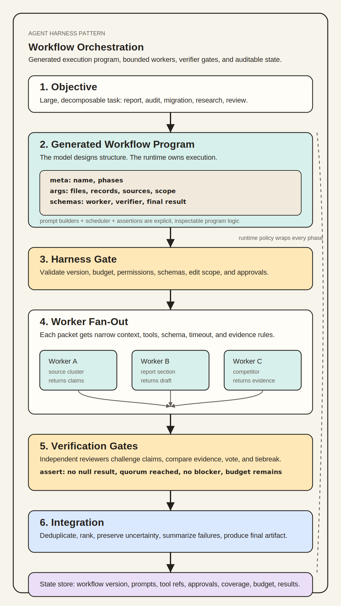

# Workflow Orchestration

## Core idea

Workflow orchestration is an advanced harness pattern for large tasks that are too broad, noisy, costly, or verification-heavy for one linear model-tool loop.

<p align="center">
  
</p>

The model may design the workflow, but the harness must own execution:

```text
objective
  -> versioned workflow plan
  -> approval and budget check
  -> bounded work packets
  -> worker contexts
  -> verifier contexts
  -> integration
  -> final result with evidence
```

The important shift is that the plan is not held only in conversational context. The workflow is represented as a durable artifact or runtime object. A mature harness can inspect, approve, execute, pause, resume, and audit that object within the limits of its runtime.

## Workflow as orchestration program

A concrete workflow is often closer to a generated program than to a prose plan. It stores the execution structure for a set of prompts:

```text
metadata
  -> input arguments
  -> output schemas
  -> prompt builders
  -> scheduling logic
  -> worker calls
  -> verifier calls
  -> assertions and gates
  -> aggregation
  -> final structured result
```

The orchestration program can be JavaScript, Python, YAML plus a runner, or another runtime-owned representation. The format matters less than the semantics: the workflow should make execution explicit and inspectable.

Typical pieces:

```text
meta: name, description, phases
args: files, records, accounts, reports, source sets, edit scope
schemas: expected worker, verifier, fix, or synthesis outputs
prompt builders: functions that create packet-specific prompts
scheduler: pipeline, parallel, map, retry, timeout, fan-out, fan-in
worker calls: agent(prompt, { phase, label, schema, permissions })
gates: no null result, no severe issue, quorum reached, budget remaining
review logic: independent votes, tiebreakers, sampling, adversarial checks
integration: dedupe, merge, rank, summarize, preserve failures
return value: final artifact plus coverage, errors, and budget status
```

This is what makes workflows different from a long prompt. The model may generate the program, but the harness/runtime executes the program and can inspect each step.

Minimal pseudocode:

```javascript
export const meta = {
  name: "report-review",
  phases: [
    { title: "Research", detail: "one worker per source cluster" },
    { title: "Draft", detail: "synthesize findings into report sections" },
    { title: "Review", detail: "two reviewers check claims and structure" },
    { title: "Revise", detail: "apply confirmed review findings" },
  ],
};

const RESEARCH_SCHEMA = { /* claims, sources, confidence */ };
const REVIEW_SCHEMA = { /* issues, severity, evidence */ };

const research = await parallel(
  sourceClusters.map(cluster => () =>
    agent(researchPrompt(cluster), {
      label: `research:${cluster.id}`,
      phase: "Research",
      schema: RESEARCH_SCHEMA,
    }),
  ),
);

const draft = await agent(draftPrompt(research), {
  label: "draft",
  phase: "Draft",
  schema: REPORT_SCHEMA,
});

const reviews = await parallel([
  () => agent(claimReviewPrompt(draft), { label: "review:claims", phase: "Review", schema: REVIEW_SCHEMA }),
  () => agent(editorialReviewPrompt(draft), { label: "review:editorial", phase: "Review", schema: REVIEW_SCHEMA }),
]);

const blockers = reviews.flatMap(r => r.issues).filter(i => i.severity === "blocker");
if (blockers.length > 0) {
  return agent(revisionPrompt(draft, blockers), { label: "revise", phase: "Revise", schema: REPORT_SCHEMA });
}

return { report: draft, reviews, coverage: coverageSummary(research) };
```

The business version of this pattern is not only “one worker per file.” It can be:

```text
one worker per customer segment
one worker per source cluster
one worker per competitor
one worker per report section
one verifier per claim type
two reviewers approve before finalization
one editor rewrites after reviewers produce blocking comments
```

## When to use workflow orchestration

Use workflow orchestration when a task is:

- large enough that one context window will become noisy;
- naturally decomposable into independent packets;
- expensive enough to need explicit budget control;
- high impact enough to need review before execution;
- likely to produce conflicting findings;
- dependent on broad coverage across many files, records, documents, customers, tickets, endpoints, or systems;
- verification-heavy, where findings should be challenged before being returned.

Good examples:

```text
Audit every endpoint for missing authorization checks.
Classify 5,000 support tickets and extract the top repeatable failure modes.
Compare all vendor contracts against a new policy and flag risky clauses.
Prepare a migration plan across many services and verify rollback coverage.
Research a market from many sources, cross-check claims, and produce cited findings.
```

Do not use workflow orchestration for simple edits, small read-only questions, ordinary drafting, or tasks where one linear loop is cheaper and easier to validate.

## Workflow artifact

A workflow should be inspectable before risky execution. Store it outside the prompt. The artifact may be a declarative spec, a generated orchestration program, or both.

Recommended workflow artifact:

```yaml
objective: "..."
scope:
  included: []
  excluded: []
success_criteria: []
version: "..."
packets:
  - id: "packet-001"
    purpose: "..."
    inputs: []
    allowed_tools: []
    forbidden_actions: []
    expected_output_schema: "..."
verification:
  strategy: "independent_review | sampling | cross_check | replay | tests"
  required_evidence: []
integration:
  conflict_policy: "..."
  final_output_schema: "..."
budget:
  max_packets: 20
  max_parallel_workers: 5
  max_model_turns: 80
  max_tool_calls: 200
  max_wall_time: "..."
  max_cost: "..."
approval_required_for: []
resume_state_ref: "..."
```

The workflow artifact should be versioned. Approval should bind to the exact version that will run.

If the artifact is executable or interpreted by a workflow runtime, treat it as untrusted model-generated code until validated. Review its declared phases, tool permissions, edit/write scope, budget, assertions, and output schemas before running it.

## Packet design

Packets are bounded work units. A good packet has:

- a single purpose;
- explicit inputs;
- narrow tool permissions;
- a result schema;
- a timeout and budget;
- a clear evidence requirement;
- no hidden dependency on another packet unless declared.

Good packet:

```text
Inspect the billing API routes for authorization gaps. Use only read-only code search, file reads, and test inspection. Return route, evidence, risk, confidence, and suggested verifier checks.
```

Bad packet:

```text
Review billing.
```

Prefer packets that can fail independently. A failed packet should produce a structured failure result, not block unrelated packets unless it is foundational.

## Worker contexts

A worker is a bounded model run, agent invocation, or sandboxed task runner assigned to one packet of the workflow. It is not a separate authority. It should behave like a scoped executor: receive a packet-specific prompt, use only approved tools, return a structured result, and stop. A worker may read, draft, inspect, classify, or edit only within the permissions the harness grants for that packet.

Each worker context should receive only what it needs:

```text
workflow objective
packet objective
allowed inputs
allowed tools
output schema
trust boundaries
budget
forbidden actions
evidence rules
```

Do not give every worker the full conversation, all tools, all secrets, or broad write access. Worker contexts inherit policy from the parent harness, but they do not inherit authority to approve their own actions.

## Verification

For high-value workflows, verification should be separate from initial production.

Verifier contexts can:

- challenge each finding;
- check evidence links;
- run tests or validators;
- look for missed cases;
- classify confidence;
- detect duplicated or contradictory results;
- verify that the packet stayed in scope.

Verification patterns:

```text
independent review: verifier receives findings and source access, not the worker's reasoning
sampling: verify a representative subset when full review is too expensive
cross-check: compare two independent packet outputs for the same area
replay: rerun a deterministic check from recorded inputs
tests: execute mechanical validation where available
```

The final output should distinguish verified findings, rejected findings, unresolved questions, and areas not covered.

## Integration

The integrator combines packet and verifier outputs into one result.

Integration responsibilities:

- deduplicate findings;
- resolve conflicts using a documented policy;
- preserve evidence;
- rank by severity, confidence, or business priority;
- identify coverage gaps;
- report budget and failure status;
- produce the requested final artifact.

Do not flatten uncertainty away. A useful final report says what was checked, what was not checked, what failed, and what evidence supports the conclusions.

## State and resume behavior

Workflow state should be durable:

```text
workflow plan
approval records
packet definitions
packet statuses
worker outputs
verifier outputs
integration notes
budget usage
model and runtime settings
tool calls and result references
data snapshot or source revision
errors and retries
final result
```

This lets the harness pause, resume, compact, partially replay or rerun from recorded state, audit, and debug the workflow without depending on the parent conversation context.

## Determinism and reproducibility

Workflow results are not automatically deterministic. Even a versioned workflow can produce different results when models, source data, permissions, tools, or runtime state change.

Record enough information to make the result auditable:

```text
workflow version
model, provider, and relevant settings
packet prompts or packet specs
worker and verifier context references
tool calls
tool outputs or durable references
source revision, data snapshot, or retrieval timestamp
permission grants and approval records
budget usage
worker and verifier outputs
integration decisions
```

Exact replay is often unrealistic for language-model workflows. The practical target is auditability plus controlled rerun: the harness should be able to explain what happened, rerun deterministic validators, and rerun packets against recorded inputs or snapshots where available.

## Permissions and budgets

Workflow orchestration increases throughput and cost. It must not increase authority by accident.

Rules:

- Parent permission policy applies to every worker and verifier.
- Risky side effects still require approval outside the model.
- Parallel execution is allowed only for independent, concurrency-safe work.
- Writes, sends, deletes, financial actions, permission changes, deployments, and destructive operations are serialized or approval-gated.
- Budgets must cover total workflow cost, not only one worker.
- The harness should stop or pause when the workflow exceeds budget, loses required context, or detects risk escalation.

## Failure handling

A workflow can partially succeed.

Track:

```text
completed packets
failed packets
skipped packets
timed-out packets
verification failures
integration conflicts
budget stops
approval pauses
```

The final answer should include completion status and next safe action. Do not present partial coverage as full coverage.

## Anti-patterns

- Using workflow orchestration when one loop is enough.
- Treating a generated workflow as trusted code or trusted policy.
- Letting workers approve their own risky actions.
- Giving every worker broad tools or full context by default.
- Running many packets without a budget or stop condition.
- Returning only the integrated answer while discarding evidence.
- Hiding packet failures from the final result.
- Skipping independent verification for high-impact findings.
- Adding multi-worker orchestration before the single-worker harness has measurable failure cases.

## Design rule

Workflow orchestration is not more autonomy by default. It is a way to make large work explicit, decomposed, permissioned, inspectable, verified, and resumable.
