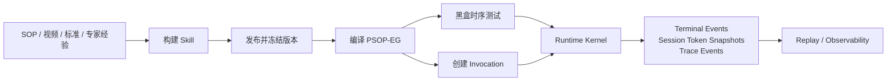
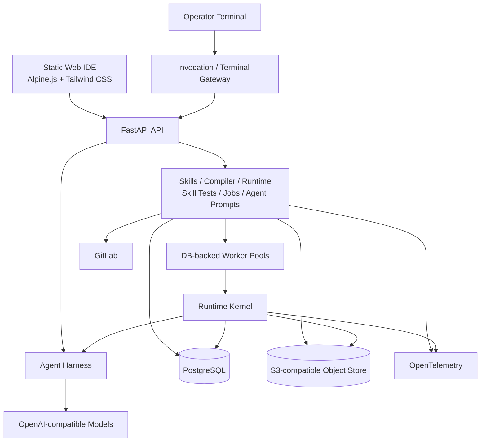

<div align="center">

# PSOP

**面向物理世界现场作业的 AI Skill 操作系统**

将 SOP、专家经验、现场证据、安全约束与工具能力，转化为可执行、可验证、可回放、可审计的 PSOP Skill。

[项目愿景](docs/overview/vision.md) · [系统架构](docs/architecture/system-architecture.md) · [Execution Graph](docs/architecture/execution-graph-formal-v5.md) · [完整文档](docs/README.md)


[](LICENSE)

</div>

> [!NOTE]
> PSOP 当前处于 MVP 阶段。仓库已形成 `Skills -> Publish -> Auto Compile -> Invocation -> Runtime -> Replay / Observability` 主链路，完整的 `Build -> Compile -> Test -> Run -> Audit -> Eval -> Improve` 闭环仍在按里程碑推进。

## PSOP 是什么

`PSOP` 是 `Physical Standard Operating Procedure` 的缩写，表示“现实物理世界的标准操作规程”。

现实现场作业通常依赖纸面 SOP、老师傅经验、临场判断、企业系统和现场证据。这些能力分散在文档、人员与系统之间，难以复用、验证和持续改进。

PSOP 将它们沉淀为 `PSOP Skill`：一种描述作业目标、适用边界、现场步骤、证据要求、安全约束、异常恢复路径和完成标准的现实任务契约。Skill 发布后会被编译为正式的 `PSOP-EG`，再由受控 Runtime 引导现场人员逐步完成任务。

PSOP 不是聊天助手，也不是一次性自动化脚本。它的设计重点是：

- **确定性的执行骨架**：正式运行以 `PSOP-EG` 为输入，由 Runtime Kernel 控制状态推进。
- **柔性的智能能力**：Agent 参与 Skill 构建、编译、测试和运行时推理，但不能绕过正式运行状态。
- **可验证的现场事实**：文本、图片、音频、视频、文件与设备确认以 append-only 事件持久化。
- **可恢复的执行过程**：Session Token snapshot、trace 与 terminal events 支撑恢复、Replay、观测与审计。

## 工作方式



### 核心对象

| 对象 | 作用 |
| --- | --- |
| `PSOP Skill` | 面向现实现场作业的任务契约，也是构建、维护和发布的核心业务资产。 |
| `PSOP-EG` | 由 Skill 编译得到的 formal-v5 Execution Graph，是 Runtime 的正式输入。 |
| `Session Token` | 一次 Run 的正式运行状态；模型上下文或 Agent thread state 不能替代它。 |
| `Terminal Event` | 终端输入输出的 append-only 事实源，可包含文本与多模态内容。 |
| `Run Package` | 一次运行产生的 terminal events、trace events、snapshots、附件与 Replay 事实。 |

## 核心能力

| 环节 | 当前能力 |
| --- | --- |
| 构建 | 通过浏览器 Web IDE 管理 Git-backed Skill 源码，并从原始素材与标准材料生成或完善 Skill draft。 |
| 发布与编译 | 冻结源码版本，自动生成并校验 formal-v5 PSOP-EG、编译诊断与能力摘要。 |
| 测试 | 使用黑盒时序场景、正反例和多模态输入验证 Skill 的运行行为。 |
| 运行 | 通过 Gateway 创建 invocation，由隔离 worker pool 异步推进 Runtime。 |
| 现场交互 | 持久化 terminal transcript、多模态附件、Session Token snapshot 与 runtime trace。 |
| 回放与观测 | 基于已持久化事实重建 Replay，并通过 OpenTelemetry 输出运行诊断。 |
| Agent 治理 | 统一管理 Agent Definition、Run、Event、Artifact、tools、skills、memory、workspace 与可选 MCP adapter。 |

## 架构概览

PSOP 采用“确定性 Runtime + 受治理 Agent Harness”的架构。Runtime 拥有正式运行状态，Agent Harness 为构建、编译、测试和推理提供统一的模型、工具、Skill、workspace 与审计边界。



完整的模块边界、数据模型和运行语义见[系统架构设计](docs/architecture/system-architecture.md)。

### 技术栈

| 层级 | 技术 |
| --- | --- |
| 后端 | Python 3.11+、FastAPI、SQLAlchemy、Pydantic |
| 前端 | Alpine.js、Tailwind CSS v4、CodeMirror、BPMN.js |
| 数据与任务 | PostgreSQL、DB-backed job queue、独立 worker pools |
| 对象存储 | S3-compatible object store，例如 MinIO |
| Agent 与模型 | LangChain、LangGraph、OpenAI-compatible API |
| 可观测性 | OpenTelemetry、runtime trace、Replay |

## 快速开始

### 前置要求

- Git 与 Bash
- Python 3.11+
- Node.js 20+ 与 npm
- PostgreSQL
- S3-compatible 对象存储，例如 MinIO
- 用于 Skill 源码管理的 GitLab token
- OpenAI-compatible 大模型接口

在 WSL 中开发时，请使用 WSL 内的 Linux-native Node.js 与 npm，不要使用挂载在 `/mnt/` 下的 Windows 可执行文件。

### 1. 克隆仓库

```bash
git clone https://github.com/servforce/psop.git
cd psop
```

### 2. 准备配置

```bash
cp .env.example .env
```

编辑 `.env`，至少按本地环境配置 PostgreSQL、GitLab、对象存储和大模型接口。示例文件包含占位凭据，请勿将真实密钥提交到仓库。

### 3. 安装依赖

```bash
cd backend
python -m venv .venv
source .venv/bin/activate
pip install -e .[dev]
cd ../static
npm ci
npm run build:css
cd ..
```

### 4. 启动本地环境

```bash
bash scripts/dev/start.sh
```

该脚本会启动 FastAPI API、三个隔离的数据库任务 worker pool（`runtime-interactive`、`build-test`、`material`）和静态 Web IDE。API 默认不内嵌 worker。

| 服务 | 默认地址 |
| --- | --- |
| Web IDE | <http://127.0.0.1:4173> |
| API | <http://127.0.0.1:8011> |
| API Base URL | <http://127.0.0.1:8011/api/v1> |

需要在后台运行并将输出写入项目根目录 `logs/` 时：

```bash
bash scripts/dev/start-background.sh
```

## 配置

根目录 [.env.example](.env.example) 是本地联调配置模板。主要配置分组如下：

| 配置分组 | 用途 |
| --- | --- |
| `PSOP_DATABASE_*` / `PSOP_DATABASE_URL` | PostgreSQL 连接与启动检查。 |
| `PSOP_GITLAB_*` | Skill 源码仓库、分支与 API 访问。 |
| `PSOP_OBJECT_STORE_*` | Skill 素材、终端附件与运行产物存储。 |
| `PSOP_LLM_TEXT_*` / `PSOP_LLM_MULTIMODAL_*` | 文本和多模态模型路由。 |
| `PSOP_ASR_*` / `PSOP_VIDEO_*` / `PSOP_RAW_MATERIAL_*` | 视频与原始素材分析。 |
| `PSOP_STANDARD_LIGHTRAG_*` | 行业标准检索。 |
| `PSOP_RUNTIME_WORKER_*` / `PSOP_RUNTIME_JOB_*` | worker 并发、lease、重试与恢复。 |
| `PSOP_TERMINAL_EVENT_*` | 终端多模态事件与上传限制。 |
| `PSOP_AGENT_HARNESS_*` | Agent Harness profile、workspace 与 MCP。 |
| `PSOP_OTEL_*` | traces、logs、metrics 与 OTLP exporter。 |
| `PSOP_SERVER_*` / `PSOP_WEB_*` | 本地服务监听地址和端口。 |

开发脚本依次读取根目录 `.env` 与 `backend/.env`，后者中的同名变量会覆盖前者。

## 开发与测试

常用命令均从仓库根目录执行：

| 命令 | 用途 |
| --- | --- |
| `bash scripts/dev/start.sh` | 前台启动 API、worker 和 Web IDE。 |
| `bash scripts/dev/start-background.sh` | 后台启动完整本地环境。 |
| `bash scripts/dev/run-server.sh` | 仅启动 FastAPI API。 |
| `bash scripts/dev/run-worker.sh` | 仅启动数据库任务 worker。 |
| `bash scripts/dev/run-web.sh` | 仅启动静态 Web IDE。 |
| `bash scripts/dev/build-web.sh` | 重新生成前端 CSS。 |
| `bash scripts/dev/test-server.sh` | 运行后端 pytest 测试。 |
| `bash scripts/dev/test-web.sh` | 运行前端 Jest 测试。 |

提交前至少运行：

```bash
bash scripts/dev/test-server.sh
bash scripts/dev/test-web.sh
```

如果修改了前端样式，再运行：

```bash
bash scripts/dev/build-web.sh
```

后端和前端的独立开发说明分别见 [backend/README.md](backend/README.md) 与 [static/README.md](static/README.md)。

## 项目结构

```text
backend/      FastAPI API、领域服务、Runtime、worker、Gateway 与 Agent Harness
static/       基于 Alpine.js 和 Tailwind CSS 的静态 Web IDE
skills/       PSOP Builder、Compiler 与 Runner 使用的 Agent Skills
tests/        后端、Runtime、API、任务、可观测性与对象存储测试
docs/         产品愿景、系统架构、形式定义、接入指南与工程文档
scripts/dev/  本地启动、构建和测试脚本
```

## 文档

建议按以下顺序阅读：

1. [项目愿景](docs/overview/vision.md)：产品定位、系统公理、阶段目标与术语。
2. [系统架构设计](docs/architecture/system-architecture.md)：当前实现边界、模块、数据模型与演进路线。
3. [Execution Graph 形式定义](docs/architecture/execution-graph-formal-v5.md)：PSOP-EG、Session Token 与运行语义。
4. [终端接入指南](docs/guides/terminal-integration-v1.md)：创建运行、收发事件、订阅、恢复与错误处理。
5. [工程协作规则](docs/engineering/agent-rules.md)：代码边界、文档事实源与 review 约定。

所有文档的分类、优先级与维护规则见 [docs/README.md](docs/README.md)。`docs/reference/` 仅作为背景资料，不替代当前实现或正式设计基线。

## 路线图

- **Milestone 1 — Build / Compile / Test**：从原始素材生成 Skill draft，编译 PSOP-EG，并通过 runner 执行正例、反例和边界测试。
- **Milestone 2 — Audit / Eval**：基于真实 Run 与测试事实进行质量归因，生成结构化改进提案。
- **Milestone 3 — Production Governance**：强化工具、MCP、sandbox、审批、长期记忆与发布门禁。

详细范围与成功标准见[产品里程碑](docs/overview/vision.md#10-产品里程碑)。

## 贡献与反馈

欢迎通过 [GitHub Issues](https://github.com/servforce/psop/issues) 报告问题或提出建议。

提交代码前请：

1. 从独立 feature branch 开始开发。
2. 确认实现与项目愿景、系统架构和 formal-v5 定义一致。
3. 如果行为或架构发生变化，同步更新对应设计文档。
4. 运行与变更相关的后端、前端和构建验证。

## 许可证

PSOP 由 servforce 团队以 [Apache License 2.0](LICENSE) 开源。
