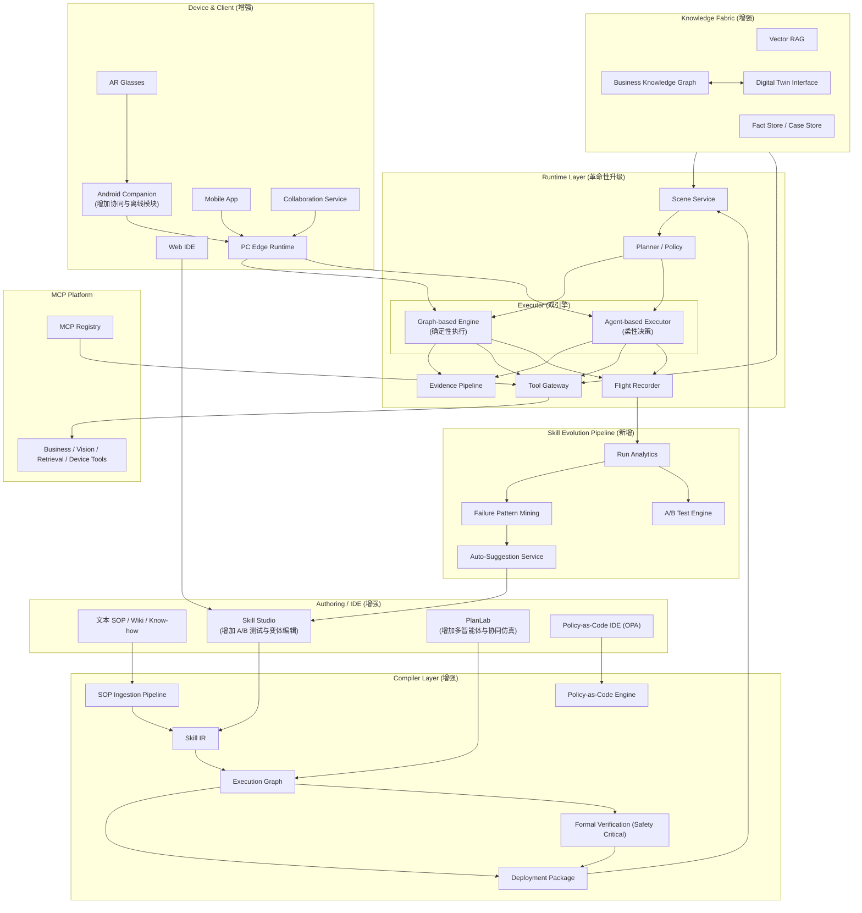
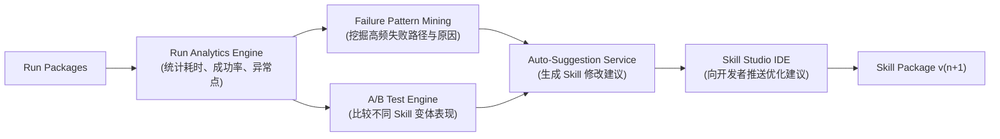

# PSOP 白皮书

副标题：把 SOP、AI、AR 与企业系统，进化为物理世界的可编程操作系统

## 1. 执行摘要

今天的大多数现场作业，仍然运行在一种低效且脆弱的组合上：

- 规程是 PDF、Wiki、老师傅经验和碎片化培训。
- AI 是通用问答助手，知道很多，但不对结果负责。
- AR 多数停留在“把说明书显示到眼前”的演示层。
- 企业系统彼此割裂，工单、资产、维保、知识库无法构成闭环。

这意味着，现实世界中最有价值的任务，至今仍然没有真正的“操作系统”。

PSOP 要做的，不是再造一个“更聪明的聊天框”，也不是再做一个“更酷的 AR Demo”，而是定义一种新的基础设施：

**把物理世界中的任务，编译成可执行、可验证、可协同、可回放、可持续进化的场景技能包。**

一句话概括：

**PSOP 不是一个应用，它是物理世界的任务操作系统。**

## 2. 一个关键转折点

我们正处在一个关键的转折点。

过去十年，工业软件、企业系统、AI、AR、边缘计算与数字孪生都各自向前迈了一大步，但它们始终没有在同一个执行平面上真正汇合。

今天我们已经同时拥有：

- 企业的工单、资产、维保、知识库系统。
- 具备视觉、语音、检索、推理和工具调用能力的 AI。
- 足以进入真实作业场景的 AR 眼镜、Android 伴生设备和手机端。
- Model Context Protocol（MCP）带来的标准化工具接入方式。
- 日益成熟的数字孪生、IoT 与边缘计算能力。

但这些能力仍然是“散的”。

今天真正缺失的，不是某个单点技术，而是一层把它们统一起来的编排系统：

- 让 SOP 不再是文档，而是执行资产。
- 让 AI 不再只是建议者，而是受控编排者。
- 让 AR 不再只是展示终端，而是执行链路的一部分。
- 让企业系统、知识库、数字孪生、设备与人进入同一个运行时。

PSOP 的机会，正是出现在这个交汇点上。

## 3. 核心理念的再升华

`Execution Graph`（执行图）提供了工业级的稳定性和可预测性，但物理世界的混沌、人因差异和现场异常，又呼唤更高的灵活性和智能。

因此，PSOP 的核心思想不是在“工作流”和“智能体”之间二选一，而是：

**在确定性的骨架上，生长出柔性的智能。**

这句话背后的含义是：

- 我们不废除执行图，而是把它作为系统的安全护栏与操作信念。
- 我们不迷信自由 Agent，而是让智能在护栏内动态应变。
- 我们不把现场复杂性粗暴简化掉，而是用结构化的方式驾驭它。

可以把它理解成：

**PSOP = 确定性规程 + 柔性智能**

这不是一次局部增强，而是一种新的系统观。

## 4. 现场世界真正的问题

现场工作最大的浪费，不是某一步慢，而是整个体系无法复用、无法监督、无法进化。

### 文档不能执行

绝大多数 SOP 只能“被阅读”，不能“被运行”：

- 不知道哪一步该推进。
- 不知道完成证据是什么。
- 不知道异常该走哪条分支。
- 不知道谁确认了什么、为什么确认。

### AI 不能担责

大模型可以解释流程、总结知识、回答问题，但它天然不是一个可信执行系统：

- 它无法保证每一步都遵守安全约束。
- 它无法天然形成完整审计链。
- 它无法天然区分“建议”和“允许执行的动作”。

### 知识不会复利

现场执行每天都在产生高价值数据：

- 哪些步骤最容易出错。
- 哪些设备型号在特定步骤异常率更高。
- 哪种提示方式更适合新手。
- 哪类步骤应该升级为客观证据校验。

但今天这些数据大多沉没了，没有回流到规程本身。

### 系统和设备是割裂的

眼镜、手机、PC、摄像头、工单系统、知识库、数字孪生彼此都是孤岛。

结果就是：

- 每接一个设备都重做一遍。
- 每接一个系统都写一层胶水。
- 每做一个场景都重新造一套流程。

## 5. 场景示例：一位现场工程师的一天

为了让 PSOP 的能力更加具象化，让我们跟随一位名叫 Alex 的风电现场工程师，体验他的一天。

**08:00 | 接收任务**
Alex 的平板电脑收到了来自企业工单系统（通过 MCP 工具集成）的推送：`为 14 号风机进行年度润滑油路检查`。他点击“接受”，PSOP 自动加载了对应的`Skill Package: Annual Lubrication Check v3.2`。

**09:30 | 到达现场，AR 引导**
戴上 AR 眼镜，Alex 看到 14 号风机的数字孪生模型叠加在实体设备上。眼镜通过 GPS 和视觉识别确认了位置无误。第一个步骤显示在眼前：“请扫描机舱入口处的二维码以确认设备。” Alex 扫描后，PSOP 的`Graph-based Engine`确认了身份和设备，解锁了下一步操作。

**10:15 | 遭遇异常，柔性处理**
当执行到“检查 A 号油泵压力”时，Alex 发现读数远低于标准值。他通过语音“报告异常，压力过低”，PSOP 立即采取行动：
1.  **激活 Agent-based Executor**：系统从确定性流程切换到柔性诊断模式。
2.  **调用知识库**：智能体迅速检索`Knowledge Fabric`，找到与该型号风机“压力过低”相关的 3 个历史案例和 1 份官方排障手册。
3.  **提供选项**：Alex 的眼镜上显示：“检测到压力过低。常见原因有：1. 滤网堵塞；2. 传感器故障；3. 油路泄漏。建议首先检查滤网。是否开始‘滤网检查’子任务？”
4.  **执行子任务**：Alex 选择是，PSOP 加载了滤网检查的`Skill Package`，并引导他一步步操作。

**11:00 | 拍照取证，协同专家**
Alex 发现滤网确实被污染物严重堵塞。根据`Skill Package`的要求，他必须拍照作为证据。PSOP 自动将照片标记上时间、地点和相关步骤，存入`Evidence Pipeline`。由于这是一个“高频异常”，系统根据`Skill Evolution Pipeline`的历史数据分析，建议 Alex：“此问题已多次出现，是否需要请求远程专家协助，进行根本原因分析？” Alex 点击“是”，一键呼叫了远在总部的专家。

**11:10 | 远程 AR 协同**
专家李工的 PC 屏幕上立刻弹出了 Alex 的第一视角画面。他可以直接在 Alex 的视野中用红色 AR 箭头，圈出需要重点检查的连接处，并通过语音指导：“Alex，检查一下我标记的这个阀门，上次的报告说它可能存在兼容性问题。”

**12:00 | 更新数字孪生与工单**
更换滤网后，系统恢复正常。Alex 在 PSOP 中确认完成任务。系统自动执行了一系列收尾工作：
-   通过 MCP 调用，在企业资产管理系统中为 14 号风机增加一条维护记录。
-   更新该风机数字孪生体中“润滑油路”的健康度和“滤网”的更换日期。
-   自动关闭工单，并将包含所有步骤、照片、耗时的`Run Package`归档。

**下午 | 技能进化**
与此同时，在总部的技能工程师收到了来自`Skill Evolution Pipeline`的建议：“‘年度润滑油路检查 v3.2’技能包在‘检查 A 号油泵压力’步骤的异常率高达 28%。数据挖掘显示，70% 的异常与滤网堵塞有关。建议将‘检查滤网’作为前置步骤加入 v3.3 版。”

这个例子生动地展示了 PSOP 如何将一个孤立、被动的任务，转变为一个数据驱动、智能协同、并且能够持续进化的闭环过程。

## 6. PSOP 的答案：把任务变成资产

PSOP 带来的不是“更好的操作指南”，而是一次工作范式的变化。

### 从文档到技能包

SOP 不再是静态文档，而是 `Skill Package`：

- 有步骤
- 有证据
- 有风险
- 有分支
- 有回退
- 有工具调用
- 有设备输入输出
- 有版本与回放

### 从提示词到执行图

任务不再依赖临时 prompt，而是编译成 `Execution Graph`。

这意味着：

- 可以静态分析。
- 可以测试与回放。
- 可以精确追踪。
- 可以在多端稳定运行。

### 从单一 AI 到双引擎

PSOP 采用“双引擎执行器”：

- `Graph-based Engine` 负责确定性执行。
- `Agent-based Executor` 负责柔性处理异常和开放式诊断。

这不是“把 Agent 塞进工作流”，而是把智能限制在可审计、可控、可证明的边界里。

### 从知识库到知识底座

PSOP 的知识层不是单纯向量检索，而是三层结构：

- 文档层：手册、工单、FAQ、培训材料。
- 图谱层：设备、部件、工具、工艺、风险关系。
- 事实层：现场观测、证据、异常与历史 run。

### 从单次执行到持续进化

每一次 run 结束后，都会形成新的数据资产：

- 哪一步最耗时。
- 哪个设备型号异常率更高。
- 哪种提示语更有效。
- 哪个步骤应该升级为客观证据校验。

PSOP 的目标不是“执行一次流程”，而是“让流程越跑越强”。

## 7. 总体系统架构：PSOP v4 视图

v3 的分层依然有效，但我们在 Runtime、Compiler 和 Device 层引入了革命性的新组件。它们共同构成了 PSOP 的下一代架构。

这张图说明了一件事：

PSOP 不是单一模块，也不是某个终端应用，而是一条从知识、规程、编译、执行、协同、审计到进化的完整价值链。

## 8. 五个使 PSOP 具备平台级价值的核心升级

### 8.1 双引擎执行器：让系统既可靠又灵活

单纯的图执行器在面对“螺丝拧花了”“工具找不到了”“设备状态与手册不一致”等意外时，只能依赖预设分支，很快就会陷入“分支爆炸”的困境。

为此，PSOP 引入双引擎执行模型。

`Graph-based Engine` 负责：

- 高确定性
- 高合规性
- 高可回放性

`Agent-based Executor` 负责：

- 异常处理
- 个性化指导
- 开放式诊断
- 局部动态重规划

但关键不是“多了一个 Agent”，而是：

**智能体的所有决策，都必须在 Execution Graph 和 Policy-as-Code 的双重护栏内完成。**

它不会替代规程，而是把规程变成智能体的“信念系统”和“操作原则”。

### 8.2 新增核心能力：技能进化流水线

`Run Package`（每一次的执行记录）不应只是躺在硬盘里的数据，而应成为系统自我进化的“养料”。PSOP 建立了一套完整的、自动化的进化流水线。

PSOP 把执行结果转化为新一代技能包的输入：

- `Run Analytics Engine` 自动分析步骤耗时、异常率、人工干预次数。
- `Failure Pattern Mining` 自动挖掘高频失败路径与原因。
- `A/B Test Engine` 对比不同 Skill 变体的真实表现。
- `Auto-Suggestion Service` 自动生成规程修改建议并推送给开发者。

这个闭环的价值在于，它让流程改进从“基于经验的猜测”变为“基于数据的科学决策”，使整个操作体系能够“从经验中学习”，让流程越跑越强。

### 8.3 知识底座增强：动态数字孪生集成

`Knowledge Fabric` 不再是静态知识库，而是通过 `Digital Twin Interface` 与物理世界实时同步。

这让 PSOP 同时具备三种能力：

- 从数字孪生体中读取实时传感器数据、设备状态，作为决策依据。
- 通过 MCP 调用，反向更新数字孪生体和资产管理系统中的状态，保证数物一致性。
- 在高风险操作前先做预演，预测其影响。

这一步的意义非常大：

PSOP 不再只是“指导人做事”，而是开始成为现实世界与数字世界之间的协调器，形成真正的数字闭环。

### 8.4 多用户协同与远程专家：让任务从单人执行走向网络化执行

现实中的很多任务不是一个人完成的，而是需要：

- 一线执行者
- 现场协作者
- 远程观察者
- 远程专家指导者

因此，PSOP 从一开始就把 `Collaboration Service` 设计进架构：

- 多人可加入同一个 `run_id`
- 共享 Scene Context、Fact Store 和 Execution Graph 状态
- 支持音视频协同、AR 标注、远程指导和状态同步

这使得 PSOP 不再只是单人辅助工具，而是团队级的执行协调系统。

### 8.5 用代码和数学确保安全：让系统具备工业级可信度

PSOP 把安全左移到编译期，而不是把风险留到现场。

通过 `Policy-as-Code`：

- 可以把安全、合规和操作规范写成 Rego 规则。
- 可以在编译时阻断不合规的 Skill Package。
- 可以在运行时拦截越界的柔性决策和危险工具调用。

通过 `Formal Verification`：

- 可以对安全关键技能包建立形式化模型。
- 可以证明系统不存在死锁、绕过确认、不可恢复回退等危险状态。

这意味着，PSOP 并不是“看起来很智能”，而是“在高风险现场里也可以被信任”。

## 9. 这不是一个 AR 应用，而是一层新的操作系统

如果只把 PSOP 理解为“戴在头上的操作提示系统”，那它的想象空间会非常小。

PSOP 更准确的定位是：

- 对内，它是现场任务的编译器和运行时。
- 对外，它是连接企业知识、AI 工具、数字孪生和设备生态的平台层。

在产品实现上，我们做的是运行在 AR 设备上的小龙虾（`OpenClaw`）。`OpenClaw` 不是通用聊天入口，而是面向物理任务执行的可控运行时：它把人、设备、工具与企业系统放在同一条可审计、可回放、可进化的执行链路里，成为连接物理世界的关键入口。

这也意味着，`OpenClaw` 的价值不止于“在眼镜里显示信息”，而在于把复杂现场工作转化为可编排、可治理、可规模化复制的数字能力，其产业前景极其广阔。

因此它的价值不来自某个具体终端，而来自三个更深的层面：

### 任务资产化

每个高频任务都能沉淀成技能包。

### 组织知识复利化

每次执行都能反哺知识底座和技能库。

### 多终端与多系统平台化

同一套技能包可以跨设备、跨企业系统、跨协作角色运行。

所以 PSOP 的终局，不是一个 App，而是：

**一个面向物理世界工作的技能操作平台。**

## 10. 产品形态

PSOP 不是单一产品，而是一个产品组合。

### 执行端

面向一线人员和专家协同：

- AR 眼镜端
- Android 伴生端
- 手机端
- PC 边缘端

### 研发与运营端

面向企业管理员、实施顾问、技能开发者：

- Web IDE
- 知识工作台
- MCP 注册与治理平台
- 回放、审计与分析平台

### 平台服务端

面向整个生态：

- 技能包发布与托管
- 运行时分发
- 安全审核
- 市场与订阅
- 多租户控制平面

## 11. 商业模式与平台飞轮

PSOP 的商业化不是单点卖软件，而是分层展开。

### 第一层：B 端解决方案

为制造、能源、维保、巡检、质检、装配等场景提供：

- 技能包定制
- 本地部署
- 知识底座建设
- MCP 接入
- AR/移动执行端落地

### 第二层：企业级平台订阅

为企业提供：

- Web IDE
- 版本管理
- 回放审计
- 运行分析
- 协同与培训体系

### 第三层：技能市场与托管

当生态成熟后，平台可以支持：

- 技能包发布
- 订阅与分发
- 托管运行
- 安全审核
- 交易抽成

### 第四层：数据与智能增值

随着 Run 数据、知识图谱、案例库和变体实验积累，平台将形成更高价值的智能服务：

- 自动优化建议
- 风险预测
- 技能迁移
- 新手/专家个性化引导
- 跨企业匿名模式挖掘

## 12. 护城河在哪里

PSOP 的壁垒不是某一个模型，也不是某一副眼镜，而是多层复合壁垒。

### 数据壁垒

真正有价值的数据不是互联网文本，而是“物理任务执行数据”：

- 证据
- 异常
- 回退
- 诊断路径
- 人机交互方式
- 哪种规程在真实世界里最有效

这类数据稀缺、昂贵、强场景化，而且会随着使用不断累积。

### 资产壁垒

技能包不是普通文档，而是企业长期沉淀的执行资产。

一旦技能包库、知识图谱和工具网络形成，迁移成本就会非常高。

### 系统壁垒

PSOP 不是一个单点能力，而是多系统的统一编排层：

- 规程编译
- 双引擎运行时
- MCP 工具网络
- 知识底座
- 数字孪生接口
- 设备适配
- 审计与进化闭环

这类系统一旦跑通，就很难被只做其中一块的产品替代。

### 生态壁垒

当技能市场、开发者、实施伙伴、设备厂商、企业客户同时进入同一个网络后，PSOP 将具备平台效应。

## 13. 为什么投资价值成立

从投资视角看，PSOP 不是一个窄应用，而是一个跨越多个大市场的基础层机会：

- 工业软件
- 企业 AI
- AR 生产力工具
- 知识管理
- 数字孪生与边缘智能

更重要的是，它切入的是“真实世界任务执行”这个长期被低估的底层入口。

谁掌握了任务如何被定义、执行、监督、优化的底层系统，谁就掌握了未来大量垂直行业的工作流入口。

这类入口一旦成立，天然具备：

- 高粘性
- 深集成
- 高替换成本
- 数据复利
- 平台扩张能力

## 14. 路线图

### 第一阶段：跑通闭环

目标：

- 用 Android/PC 本地闭环跑通执行链路。
- 接入本地知识底座和 MCP Server。
- 先做 10 到 20 个高频技能包。
- 用回放和审计证明系统可靠性。

### 第二阶段：做强体验

目标：

- 接入 Rokid 等参考设备。
- 引入视觉证据链路和柔性诊断。
- 做出 Web IDE、回放系统和技能迭代流程。
- 开始支持远程专家和协同作业。

### 第三阶段：平台化

目标：

- 推出技能市场。
- 支持托管运行和容器化部署。
- 兼容更多大厂眼镜和移动终端。
- 形成开发者、实施伙伴、企业和终端用户的生态网络。

## 15. 一张图看懂平台飞轮

平台飞轮一旦启动，增长逻辑将不再只依赖销售，而会依赖：

- 更多场景带来更多数据。
- 更多数据带来更强技能。
- 更强技能带来更高交付价值。
- 更高价值吸引更多客户、开发者和设备伙伴。

## 16. 结语

`PSOP-Architecture.md` 描绘的是一幅严谨可落地的工程蓝图，而这份白皮书想表达的是更大的命题。

这不仅仅是一次产品升级，而是一次范式跃迁。

它承认物理世界的混沌，并试图用一种更智能、更自适应、更可验证的方式去驾驭它，而不是把复杂性粗暴压平。

过去的软件主要服务数字世界。

未来更大的机会，在于让软件真正进入物理世界，参与真实任务的定义、执行、监督和进化。

PSOP 的野心，不是做一个更方便的作业工具，而是建立一层新的基础设施：

**让现实世界的工作，第一次可以像软件一样被编排、测试、部署、回放、协同和持续优化。**

如果这个命题成立，那么 PSOP 对应的就不是一个单一产品市场，而是一整代物理世界生产力平台的入口。

## 17. PPT 拆页建议

如果要从本文档直接生成对外 PPT，更适合按“一个章节一页”来拆分。这样结构与白皮书正文完全一致，叙事更完整，也更方便现场讲述与后续删改。

建议按以下 16 页拆分：

1. 执行摘要：一句话讲清 PSOP 是什么。
2. 一个关键转折点：为什么是现在，为什么机会已经成熟。
3. 核心理念的再升华：在确定性的骨架上，生长出柔性的智能。
4. 现场世界真正的问题：文档不能执行、AI 不能担责、知识不会复利、系统彼此割裂。
5. 场景示例：一位现场工程师的一天。
6. PSOP 的答案：把任务变成资产。
7. 总体系统架构：PSOP v4 视图。
8. 五个使 PSOP 具备平台级价值的核心升级。
9. 这不是一个 AR 应用，而是一层新的操作系统。
10. 产品形态：执行端、研发与运营端、平台服务端。
11. 商业模式与平台飞轮。
12. 护城河在哪里。
13. 为什么投资价值成立。
14. 路线图。
15. 一张图看懂平台飞轮。
16. 结语。

如果后续需要更精简的对外版本，再从这 16 页基础上合并为 10 到 12 页，会比先压缩再展开更自然。
