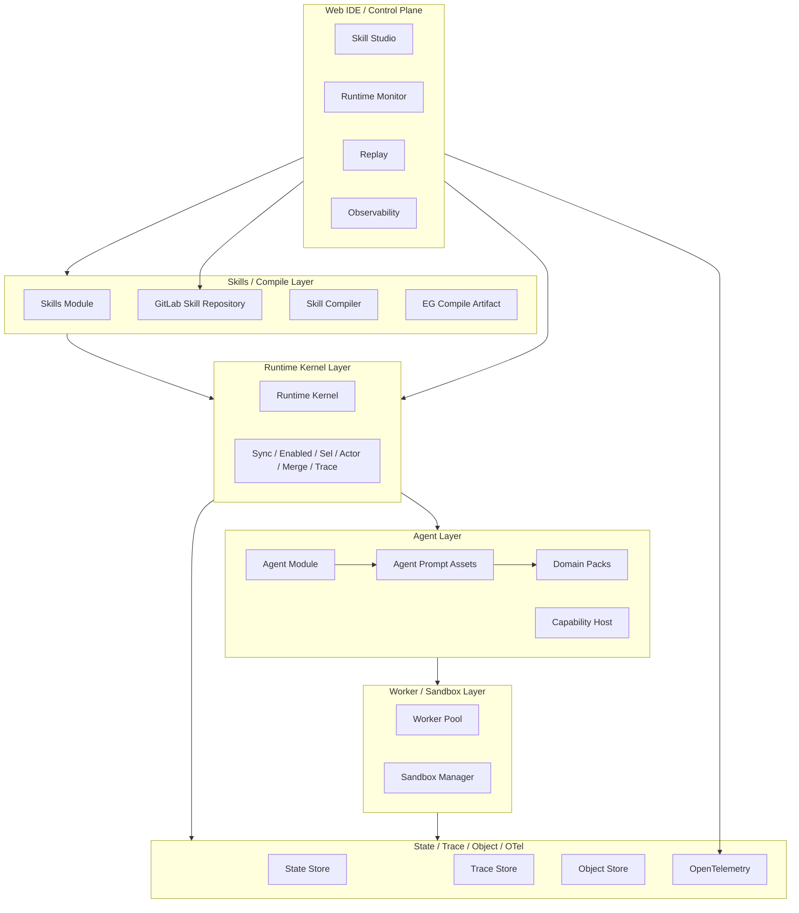

# PSOP 概要设计 v1

## 1. 文档定位

本文是 `PSOP` 的工程概要设计文档，目标是给出系统分层、模块边界与阶段性落地路径。

本文不替代：

- [PSOP Run Server外部项目调研与运行时架构建议.md](./PSOP%20Run%20Server%E5%A4%96%E9%83%A8%E9%A1%B9%E7%9B%AE%E8%B0%83%E7%A0%94%E4%B8%8E%E8%BF%90%E8%A1%8C%E6%97%B6%E6%9E%B6%E6%9E%84%E5%BB%BA%E8%AE%AE.md)
- [PSOP_execution_graph_formal_v5.md](./PSOP_execution_graph_formal_v5.md)
- [PSOP-Whitepaper-v3.md](./PSOP-Whitepaper-v3.md)

其中：

- `PSOP_execution_graph_formal_v5.md` 是 `EG` 的形式定义
- `Skills` 的编译产物必须符合这一定义
- `Runtime` 也必须围绕这一定义推进 `EG` 的执行

## 2. 当前阶段的对象边界

当前阶段必须明确三层对象：

1. `Skills`
   - 用户在 `Web IDE` 中定义、编辑、发布的对象
2. `EG`
   - `Skills` 发布后自动编译得到的形式化执行图
3. `Runtime`
   - 加载某个 `Skill` 对应 `EG` 并推进执行的宿主

因此：

- 用户定义的不是 `EG source`
- 用户定义的是 `Skills`
- `EG` 是编译对象，不是用户主编辑对象

## 3. 三阶段主线

### 3.1 运行前

- `Web IDE` 构建 `Skills`
- `Skills` 发布后自动编译出 `EG`
- 编译产物必须满足形式定义

### 3.2 运行时

- 用户通过 `Gateway` 发起某个 `Skill Invocation`
- server 加载该 `Skill` 对应的 `EG`
- `Runtime Kernel` 以 `Session Token` 为唯一正式状态推进执行

### 3.3 运行后

- `Web IDE` 可实时观测运行中的 `Skills`
- `Web IDE` 可查看已执行完成 `Skills` 的运行历史
- 观测基础是 `Trace / Replay / OpenTelemetry`

## 4. 设计目标与核心原则

### 4.1 设计目标

`PSOP v1` 当前阶段要先回答三个问题：

1. 如何让用户在 `Web IDE` 中稳定构建和发布 `Skills`
2. 如何把已发布 `Skills` 自动编译为符合形式定义的 `EG`
3. 如何让 `Runtime Kernel` 围绕该形式定义稳定推进执行与观测闭环

### 4.2 核心原则

1. `Skills` 是用户创作对象，`EG` 是编译对象
2. `Session Token` 是唯一正式状态对象
3. `Runtime Kernel` 是唯一状态主权者
4. `Lead Agent` 只做建议，不做正式状态提交
5. `Agent Prompt Assets` 按智能体职责和产品场景版本化管理，行业差异通过 `Domain Pack` 注入，不作为第一层模块边界
6. `Run != OS 进程`，执行层采用 `Run -> Worker -> Sandbox` 分层
7. `MCP` 是能力协议，不是状态协议
8. `OpenTelemetry + Trace/Replay` 统一承载运行时观测闭环

## 5. 总体架构

### 5.1 一句话定义

`PSOP v1` 应被定义为：

> 一个以 `Skills` 为用户创作对象、以 `PSOP-EG` 为编译后控制核、以 `Session Token` 为唯一正式状态、以 `Runtime Kernel` 为唯一状态主权者、以 `Gateway` 为 skill invocation 入口、以 `OpenTelemetry + Trace/Replay` 为观测闭环的 `Skill Runtime + Web IDE Control Plane`。

### 5.2 六层视图

## 6. 三块核心设计

### 6.1 运行时环境

`PSOP v1` 的运行时环境不是单个 agent 进程，而是一个分层的 `Agent Runtime`：

- `Run` 是逻辑事务实例，其本体是 `Session Token` 演化链
- `Runtime Kernel` 是正式执行器，负责推进符合形式定义的 `EG`
- `Worker Pool` 承载普通节点执行
- `Sandbox Manager` 按需为高风险节点提供隔离环境
- `State Store + Trace Store + Object Store` 负责恢复、回放与对象证据存储
- `Agent Module` 是 PSOP 的智能体能力层，负责 sub-agent、memory、planning 与 tool-use orchestration
- `Agent Prompt Assets` 是智能体提示词、输入模板、输出约束和测试样例的 repo-backed 版本化资产
- `Domain Packs` 是行业术语、流程模式、质量标准和安全边界的可选增强包，不改变正式 `Skill -> EG -> Runtime` 主链路
- `DeerFlow` 可以作为可借鉴或可复用的 harness 参考实现，但不是产品级模块边界，也不是正式状态主权者

### 6.2 Gateway / 输入输出模拟器

当前阶段 `Gateway` 同时承担两类职责：

1. `Skill Invocation` 入口
2. 输入输出模拟器

它包含三个子层：

- `Terminal Gateway`
  - 当前阶段承接文本、图像、语音、视频等输入输出模拟，供 `Web IDE` 驱动 skill 运行
- `MCP Gateway`
  - discovery、policy、allowlist、budget、结果归一化、调用审计
- `LLM Inference Gateway`
  - 模型路由、provider 抽象、结构化输出、tool calling 代理、配额与回退

### 6.3 WEB 端管理界面

`WEB` 端不是单页 IDE，而是 `Web IDE + Runtime Console` 的组合：

- `Skill Studio`
  - skill 创建、编辑、版本和发布
- `Publish & Diagnostics`
  - 查看发布结果、编译诊断和 artifact 信息
- `Runtime Monitor`
  - 查看运行中的 skills、终端输入输出和当前执行状态
- `Replay`
  - 回看已执行完成 skills 的 trace、token 快照和对象证据
- `Observability`
  - 查看 OTel traces、metrics、logs、异常拓扑与慢调用

## 7. 当前阶段方案与演进目标

### 7.1 当前阶段方案

- `Web IDE` 同时承担 Skill Studio 与运行观测控制台职责
- `Skills Module` 负责 skill 定义、GitLab 绑定、版本与发布；`Compiler` 只负责编译
- `GitLab` 是 `skill source` 的正式事实源
- Agent 提示词按 `skill_creation`、`skill_compilation`、`runtime_execution` 等职责分类保存；行业知识通过 `generic`、`industrial_inspection`、`equipment_maintenance` 等 `Domain Pack` 注入
- `Skills` 发布后自动编译出 `EG`
- `Runtime Kernel` 只加载 compile artifact，不直接解释 skill 源码
- `Gateway` 统一承接 invocation、模拟 I/O 和外部能力接入
- `OpenTelemetry` 在 v1 就接入，至少建立 `skill -> compile -> invocation -> run -> trace` 的关联链路

### 7.2 演进目标

- `Web IDE` 与 `Control Plane Console` 后续可拆分
- `Terminal Gateway` 从“模拟优先”过渡到“真实设备接入优先”
- `Inference Gateway` 逐步支持多模型、多 provider、配额和回退
- `Replay` 与 `Observability` 从基础检索升级到问题定位和性能分析工作台

## 8. 核心接口 / 类型

- `Skill Definition`
  - 用户在 Web IDE 中定义的 skill 对象
- `Skills Module`
  - 负责 skill 定义、版本、GitLab 绑定与发布
- `EG Compile Artifact`
  - 符合 `PSOP-EG` 形式定义的运行时输入对象
- `Agent Module`
  - 负责智能体相关的运行时组织与 harness 抽象
- `Agent Prompt Assets`
  - 按职责/场景版本化保存智能体提示词、模板、schema、示例和测试
- `Domain Pack`
  - 为 Skill 创建、编译和运行时 LLM 节点提供行业上下文增强，不拥有状态主权
- `Runtime Kernel`
  - 唯一正式执行与状态提交边界
- `Session Token`
  - 唯一正式状态快照对象
- `Terminal Gateway`
  - 统一 Web 模拟 I/O 与未来真实设备输入协议
- `MCP Gateway`
  - 统一 MCP server/tool 受控接入
- `LLM Inference Gateway`
  - 统一模型 provider、路由、回退与结构化输出

## 9. 典型闭环

一条典型主链路如下：

1. 用户在 `Web IDE` 中创建一个 `Skill`，并将其绑定到 GitLab 仓库
2. 用户发布某个 skill version 时，系统冻结对应 Git revision 并自动编译，生成符合形式定义的 `EG Compile Artifact`
3. 用户通过 `Gateway` 发起某次 `Skill Invocation`
4. `Runtime Kernel` 加载该 artifact 并创建 `Run + Session Token`
5. `Runtime Kernel` 推进 `EG` 执行，必要时调用 `MCP / LLM / Worker / Sandbox`
6. 所有执行结果都通过 `Merge` 回到 `Session Token`
7. `Trace Store + Replay + OTel` 提供运行中与运行后的统一观测

## 10. 小结

当前阶段的 PSOP，不是一个“用户直接画 EG 的系统”，而是一个“用户构建 Skills，系统自动编译为 EG，再由 Runtime 正式执行和观测”的系统。
