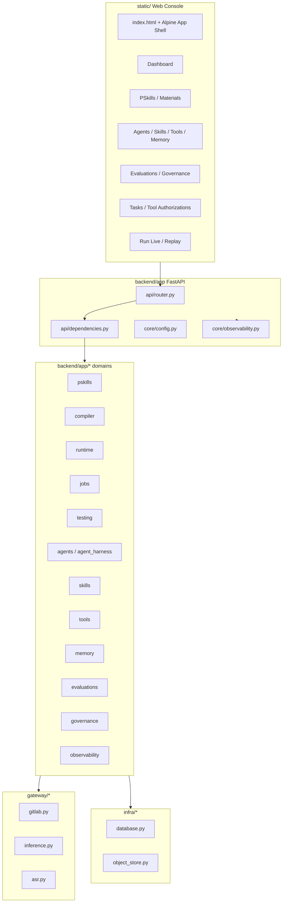

# PSOP 概要设计 v1

## 1. 文档定位

本文是 PSOP 当前代码实现的工程概要设计，用于描述系统已经落地的对象边界、模块分层和主链路。产品纲领、EG 形式定义和详细实现分别以以下文档为准：

- [PSOP-Whitepaper-v3.md](./PSOP-Whitepaper-v3.md)
- [PSOP_execution_graph_formal_v5.md](./PSOP_execution_graph_formal_v5.md)
- [PSOP前端详细设计v1.md](./PSOP前端详细设计v1.md)
- [PSOP服务端详细设计v1.md](./PSOP服务端详细设计v1.md)

本文按当前代码同构描述，不把尚未实现的 `MCP Gateway`、独立 `CapabilityHost`、独立 `Scheduler`、`SandboxManager`、租户/权限系统写成已落地模块。

## 2. 当前对象边界

当前代码中必须区分四层对象：

1. `PSkills`
   - 用户在 Web 控制台中创建、编辑、上传素材和发布的现实世界任务契约。
   - 用户源码事实源是 GitLab 项目；数据库保存 `pskill_definition`、`pskill_version`、`manifest_snapshot`、发布记录和索引。
2. `EG Compile Artifact`
   - PSkill 发布或手动编译后，由 `pskill.compiler` 生成并经服务端 formal-v5 校验的运行时输入。
   - 当前 artifact 保存在 `artifact_object.content_json`，并由 `eg_compile_artifact` 建索引。
3. `Skills`
   - Agent 能力包，来自 `skills/psop` 和 `skills/public`。
   - 数据库保存 `skill_package`、`skill_version`、`skill_resource`、`skill_activation`，并参与 Agent 可用工具交集计算。
4. `Runtime`
   - 通过 `skill_invocation` 创建 `run`、`terminal_session`、`session_token_snapshot`、`run_trace` 和 `run_event`。
   - `Session Token` 是正式状态对象，`RuntimeService` 是当前代码中的 Runtime Kernel 实现边界。

因此：

- 用户定义的是 `PSkills`，不是手写 `EG source`。
- 系统编译和执行的是 `EG Compile Artifact`，不是草稿中的 PSkill 源码。
- Agent 使用的是 `Skills` 能力包，不是用户定义的 PSkill。
- Gateway、WebSocket、前端和 worker 都不拥有正式运行时状态；它们只能创建请求、追加事件、唤醒或展示状态。

## 3. 当前阶段主线

### 3.1 运行前

- Web 控制台创建 PSkill，并通过 GitLab gateway 创建或更新 `README.md`、`SKILL.md`、`skill.yaml` 和仓库文件。
- 保存 PSkill 元数据或源码时同步更新 draft `pskill_version.manifest_snapshot`。
- Materials 上传和分析写入 `pskill_material`、`pskill_material_analysis`，并可通过 `pskill.builder` 生成可 review 的 draft patch。
- 发布 PSkill 时冻结当前 GitLab branch head，创建 published `pskill_version`、`pskill_publish_record`、`pskill_compile_request` 和 `runtime_job(job_type=pskill_compile)`。
- 编译 worker 读取冻结 commit 与 frozen manifest snapshot，调用 `pskill.compiler`，经 `formal_v5` validator 后生成 `eg_compile_artifact`。
- 发布前测试通过 `pskill_test` job、测试场景和 `pskill_publish_gate` 形成发布门禁证据。

### 3.2 运行时

- Gateway 通过 `POST /api/v1/gateway/invocations` 按 `skill_key` 解析已发布版本和 ready artifact。
- Runtime 创建 `skill_invocation`、`run`、`terminal_session`、默认 `run_capability_binding`、初始 `session_token_snapshot` 和 `runtime_job(job_type=runtime_step)`。
- 当前实现会在创建 invocation 后同步调用一次 `RuntimeService.process_run()`，同时仍保留 runtime job 作为后续推进和 worker 接管入口。
- Terminal 输入输出统一为 append-only `run_event`；多模态输入由服务端生成 `run_event_part`，二进制内容经对象存储并由 `artifact_object` 索引。
- Runtime 每轮从最新 snapshot 和 run event cursor 恢复，执行 `Sync -> Enabled -> Sel -> Actor -> Merge -> Trace`，写入新 snapshot 和 run trace。

### 3.3 运行后

- Replay 基于 `run`、`session_token_snapshot`、`run_trace`、`run_event`、`run_capability_binding` 重组 timeline。
- Evaluation 基于 replay/run facts 创建 `run_evaluation` 和 `run_evaluation_finding`，并由 `pskill.evaluator` 记录 AgentRun 证据。
- Governance 可从 finding 创建 `psop_improvement_proposal` 和实验记录，`psop.governance` 只生成提案，不直接上线变更。
- 高副作用工具调用通过 AgentRun 内 `agent_tool_authorization` 暂停和恢复；proposal review 属于治理业务状态，不属于 AgentRun 内 HITL。
- OpenTelemetry 通过 FastAPI、HTTPX、SQLAlchemy 和显式 span 记录编译、GitLab、LLM、job、runtime 关键链路。
- 任务页通过 `/api/v1/runtime/jobs` 和 `/api/v1/runtime/jobs/stats` 观察共享 `runtime_job` 队列。

## 4. 当前模块视图

## 5. 当前实现边界

### 5.1 后端

- Python 包根目录是 `backend/app`。
- `backend/app/app.py` 提供 FastAPI application factory、lifespan、CORS、异常处理、依赖注入对象和内置 worker 启动。
- `backend/app/api/routes/*` 按资源拆分路由：system、pskills、compiler、runtime、skill_tests、agent_prompts、agents、skills、tools、memory、evaluations、governance、observability、inference。
- `backend/app/*` 下的顶层领域包按业务边界分层，例如 `pskills`、`compiler`、`runtime`、`testing`、`jobs`、`agents`、`agent_harness`、`skills`、`tools`、`memory`、`evaluations`、`governance`、`observability`，每个主要领域拆成 `models.py`、`schemas.py`、`repository.py`、`service.py`。
- `backend/app/gateway/*` 封装外部 GitLab、OpenAI-compatible LLM、ASR 服务。
- `backend/app/infra/*` 封装 SQLAlchemy 数据库和 S3-compatible 对象存储。

### 5.2 前端

- 前端根目录是 `static/`，入口是 `static/index.html`。
- 运行时依赖本地加载：Alpine.js、bpmn-js、Material Symbols 字体、编译后的 Tailwind CSS。
- `static/js/app.js` 提供全局 helper、路由解析和初始状态；`static/js/app/*.js` 扩展 Alpine 组件方法。
- `static/pages/*.html` 是页面片段，由 App Shell 加载到固定容器中。
- 当前左侧一级菜单覆盖 `Dashboard`、`Skills`、`Prompt Packs`、`Agents`、`Agent Runs`、`Skill Packages`、`Tasks`、`Evaluations`、`Governance`、`Tool Authorizations`、`Tools`、`Memory`、`Observability`；编译、运行、测试和 Replay 通过 PSkill 详情、列表动作或深链进入。

### 5.3 任务系统

- 当前任务系统是数据库驱动的共享 `runtime_job` 表。
- 支持当前 job type：`material_analysis`、`pskill_build`、`pskill_compile`、`pskill_test`、`runtime_step`、`run_evaluation`、`governance_proposal`、`memory_compaction`、`skill_sync`；`compile`、`runtime`、`skill_test_timeline_driver` 仅作为兼容旧任务的 legacy alias。
- `RuntimeJobWorker` 在 FastAPI lifespan 中按配置启动，轮询并按顺序 claim job。
- Claim 使用 SQLAlchemy `with_for_update(skip_locked=True)`，依赖数据库行锁。
- Claim 前会恢复过期 lease；可重试任务回到 `pending` 并退避，耗尽 `max_attempts` 后进入 `dead_letter`。
- 当前没有独立 scheduler 进程；过期 lease 恢复由内置 worker 在轮询前执行，尚无独立 dead-letter 管理界面。

### 5.4 Runtime Kernel

当前 Runtime Kernel 落在 `RuntimeService` 内，已实现：

- `skill_invocation` 到 `run` 的创建。
- 默认 terminal input/output binding。
- 初始 Session Token 与后续 snapshot。
- run input 同步、wait checkpoint、evaluation decision 处理。
- LLM 节点经 `LlmInferenceGateway` 调用；有附件时走多模态 route。
- demo tool `psop.demo.inspect_input`。
- `run_event`、`run_event_part`、`run_trace` 和 Replay 构建。
- recoverable run turn failure 回到 `waiting_input` 的恢复逻辑。

未作为独立模块实现：

- `CapabilityHost`
- `MCPGateway`
- `SandboxManager`
- 设备注册和真实 IoT adapter

这些概念仍保留为架构方向，但当前代码中不应按独立模块引用。

## 6. 核心类型

- `PSkillDefinition`
  - PSkill 总对象和 GitLab 仓库绑定。
- `PSkillVersion`
  - draft 或 published 版本，保存 source ref、commit SHA、manifest snapshot 和 runtime policy snapshot。
- `PSkillPublishRecord`
  - 一次发布行为及其编译状态。
- `SkillCompileRequest`
  - 编译请求和 dedupe key。
- `EgCompileArtifact`
  - ready artifact 索引，正式运行输入。
- `ArtifactObject`
  - JSON artifact、素材、run event 媒体、测试资源等对象索引。
- `SkillInvocation`
  - Gateway 受控调用对象。
- `Run`
  - 一次逻辑运行实例，不等同 OS 进程。
- `SessionTokenSnapshot`
  - 正式状态快照链。
- `RunTrace`
  - Runtime 和 Gateway 可回放事件。
- `TerminalSession`
  - Run 的 I/O 会话。
- `RunEvent`
  - append-only 输入输出事件。
- `RunEventPart`
  - 一个输入事件内的 text/image/audio/video 单元。
- `RunCapabilityBinding`
  - 本次 run 的 terminal input/output 绑定。
- `RuntimeJob`
  - 共享数据库 job。
- `AgentDefinition / AgentVersion / AgentRun / AgentEvent`
  - 六智能体定义、版本、运行和事件事实。
- `SkillPackage / SkillVersion / SkillActivation`
  - Agent 能力包和激活事实。
- `ToolPolicy / AgentToolCall / AgentToolAuthorization`
  - 工具策略、工具调用和 AgentRun 内高副作用授权。
- `AgentMemoryEntry`
  - Agent 记忆条目；不作为 Runtime 正式状态源。
- `RunEvaluation / RunEvaluationFinding`
  - Run 质量评估和 finding。
- `GovernanceProposal / GovernanceExperiment`
  - 系统改进提案和实验状态。
- `SkillTestScenario / SkillTestScenarioRun / SkillTestExpectationEvaluation`
  - 黑盒时序测试与语义判断记录。
- `AgentPromptDefinition / AgentPromptVersion / AgentPromptBinding`
  - 平台级 Agent Prompt Pack 和 usage key 绑定。

## 7. 典型闭环

1. 用户在 `/admin/skills` 创建 PSkill。
2. 服务端创建 GitLab project，写入默认 `README.md`、`SKILL.md`、`skill.yaml`，并创建 draft `PSkillVersion`。
3. 用户编辑源码、仓库文件、素材或元数据。
4. 用户可通过 materials 生成 PSkill draft patch，经 review 后应用到 source。
5. 用户发布 PSkill，服务端冻结 commit，创建 published version 与 `pskill_compile` job。
6. Worker 处理 compile job，调用 `pskill.compiler`，生成 formal-v5 artifact。
7. 发布前测试和 publish gate 记录测试证据。
8. 用户从 PSkill 详情或 deep link 发起 invocation。
9. Runtime 创建 run、terminal session、binding、snapshot，并主动推进到输出或等待点。
10. 用户通过 Run Live 提交文本、图片、音频或视频；服务端追加 run event 和 parts。
11. Runtime 消费 run event，执行 LLM/evaluation/tool/terminal 节点，持续写 snapshot、run trace 和 run event output。
12. Run 结束后，Replay 页面读取持久化事实重组时间线。
13. `pskill.evaluator` 基于 run facts 生成 run evaluation 和 findings。
14. Finding 可由 `psop.governance` 转成治理提案；后续 review、测试、灰度、回滚是治理业务状态。

## 8. 当前未实现项

以下能力在设计中存在，但当前代码没有对应正式 API、表或独立模块：

- 租户、用户、权限、审批流。
- Alembic 迁移；当前 schema 创建依赖 `DatabaseManager.create_schema()`。
- 独立 scheduler、worker heartbeat、dead-letter 管理界面；当前内置 worker 已覆盖过期 lease 恢复和 dead_letter 终态。
- 独立 `MCPGateway`、MCP server/tool 表和 API。
- 独立 `CapabilityHost`、artifact 级 capability binding 表。
- 独立 sandbox lease 表和 Sandbox Manager。
- `/api/v1/replay/traces/{trace_id}`、`/api/v1/runtime/workers`、`/api/v1/runtime/sandboxes` 等规划接口。
- FastAPI 直接托管 `static/`；当前静态控制台由 `static/scripts/dev-server.cjs` 或其他静态宿主提供。
