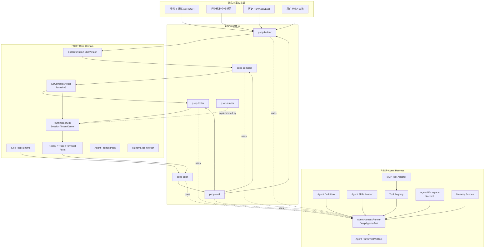
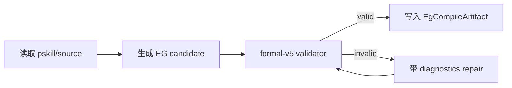
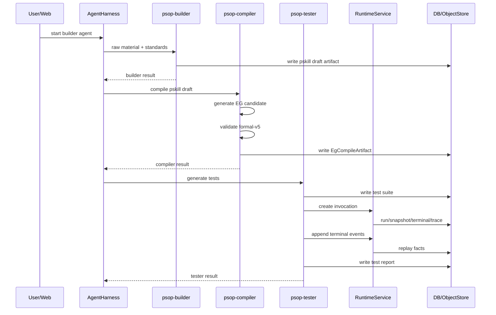
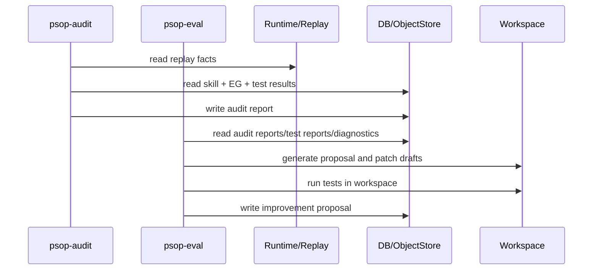

# PSOP 系统架构详细设计 v2

版本：v2  
状态：Agent Harness 架构基线  
适用范围：`issue-1-psop-mvp` 后续演进  
关联文档：`vision.md`、`PSOP_execution_graph_formal_v5.md`、`PSOP概要设计v1.md`、`PSOP服务端详细设计v1.md`

## 1. 文档定位

本文是在现有 PSOP MVP 架构基础上生成的系统架构详细设计。它不替代 formal-v5、Session Token、Runtime Kernel、terminal_event、trace_event、Replay 等既有抽象，而是在这些抽象之上加入 PSOP Agent Harness，实现 `Build -> Compile -> Test -> Run -> Audit -> Eval -> Improve` 的多智能体治理闭环。

本文的核心立场是：

1. `PSOP-EG` 仍是正式执行图。
2. `Session Token` 仍是真实运行实例的一等状态对象。
3. `RuntimeService` 仍是 `psop-runner-agent` 的正式治理环境。
4. `terminal_event` 仍是终端输入输出的 append-only 事实源。
5. `trace_event`、`session_token_snapshot`、`terminal_event`、`artifact_object` 仍是 Replay 和审计的事实基础。
6. 新增 Agent Harness 负责 builder、compiler、tester、audit、eval 等智能体的统一定义、运行、工具调用、skills、memory、MCP、workspace、事件与产物治理。

## 2. 当前基线摘要

当前 PSOP MVP 已经具备以下主链路：

```text
Skills -> Publish -> Auto Compile -> Invocation -> Runtime -> Replay / Observability
```

核心模块包括：

```text
backend/app/
  api/                  FastAPI routes 与依赖注入
  core/                 settings / logging / observability
  domain/skills/        Skill 元数据、源码、发布、素材
  domain/compiler/      formal-v5 编译请求、诊断、EG artifact
  domain/runtime/       invocation、run、Session Token、terminal、trace、replay
  domain/skill_tests/   黑盒时序测试、timeline driver、semantic judge
  domain/agent_prompts/ Prompt Pack 定义、版本与 binding
  domain/jobs/          DB-backed runtime_job worker
  gateway/              GitLab / LLM / ASR adapter
  infra/                SQLAlchemy / object store
```

当前 Runtime Kernel 关键事实：

- 创建 invocation 时生成 `skill_invocation`、`run`、`terminal_session`、默认 `run_capability_binding`、初始 `session_token_snapshot` 与 `runtime_job`。
- 每轮 runtime 从最新 snapshot 和 terminal cursor 恢复。
- Runtime 执行 `Sync -> Enabled -> Select -> Actor -> Merge -> Trace`。
- terminal 输入输出统一进入 `terminal_event`。
- 多模态输入由 `terminal_event_part` 与 `artifact_object` 表达。
- Replay 只基于持久化事实重组。

这些机制在新架构中保持不变。

## 3. 总体架构目标

PSOP v2 的系统目标是从“Skill 发布与运行 MVP”扩展为“多智能体治理平台”。

目标闭环：

```text
raw materials / standards / history
  -> psop-builder
  -> pskill draft
  -> psop-compiler
  -> PSOP-EG formal-v5
  -> psop-tester
  -> generated tests + runner executions
  -> psop-runner
  -> run facts / replay
  -> psop-audit
  -> quality attribution
  -> psop-eval
  -> improvement proposal
  -> builder / compiler / tester / runtime evolution
```

## 4. 架构总览



## 5. 设计原则

### 5.1 Runtime 状态主权不变

`psop-runner` 的正式运行状态仍由 `RuntimeService` 管理。DeepAgents / LangGraph 的 thread state 只能作为 Agent Harness 的内部执行状态，不能替代 `SessionTokenSnapshot`。

正式状态对象包括：

```text
Run
SessionTokenSnapshot
TraceEvent
TerminalSession
TerminalEvent
TerminalEventPart
RunCapabilityBinding
```

### 5.2 DeepAgents-first，但不暴露复杂 runner 分类

前期不在产品和代码层面暴露多个 runner 类型，例如 `LangGraphRunner`、`WorkflowRunner`、`DeepAgentRunner`。对业务服务只暴露一个：

```text
AgentHarnessRunner
```

内部默认使用 DeepAgents 创建智能体。LangGraph 作为 DeepAgents 或后续复杂 agent workflow 的内部能力，不作为顶层概念让业务模块选择。

保留两个 runner kind：

```text
deep_agent      # builder/compiler/tester/audit/eval 默认使用
psop_runtime    # runner 特殊实现，映射到 RuntimeService
```

### 5.3 Skills-first，Subagents-later

前期具体动作优先通过 tools 执行，专业方法优先通过 Agent Skills 加载。Subagents 只用于后续复杂并行、上下文隔离或长任务。

```text
Tools：执行动作。
Agent Skills：加载方法、模板、规则、领域知识。
Subagents：隔离复杂任务或并行分析。
```

### 5.4 dev_open 优先跑通闭环

早期默认采用 `dev_open` agent profile：

```text
shell: enabled
file_write: enabled
mcp_tools: enabled
approval: disabled
workspace_scope: agent_run_workspace
```

底线约束：

1. shell 与文件写入默认限制在 agent workspace。
2. 所有工具调用写入 `agent_event`。
3. 所有输出产物写入 `agent_artifact` 或 `artifact_object`。

后续再增加 `prod_guarded` profile。

### 5.5 LLM 调用优先保留 PSOP Gateway

生产链路中 LLM 调用应继续经过 `LlmInferenceGateway`。Agent Harness 使用 `PsopGatewayChatModel` 适配 DeepAgents / LangChain，避免模型调用绕过 PSOP 的配置、日志、usage、trace 和 redaction 机制。

## 6. 核心对象模型

### 6.1 PSOP Skill

`PSOP Skill` 是业务任务契约，对应当前系统中的：

```text
SkillDefinition
SkillVersion
SkillPublishRecord
SkillRawMaterial
SkillRawMaterialAnalysis
```

它描述现实作业目标、适用边界、步骤、证据、安全约束、异常恢复和完成标准。

### 6.2 pskill

`pskill` 是面向构建与编译的 Skill source 表示。它可以表现为 Git-backed source 文件、manifest snapshot、SKILL.md、README.md、skill.yaml 等组合。

`psop-builder` 生成 pskill draft，`psop-compiler` 消费 pskill 并生成 PSOP-EG。

### 6.3 PSOP-EG

`PSOP-EG` 是 formal-v5 Execution Graph，是 runner 的正式运行输入。

核心语义：

```text
nodes: 静态候选节点集合
guard: 基于 Session Token 判断 enabledness
actor: 节点执行者，例如 runtime.start / runtime.input / agent.llm / capability.tool / runtime.terminal
merge: 节点 observation 对 Session Token 的受控重写
halt: success / wait / aborted / failure 终止或停顿条件
```

### 6.4 Session Token

Session Token 是运行实例的一等状态对象。工程实现中对应 `session_token_snapshot.token_payload`。

典型结构：

```json
{
  "phase": "start",
  "input_envelope": {},
  "observations": {},
  "budgets": {"llm_calls": 0, "tool_calls": 0},
  "outputs": {},
  "control": {},
  "metadata": {"artifact_version": "...", "terminal_cursor": 0},
  "terminal": {"events": [], "latest_seq": 0},
  "facts": {},
  "registers": {},
  "memory": {},
  "trace": [],
  "status": "running"
}
```

Agent Harness 可以从 Session Token 构建 Prompt View，但不能直接取代它。

### 6.5 Agent Definition

Agent Definition 是 PSOP 智能体的声明式契约。

建议 YAML：

```yaml
agent_key: psop-builder
version: v1
runner_kind: deep_agent
purpose: Build PSOP skill drafts from raw materials and standards.
model:
  route_key: text
  multimodal_route_key: multimodal
profile: dev_open
skills:
  - builder/core/v1
  - safety/extraction/v1
tools:
  - workspace.read_file
  - workspace.write_file
  - workspace.shell
  - psop.raw_material.read
  - psop.standard.search
  - psop.skill.write_draft
mcp:
  enabled: true
  servers:
    - standards_registry
memory:
  read_scopes:
    - domain_pack
    - audit_lessons
  write_scopes:
    - builder_decision_history
input_schema_ref: psop-builder.input.v1
output_schema_ref: psop-builder.output.v1
```

### 6.6 Agent Skill

Agent Skill 是智能体可按需加载的专业能力包，不等同于 PSOP Skill。

典型内容：

```text
SKILL.md          技能说明、适用场景、步骤、注意事项
examples/         示例输入输出
schemas/          输出结构 schema
scripts/          可由工具调用的辅助脚本
templates/        prompt 或文档模板
references/       领域参考资料摘要
```

### 6.7 Agent Run / Event / Artifact

Agent Harness 新增一组智能体事实对象：

```text
AgentRun       一次智能体运行
AgentEvent     模型调用、工具调用、文件操作、MCP 调用、产物生成、错误等事件
AgentArtifact  智能体输入输出产物
AgentMemory    可选长期记忆项
```

这些对象不替代 Runtime 的 Run / Trace / Snapshot，而是补充 builder/compiler/tester/audit/eval 的执行事实。

## 7. 模块设计

建议新增：

```text
backend/app/agent_harness/
  __init__.py
  definitions.py
  runner.py
  deepagent_factory.py
  context.py
  events.py
  schemas.py

  models/
    psop_gateway_chat_model.py
    model_router.py

  skills/
    loader.py
    manifest.py

  tools/
    registry.py
    base.py
    workspace_tools.py
    shell_tool.py
    mcp_tools.py
    psop_runtime_tools.py
    psop_skill_tools.py
    psop_compiler_tools.py
    psop_test_tools.py

  memory/
    scopes.py
    store.py
    workspace_memory.py

  persistence/
    models.py
    repository.py
    service.py

  agents/
    builder/
      agent.yaml
      SKILL.md
    compiler/
      agent.yaml
      SKILL.md
    tester/
      agent.yaml
      SKILL.md
    audit/
      agent.yaml
      SKILL.md
    eval/
      agent.yaml
      SKILL.md
```

### 7.1 definitions.py

职责：定义 AgentDefinition、ToolBinding、SkillBinding、McpBinding、MemoryPolicy、AgentProfile。

核心类型：

```python
class AgentDefinition(BaseModel):
    agent_key: str
    version: str
    runner_kind: Literal["deep_agent", "psop_runtime"]
    purpose: str
    profile: str = "dev_open"
    model: AgentModelPolicy
    skills: list[str] = []
    tools: list[str] = []
    mcp: AgentMcpPolicy = AgentMcpPolicy()
    memory: AgentMemoryPolicy = AgentMemoryPolicy()
    input_schema_ref: str | None = None
    output_schema_ref: str | None = None
```

### 7.2 runner.py

职责：对业务层暴露统一智能体调用接口。

```python
class AgentHarnessRunner:
    def invoke(self, session: Session | None, request: AgentInvocation) -> AgentResult:
        ...
```

`AgentHarnessRunner` 内部：

1. 解析 AgentDefinition。
2. 创建 AgentRun。
3. 准备 workspace。
4. 加载 Agent Skills。
5. 解析 tools 与 MCP tools。
6. 创建 DeepAgent。
7. 执行 agent。
8. 记录 AgentEvent。
9. 写入 AgentArtifact。
10. 返回 AgentResult。

### 7.3 deepagent_factory.py

职责：封装 DeepAgents 创建逻辑。

伪代码：

```python
def create_psop_deep_agent(definition: AgentDefinition, context: AgentContext):
    model = PsopGatewayChatModel(
        inference_gateway=context.inference_gateway,
        route_key=definition.model.route_key,
    )
    tools = tool_registry.resolve(definition.tools, context)
    skills = skill_loader.load(definition.skills)
    system_prompt = render_system_prompt(definition, skills)

    return create_deep_agent(
        model=model,
        tools=tools,
        system_prompt=system_prompt,
    )
```

### 7.4 PsopGatewayChatModel

职责：把 `LlmInferenceGateway` 适配为 DeepAgents / LangChain 可用的 chat model。

约束：

- text route 调用 `complete()`。
- multimodal route 调用 `complete_multimodal()`。
- 将 provider、model、usage、request summary 写入 response metadata。
- 不绕过 PSOP LLM 配置。

### 7.5 Tool Registry

职责：管理 PSOP 内部工具、workspace 工具、shell 工具、MCP tools。

工具分层：

```text
workspace.*          文件读写、glob、grep、目录列表
shell.*              agent workspace 内 shell 执行
mcp.*                MCP adapter 导入工具
psop.raw_material.*  读取视频解析结果、关键帧、OCR、ASR
psop.skill.*         读写 pskill draft / Git-backed source
psop.compiler.*      formal-v5 validator、artifact writer
psop.runtime.*       create invocation、append terminal event、read replay
psop.test.*          创建测试场景、执行 timeline、读取 judge 结果
psop.audit.*         读取 replay facts、生成 attribution artifact
psop.eval.*          生成 proposal、patch draft、test plan
```

前期默认暴露 workspace、shell、MCP，但限制在 agent workspace，并记录事件。

### 7.6 Agent Skills Loader

职责：加载智能体能力包。

首版简单实现：

```text
backend/app/agent_harness/agents/{agent_key}/SKILL.md
backend/app/agent_harness/agent_skills/{skill_ref}/SKILL.md
```

后续再支持：

- frontmatter metadata。
- progressive disclosure。
- DB-backed Agent Skill version。
- security scanner。
- skill activation middleware。

### 7.7 Memory

首版不实现复杂长期记忆，只实现：

```text
workspace memory：agent run 内的文件和中间产物
artifact memory：从历史 audit/test/eval artifact 中读取摘要
```

后续扩展：

```text
semantic memory      行业标准、设备知识、企业规范
episodic memory      历史决策、历史失败、历史修复
procedural memory    prompt、rubric、compiler rule、testing strategy
```

## 8. 数据库设计

### 8.1 新增表

#### agent_run

| 字段 | 类型 | 说明 |
| --- | --- | --- |
| id | string | Agent Run ID |
| agent_key | string | 智能体 key |
| agent_version | string | 智能体版本 |
| runner_kind | string | deep_agent / psop_runtime |
| profile | string | dev_open / prod_guarded |
| status | string | pending / running / succeeded / failed / cancelled |
| parent_agent_run_id | string nullable | 父智能体运行 |
| related_skill_definition_id | string nullable | 关联 Skill |
| related_skill_version_id | string nullable | 关联 Skill Version |
| related_compile_request_id | string nullable | 关联 Compile Request |
| related_runtime_run_id | string nullable | 关联 Runtime Run |
| input_payload | json | 输入摘要 |
| output_payload | json | 输出摘要 |
| workspace_path | string | workspace 路径 |
| model_provider | string | 模型 provider |
| model_name | string | 模型名 |
| token_usage | json | token usage |
| error_message | text | 错误 |
| started_at | datetime | 开始时间 |
| finished_at | datetime | 结束时间 |
| created_at | datetime | 创建时间 |
| updated_at | datetime | 更新时间 |

#### agent_event

| 字段 | 类型 | 说明 |
| --- | --- | --- |
| id | string | Event ID |
| agent_run_id | string | Agent Run |
| seq_no | int | 递增序号 |
| event_type | string | agent.started / tool.started / tool.completed 等 |
| payload | json | 事件内容 |
| trace_event_id | string nullable | 可选映射到 runtime trace |
| occurred_at | datetime | 发生时间 |

#### agent_artifact

| 字段 | 类型 | 说明 |
| --- | --- | --- |
| id | string | Agent Artifact ID |
| agent_run_id | string | Agent Run |
| artifact_type | string | pskill_draft / eg_candidate / test_report / audit_report / proposal |
| artifact_object_id | string nullable | 对应 artifact_object |
| inline_content | json nullable | 小型 JSON 产物 |
| content_hash | string | 内容哈希 |
| provenance | json | 来源、输入、工具、事件引用 |
| status | string | draft / ready / superseded |
| created_at | datetime | 创建时间 |

#### agent_memory_item（后续）

| 字段 | 类型 | 说明 |
| --- | --- | --- |
| id | string | Memory ID |
| scope_type | string | domain / skill / agent / system |
| scope_id | string | scope 标识 |
| memory_kind | string | semantic / episodic / procedural |
| key | string | key |
| content | text/json | 内容 |
| metadata | json | 元数据 |
| source_artifact_id | string nullable | 来源 |
| status | string | active / archived |

### 8.2 与现有表关系

```text
agent_run.related_runtime_run_id -> run.id
agent_run.related_compile_request_id -> skill_compile_request.id
agent_artifact.artifact_object_id -> artifact_object.id
agent_event.trace_event_id -> trace_event.id
```

Agent 表是横向补充，不替代现有 domain 表。

## 9. 智能体详细设计

### 9.1 psop-builder

Runner：`deep_agent`

输入：

```json
{
  "skill_definition_id": "...",
  "raw_material_analysis_ids": ["..."],
  "keyframes": ["artifact_object_id"],
  "transcript": "...",
  "standard_refs": ["..."],
  "user_goal": "..."
}
```

工具：

```text
psop.raw_material.read
psop.raw_material.read_keyframes
psop.standard.search
psop.skill.read_draft
psop.skill.write_draft
workspace.read_file
workspace.write_file
workspace.shell
mcp.*
```

Agent Skills：

```text
builder/core/v1
builder/evidence_mapping/v1
builder/safety_constraints/v1
builder/pskill_schema/v1
```

输出：

```json
{
  "pskill_draft_artifact_id": "...",
  "evidence_map": [],
  "missing_questions": [],
  "safety_constraints": [],
  "applicability": {}
}
```

成功条件：写入 draft，不自动发布。

### 9.2 psop-compiler

Runner：`deep_agent`

首版实现策略：以 DeepAgent 生成 EG candidate，再通过 formal-v5 validator tool 做确定性校验。必要时允许一次 repair。

工具：

```text
psop.skill.read_source
psop.compiler.validate_formal_v5
psop.compiler.write_eg_artifact
workspace.write_file
workspace.shell
```

Agent Skills：

```text
compiler/formal_v5/v1
compiler/runtime_contract/v1
compiler/diagnostics/v1
```

流程：



输出：

```json
{
  "compile_request_id": "...",
  "eg_compile_artifact_id": "...",
  "diagnostics": [],
  "graph_summary": {},
  "capability_summary": {}
}
```

约束：

- validator 是硬门禁。
- 不允许生成 runner 不支持的 actor/tool/guard/merge。
- compile diagnostics 必须持久化。

### 9.3 psop-tester

Runner：`deep_agent`

目标：生成并执行最小测试闭环。

工具：

```text
psop.test.create_scenario
psop.test.write_timeline
psop.runtime.create_invocation
psop.runtime.append_terminal_event
psop.runtime.read_replay
psop.test.semantic_judge
workspace.write_file
workspace.shell
```

Agent Skills：

```text
tester/world_model/v1
tester/positive_negative_cases/v1
tester/terminal_timeline/v1
tester/coverage_report/v1
```

首版测试维度：

```text
positive case：正常证据充分，流程应完成。
negative case：缺少关键证据，应要求补充或 retry。
edge case：现场输入与适用边界不符，应 abort 或转人工。
```

输出：

```json
{
  "test_suite_artifact_id": "...",
  "scenario_run_ids": [],
  "coverage_summary": {},
  "failure_feedback": [],
  "recommendations": []
}
```

### 9.4 psop-runner

Runner：`psop_runtime`

实现：现有 `RuntimeService`。

输入：

```text
CreateInvocationRequest
EgCompileArtifact
TerminalEvent
TerminalEventPart
```

核心循环：

```text
load latest SessionTokenSnapshot
sync terminal events
evaluate guards
select node
execute actor
merge observation
append snapshot
append trace
emit terminal output if needed
halt / wait / continue
```

与 Agent Harness 的关系：

- `psop-tester` 通过工具调用 runner。
- `psop-audit` 读取 runner replay。
- `psop-runner` 内部 LLM 节点未来可以调用 Agent Harness，但正式状态仍由 RuntimeService 控制。

### 9.5 psop-audit

Runner：`deep_agent`

工具：

```text
psop.runtime.read_replay
psop.runtime.read_trace_events
psop.runtime.read_terminal_events
psop.compiler.read_artifact
psop.skill.read_source
workspace.write_file
```

Agent Skills：

```text
audit/timeline_analysis/v1
audit/quality_attribution/v1
audit/evidence_refs/v1
```

输出：

```json
{
  "audit_report_artifact_id": "...",
  "deviations": [],
  "quality_attribution": [],
  "evidence_refs": [],
  "confidence": 0.0
}
```

归因分类：

```text
skill_design_issue
compiler_issue
runner_issue
operator_issue
environment_issue
tool_or_integration_issue
model_behavior_issue
```

### 9.6 psop-eval

Runner：`deep_agent`

工具：

```text
psop.audit.read_reports
psop.test.read_reports
psop.agent_prompt.read_versions
psop.agent_prompt.write_draft
psop.skill.write_patch_draft
workspace.write_file
workspace.shell
mcp.github_or_gitlab.*
```

Agent Skills：

```text
eval/root_cause_synthesis/v1
eval/improvement_proposal/v1
eval/patch_generation/v1
eval/release_checklist/v1
```

输出：

```json
{
  "proposal_artifact_id": "...",
  "patch_artifact_ids": [],
  "test_plan": {},
  "release_checklist": [],
  "requires_human_review": true
}
```

约束：

- 首版 proposal-first。
- 可以生成 patch draft。
- 可以在 workspace 中运行测试。
- 不自动发布生产版本。

## 10. 关键运行链路

### 10.1 Build/Compile/Test 最小闭环



### 10.2 Audit/Eval 闭环



## 11. API 与服务集成

### 11.1 新增服务

```text
AgentHarnessService
AgentDefinitionService
AgentRunService
AgentArtifactService
```

### 11.2 新增依赖注入

在 `api/dependencies.py` 中新增：

```python
def get_agent_harness_service(request: Request) -> AgentHarnessService:
    return AgentHarnessService(
        settings=get_app_settings(request),
        inference_gateway=get_inference_gateway(request),
        object_store=get_object_store(request),
    )
```

### 11.3 路由建议

首版可只暴露内部/调试 API：

```text
POST /api/v1/agents/{agent_key}/runs
GET  /api/v1/agents/runs/{agent_run_id}
GET  /api/v1/agents/runs/{agent_run_id}/events
GET  /api/v1/agents/runs/{agent_run_id}/artifacts
```

后续再增加：

```text
GET  /api/v1/agents/definitions
POST /api/v1/agents/definitions/{agent_key}/versions
POST /api/v1/agents/{agent_key}/approve
```

## 12. Job 集成

现有 `runtime_job` 可先继续承载 agent 异步任务，新增 job_type：

```text
agent_builder
agent_compiler
agent_tester
agent_audit
agent_eval
```

或统一为：

```text
agent_run
```

推荐首版统一使用 `agent_run`，payload 中包含：

```json
{
  "agent_run_id": "...",
  "agent_key": "psop-builder"
}
```

后续如果调度优先级、队列隔离和指标差异明显，再拆 job_type。

## 13. Workspace 与工具执行

### 13.1 Workspace 目录

每次 AgentRun 创建独立 workspace：

```text
.data/agent-runs/{agent_run_id}/workspace/
```

目录结构：

```text
workspace/
  input/
  output/
  scratch/
  artifacts/
  logs/
```

### 13.2 文件写入规则

`dev_open` profile：

- 默认允许读写 workspace。
- 允许读取注入到 `input/` 的材料。
- 产物写入 `output/` 或 `artifacts/`。
- 禁止默认写项目根目录、`.env`、数据库文件、对象存储根路径。

### 13.3 Shell 规则

首版：

- shell cwd 固定为 workspace。
- stdout/stderr tail 写入 AgentEvent。
- 重要输出文件登记为 AgentArtifact。
- timeout 默认启用。

### 13.4 MCP Tools

首版：

- 读取配置中声明的 MCP server。
- 将 MCP tools 转为 Agent tools。
- 记录 tool descriptor snapshot。
- 调用结果写 AgentEvent。

后续：

- MCP trust registry。
- tool descriptor scanner。
- user approval。
- server capability allowlist。

## 14. 产物与事实流

### 14.1 Builder 产物

```text
pskill draft
raw material evidence map
missing questions
safety constraints
```

### 14.2 Compiler 产物

```text
EG candidate
formal-v5 validation diagnostics
EgCompileArtifact
capability summary
graph summary
```

### 14.3 Tester 产物

```text
test suite
positive/negative/edge scenario
terminal timeline
scenario run result
coverage report
failure feedback
```

### 14.4 Runner 产物

```text
Run
SessionTokenSnapshot
TraceEvent
TerminalEvent
TerminalEventPart
Replay detail
final output
```

### 14.5 Audit 产物

```text
audit report
deviation list
quality attribution
evidence refs
confidence
```

### 14.6 Eval 产物

```text
improvement proposal
prompt patch draft
skill patch draft
compiler rule proposal
test plan
code patch draft
release checklist
```

## 15. Observability 与 Replay

Agent Harness 需要与 PSOP 现有 observability 统一。

### 15.1 AgentEvent 类型

建议事件类型：

```text
agent.started
agent.completed
agent.failed
agent.model.requested
agent.model.completed
agent.model.failed
agent.tool.started
agent.tool.completed
agent.tool.failed
agent.file.read
agent.file.written
agent.shell.started
agent.shell.completed
agent.mcp.tool_started
agent.mcp.tool_completed
agent.artifact.created
agent.memory.read
agent.memory.written
```

### 15.2 与 Runtime Trace 的关系

- `agent_event` 记录智能体内部事实。
- `trace_event` 记录 runner/runtime 的正式执行事实。
- 当 tester 调用 runner、audit 读取 replay、eval 生成 proposal 时，通过相关字段关联。

### 15.3 Replay 视图扩展

后续 Replay 页面可以展示：

```text
Run timeline
Agent timeline
Tool timeline
Artifact lineage
Audit attribution
Eval proposal
```

## 16. 安全与治理演进

### 16.1 dev_open

用于 MVP 闭环。

```text
shell enabled
file write enabled
MCP enabled
approval disabled
workspace isolation enabled
event log required
```

### 16.2 prod_guarded

用于生产治理。

```text
shell disabled by default
file write scoped
MCP trust registry required
approval required for side effects
secret scanner enabled
tool allowlist required
release gate required
```

### 16.3 风险边界

必须明确：

- Agent 可以生成建议，不等于允许发布。
- Agent 可以写 draft，不等于允许覆盖正式 Skill。
- Agent 可以生成 patch，不等于允许 merge。
- Agent 可以调用 MCP，不等于信任 MCP tool 描述。
- Agent 可以运行 shell，不等于拥有项目根目录写权限。

## 17. 与现有模块的改造点

### 17.1 `domain/compiler`

当前 `SkillCompileAgent` 直接组装 prompt 并调用 `LlmInferenceGateway`。

改造后：

```text
CompilerService
  -> AgentHarnessService.invoke(agent_key="psop-compiler")
  -> DeepAgent generates EG candidate
  -> formal-v5 validator tool
  -> EgCompileArtifact
```

保留：

- `SkillCompileRequest`
- `CompileDiagnostic`
- `EgCompileArtifact`
- formal-v5 validator
- artifact_object 写入

### 17.2 `domain/runtime`

保留现有 RuntimeService。

新增工具封装：

```text
psop.runtime.create_invocation
psop.runtime.append_terminal_event
psop.runtime.read_replay
psop.runtime.list_trace_events
```

供 tester/audit 调用。

### 17.3 `domain/skill_tests`

保留现有 test scenario、timeline driver、semantic judge。

新增 tester agent：

- 生成场景。
- 调用现有 test service 或 runtime tools。
- 汇总 coverage。

### 17.4 `domain/agent_prompts`

保留 Prompt Pack 管理。

AgentDefinition 使用 Prompt Pack 作为 system prompt、template 或 skill 内容来源之一。

后续可把 Agent Definition 与 Prompt Pack binding 融合，但首版不强行重构。

### 17.5 `domain/jobs`

新增 `agent_run` job type 或 agent-specific job types。

Worker 创建 `AgentHarnessService`，处理 agent run。

## 18. Milestone 计划

### Milestone 1：Agent Harness MVP + Build/Compile/Test 闭环

范围：

```text
- backend/app/agent_harness/ 基础模块
- DeepAgents-based AgentHarnessRunner
- PsopGatewayChatModel
- AgentDefinition YAML loader
- AgentRun / AgentEvent / AgentArtifact 持久化
- Agent Skills loader
- workspace file tools
- shell tool
- MCP adapter MVP
- psop-builder MVP
- psop-compiler MVP
- psop-tester MVP
- 调用现有 psop-runner 执行测试
```

验收：

```text
raw material summary + standard snippets
  -> pskill draft
  -> PSOP-EG
  -> generated positive/negative tests
  -> runner execution
  -> tester feedback
```

### Milestone 2：Audit + Eval 闭环

范围：

```text
- psop-audit MVP
- audit report schema
- psop-eval MVP
- improvement proposal schema
- workspace patch draft
- 测试运行能力
```

验收：

```text
run replay/test report
  -> audit attribution
  -> eval improvement proposal
  -> prompt/skill/test/code patch draft
```

### Milestone 3：治理强化

范围：

```text
- prod_guarded profile
- MCP trust registry
- tool allowlist/denylist
- human approval
- sandbox hardening
- long-term memory
- release gate
- 自动 PR / staged release
```

## 19. 测试策略

### 19.1 单元测试

```text
AgentDefinition parser
Agent Skills loader
ToolRegistry
Workspace tools
Shell tool timeout
PsopGatewayChatModel
AgentEvent repository
```

### 19.2 集成测试

```text
builder produces pskill draft
compiler produces valid formal-v5 artifact
tester creates invocation and appends terminal events
runner replay is readable by audit
```

### 19.3 端到端测试

```text
raw_material_analysis fixture
  -> builder
  -> compiler
  -> tester
  -> runner
  -> test report
```

### 19.4 回归测试

现有 runtime、compiler、skill_tests、replay 测试必须继续通过。

## 20. 非目标

当前版本不实现：

- 完整租户权限系统。
- 生产级 MCP security scanner。
- 完整 human approval UI。
- 自动 merge / deploy。
- 大规模 subagent 编排。
- 用 DeepAgents 替换 RuntimeService。
- 将 Agent Skill 与 PSOP Skill 合并为同一对象。

## 21. 结论

PSOP v2 架构的核心是：

```text
保留 formal-v5 和 Session Token 作为执行治理骨架；
新增 DeepAgents-first 的 Agent Harness 作为构建、编译、测试、审计、评估的统一智能体底座；
优先跑通 Build/Compile/Test/Run 闭环，再逐步强化 Audit/Eval 和生产治理。
```

这一路径避免过早抽象过度，同时保证 PSOP 的根本边界不被破坏：真实现场执行仍然由 PSOP-EG、Session Token、RuntimeService 和持久化事实源主导。