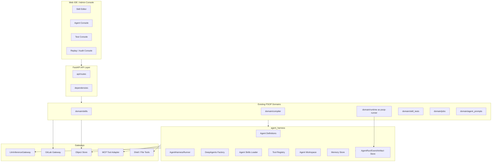
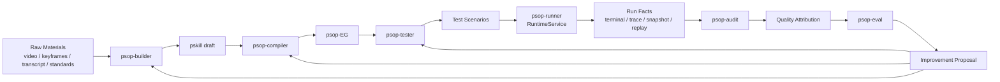
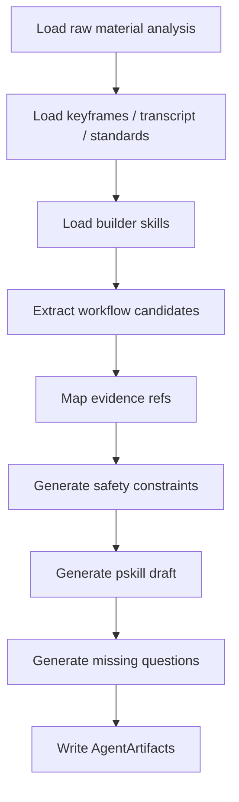
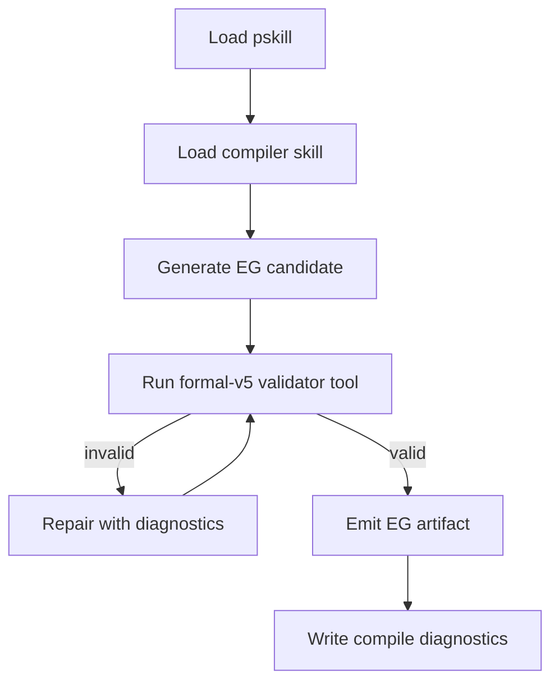
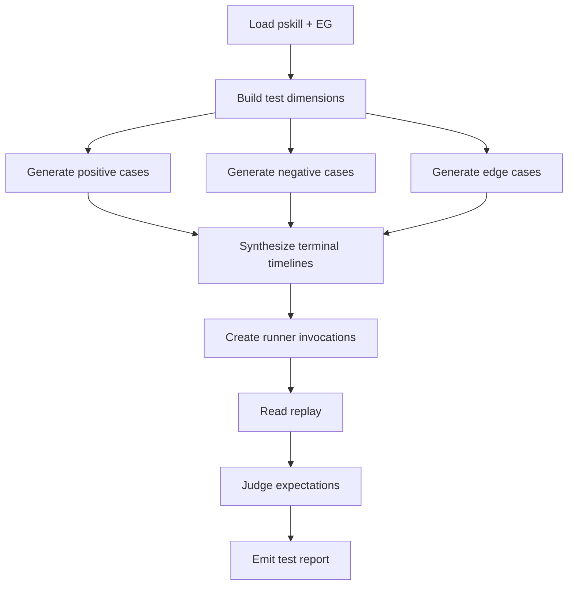
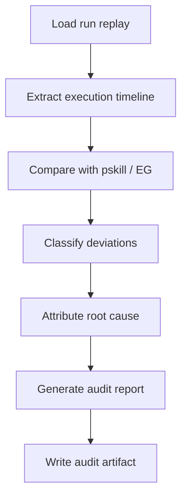
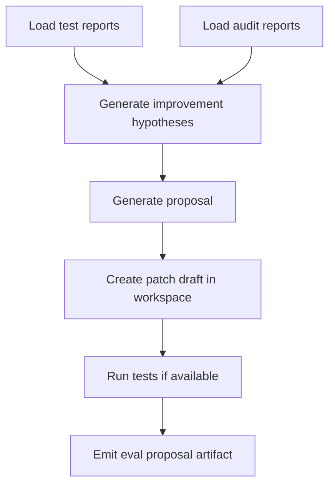

# PSOP 系统架构详细设计 v2

## 1. 文档定位

本文是 PSOP 下一阶段系统架构详细设计文档，基于当前 `issue-1-psop-mvp` 分支已经形成的 MVP 主链路进行扩展设计。

当前代码已经落地的主链路是：

```text
Skills -> Publish -> Auto Compile -> Invocation -> Runtime -> Replay / Observability
```

本文描述的目标架构是在该主链路之上引入统一的 `Agent Harness`，构建覆盖以下智能体的 PSOP 整体智能体治理框架：

```text
psop-builder
psop-compiler
psop-tester
psop-runner
psop-audit
psop-eval
```

本文不把尚未实现的能力写成已落地事实。凡是当前代码没有表、路由或模块的内容，均作为目标设计或里程碑规划描述。

## 2. 设计目标

PSOP 系统下一阶段的目标不是简单引入 LangGraph、DeepAgents 或 MCP，而是形成一个面向现实现场作业的受治理多智能体系统。

核心目标：

1. **统一智能体底座**：所有业务智能体都通过统一 Agent Harness 创建、运行、观测、持久化。
2. **跑通业务闭环**：优先打通 `builder -> compiler -> tester -> runner` 的最小闭环。
3. **保留 runtime 主权**：当前 RuntimeService 继续作为 `psop-runner` 的正式运行状态主权者。
4. **技能与工具复用**：memory、tools、MCP、agent skills、workspace、shell、file write 等公共能力由 harness 统一管理。
5. **事实化治理**：所有 agent run、tool call、artifact、测试反馈、审计归因都必须成为可追踪事实。
6. **渐进式安全治理**：前期采用 dev-open profile 快速跑通闭环，后续逐步强化 sandbox、policy、approval、release gate。

## 3. 总体架构

### 3.1 逻辑视图



### 3.2 智能体闭环视图



## 4. 关键架构决策

### 4.1 顶层只暴露一个通用 AgentHarnessRunner

前期不同时暴露 `LangGraphRunner`、`DeepAgentRunner`、`WorkflowRunner` 等多个 runner 概念。

统一对外抽象为：

```text
AgentHarnessRunner
```

内部默认使用 DeepAgents 构建 agent。LangGraph 作为 DeepAgents 的底层 runtime 能力保留，但不在第一阶段作为独立 runner 类型暴露。

第一阶段只保留两类 runner type：

```text
deep_agent
psop_runtime
```

- `deep_agent`：用于 builder、compiler、tester、audit、eval。
- `psop_runtime`：用于 runner，映射现有 RuntimeService。

### 4.2 psop-runner 不被 DeepAgent 取代

`psop-runner` 是当前 RuntimeService 的智能体化命名。它是 PSOP 真实现场执行的正式状态主权者。

正式状态仍由以下对象承载：

- `skill_invocation`
- `run`
- `terminal_session`
- `session_token_snapshot`
- `terminal_event`
- `terminal_event_part`
- `trace_event`
- `run_capability_binding`

DeepAgent 可以用于 runner 内部某些 LLM 节点或工具节点，但不能接管 run status、phase、wait checkpoint、terminal cursor、snapshot chain 和 replay 事实源。

### 4.3 skills-first，不做 subagents-first

PSOP 第一阶段的 agent composition 原则：

```text
tools 负责动作
skills 负责方法、模板、知识、规则
subagents 仅用于上下文隔离、并行推理和复杂长任务
```

因此第一阶段的 builder、compiler、tester 都优先采用主 agent + tools + skills。subagents 作为后续优化点，不作为 MVP 必要条件。

### 4.4 dev-open profile 默认暴露 shell / file write / MCP

为了快速跑通闭环，开发期默认配置为：

```text
PSOP_AGENT_PROFILE=dev_open
```

在该 profile 下：

- shell tool enabled。
- file read/write enabled。
- MCP tool adapter enabled。
- approval disabled。
- tool policy 简化为 workspace-scoped allow。

但仍需满足最低治理底线：

1. shell 与 file write 只允许在 agent workspace 内运行。
2. 所有 tool call 必须写入 AgentEvent。
3. 所有输出产物必须导入 AgentArtifact 或 ArtifactObject。

后续生产 profile 再逐步引入 approval、denylist、MCP trust registry、secret scanning、release gate。

### 4.5 LLM 调用仍经过 LlmInferenceGateway

即使引入 DeepAgents / LangChain，也不允许生产路径绕过 PSOP 的 `LlmInferenceGateway`。

Agent Harness 通过 `PsopGatewayChatModel` 适配 LangChain ChatModel 接口，内部仍调用：

```text
LlmInferenceGateway.complete()
LlmInferenceGateway.complete_multimodal()
```

这样可以保留当前 PSOP 的模型路由、配置、usage、provider/model 记录、redaction、observability 和错误处理边界。

## 5. 模块设计

### 5.1 新增目录结构

第一阶段建议新增：

```text
backend/app/agent_harness/
  __init__.py
  definitions.py
  runner.py
  deepagent_factory.py
  context.py
  events.py
  errors.py

  models/
    psop_gateway_chat_model.py

  tools/
    registry.py
    base.py
    file_tools.py
    shell_tool.py
    mcp_tools.py
    psop_runtime_tools.py
    psop_compiler_tools.py
    psop_test_tools.py

  skills/
    loader.py
    manifest.py
    package.py

  memory/
    workspace_memory.py
    interfaces.py

  persistence/
    models.py
    repository.py
    service.py

  agents/
    builder/
      agent.yaml
      SKILL.md
      prompts/
    compiler/
      agent.yaml
      SKILL.md
      prompts/
    tester/
      agent.yaml
      SKILL.md
      prompts/
    audit/
      agent.yaml
      SKILL.md
      prompts/
    eval/
      agent.yaml
      SKILL.md
      prompts/
```

后续阶段再按需新增：

```text
  guardrails/
  mcp_gateway/
  sandbox/
  approval/
  release/
  subagents/
```

### 5.2 AgentDefinition

`AgentDefinition` 是所有 PSOP 智能体的声明式定义。

建议 YAML 结构：

```yaml
agent_key: psop-builder
version: v1
runner_type: deep_agent
name: PSOP Builder
purpose: Build pskill drafts from raw materials and standards.
model_route: text
multimodal_route: multimodal
profile: dev_open

input_schema_ref: psop.builder.input.v1
output_schema_ref: psop.builder.output.v1

skills:
  - builder/core/v1
  - builder/evidence_mapping/v1
  - domain/generic/v1

tools:
  - workspace.read_file
  - workspace.write_file
  - shell.execute
  - psop.raw_material.read
  - psop.standard.search
  - psop.skill_draft.write

mcp_servers:
  - standards_registry
  - document_search

memory:
  read_scopes:
    - workspace
    - domain_pack
    - audit_lessons
  write_scopes:
    - builder_decisions

output_artifacts:
  - pskill_draft
  - evidence_map
  - missing_questions
```

第一阶段可先使用 repo-backed YAML 文件，不急于建立完整 AgentDefinition 管理 API。后续可增加 DB-backed definition/version/binding。

### 5.3 AgentContext

`AgentContext` 用于把智能体运行与 PSOP 现有事实对象关联。

建议字段：

```python
class AgentContext(BaseModel):
    agent_run_id: str | None = None
    parent_agent_run_id: str | None = None
    skill_definition_id: str | None = None
    skill_version_id: str | None = None
    compile_request_id: str | None = None
    compile_artifact_id: str | None = None
    runtime_run_id: str | None = None
    invocation_id: str | None = None
    terminal_session_id: str | None = None
    skill_test_scenario_id: str | None = None
    skill_test_scenario_run_id: str | None = None
    workspace_path: str | None = None
    profile: str = "dev_open"
```

### 5.4 AgentInvocation / AgentResult

```python
class AgentInvocation(BaseModel):
    agent_key: str
    input: dict[str, Any]
    context: AgentContext
    attachments: list[AgentAttachment] = []
    requested_tools: list[str] = []
    requested_skills: list[str] = []
    metadata: dict[str, Any] = {}

class AgentResult(BaseModel):
    agent_run_id: str
    status: Literal["succeeded", "failed", "cancelled"]
    output: dict[str, Any]
    artifacts: list[AgentArtifactRef]
    events: list[AgentEventRef]
    usage: dict[str, Any] = {}
    diagnostics: list[dict[str, Any]] = []
    error_message: str = ""
```

### 5.5 AgentHarnessRunner

`AgentHarnessRunner` 是统一入口。

职责：

1. 创建 AgentRun。
2. 创建 workspace。
3. 加载 AgentDefinition。
4. 加载 Agent Skills。
5. 解析 tools。
6. 构建 `PsopGatewayChatModel`。
7. 调用 DeepAgents。
8. 记录 AgentEvents。
9. 导入 AgentArtifacts。
10. 返回 AgentResult。

伪代码：

```python
class AgentHarnessRunner:
    def invoke(self, session: Session, invocation: AgentInvocation) -> AgentResult:
        definition = self.registry.load(invocation.agent_key)
        agent_run = self.persistence.create_run(session, definition, invocation)
        workspace = self.workspace_manager.prepare(agent_run, invocation)
        tools = self.tool_registry.resolve(definition.tools, workspace=workspace, context=invocation.context)
        skills = self.skills_loader.load(definition.skills)
        model = PsopGatewayChatModel(self.inference_gateway, route_key=definition.model_route)
        agent = self.deepagent_factory.create(definition, model=model, tools=tools, skills=skills)
        result = agent.invoke(self._build_agent_input(invocation, workspace))
        artifacts = self.artifact_importer.import_outputs(agent_run, workspace, result)
        self.persistence.finish_run(session, agent_run, result, artifacts)
        return self._build_result(agent_run, result, artifacts)
```

## 6. 持久化设计

### 6.1 新增表

第一阶段建议新增以下最小表：

```text
agent_run
agent_event
agent_artifact
```

### 6.2 agent_run

用途：记录一次智能体执行。

关键字段：

```text
id
agent_key
agent_version
runner_type
profile
status
parent_agent_run_id
related_skill_definition_id
related_skill_version_id
related_compile_request_id
related_compile_artifact_id
related_runtime_run_id
related_invocation_id
related_test_scenario_id
related_test_scenario_run_id
workspace_path
input_payload
output_summary
model_provider
model_name
usage
error_message
started_at
finished_at
created_at
updated_at
```

### 6.3 agent_event

用途：记录智能体执行过程中的可审计事件。

关键字段：

```text
id
agent_run_id
seq_no
event_type
payload
trace_event_id
occurred_at
created_at
```

建议事件类型：

```text
agent.started
agent.finished
agent.failed
agent.model.started
agent.model.completed
agent.tool.started
agent.tool.completed
agent.tool.failed
agent.artifact.created
agent.workspace.file_written
agent.mcp.tool_called
agent.diagnostic.created
```

### 6.4 agent_artifact

用途：记录智能体产生的产物。

关键字段：

```text
id
agent_run_id
artifact_type
artifact_object_id
path
media_type
content_hash
provenance
status
created_at
```

常见 artifact_type：

```text
pskill_draft
evidence_map
missing_questions
psop_eg_candidate
compile_diagnostics
test_scenario_suite
test_report
audit_report
eval_proposal
code_patch_draft
```

## 7. Tool 架构

### 7.1 ToolSpec

```python
class ToolSpec(BaseModel):
    name: str
    version: str = "v1"
    description: str
    input_schema: dict[str, Any]
    output_schema: dict[str, Any] | None = None
    backend: Literal["python", "psop_api", "mcp", "shell", "workspace"]
    risk_level: Literal["read", "write", "external", "code_execution"] = "read"
    workspace_scoped: bool = True
```

### 7.2 第一阶段默认工具

Workspace tools：

```text
workspace.read_file
workspace.write_file
workspace.edit_file
workspace.list_files
workspace.search_files
```

Shell tools：

```text
shell.execute
```

MCP tools：

```text
mcp.call_tool
mcp.list_tools
```

PSOP tools：

```text
psop.raw_material.read
psop.raw_material.list_assets
psop.standard.search
psop.skill_draft.write
psop.compiler.validate_formal_v5
psop.compiler.emit_artifact
psop.runner.create_invocation
psop.runner.append_terminal_event
psop.runner.read_replay
psop.tester.create_scenario
psop.tester.run_scenario
```

### 7.3 Tool 调用治理 MVP

第一阶段不做复杂审批，但必须做：

1. workspace path 限制。
2. stdout/stderr 截断。
3. timeout。
4. AgentEvent 记录。
5. tool output schema 基础校验。
6. 产物导入 AgentArtifact。

## 8. Agent Skills 架构

### 8.1 与 PSOP Skill 的区别

`PSOP Skill` 是现实作业契约，会被编译为 PSOP-EG。

`Agent Skill` 是给智能体使用的专业能力包，包含方法、模板、规则、示例、脚本和工具说明。

二者必须在命名和目录上区分。

### 8.2 Agent Skill 包结构

建议结构：

```text
backend/app/agent_harness/agent_skills/builder/evidence_mapping/v1/
  skill.yaml
  SKILL.md
  templates/
    pskill_step.md
    evidence_map.json
  examples/
    inspection_case.md
```

`skill.yaml` 示例：

```yaml
skill_key: builder/evidence_mapping
version: v1
title: Evidence Mapping for PSOP Builder
summary: Map video/keyframe/transcript facts to pskill workflow steps.
allowed_agents:
  - psop-builder
required_tools:
  - psop.raw_material.read
  - workspace.write_file
```

### 8.3 加载策略

第一阶段可以简单加载 agent definition 中声明的全部 skills。

后续阶段优化为 progressive disclosure：启动时只加载 metadata 和 summary，任务需要时再加载完整 `SKILL.md`、模板和示例。

## 9. Memory 架构

第一阶段不建设复杂长期记忆系统，只实现 workspace memory 和 artifact memory。

### 9.1 MVP memory

```text
workspace memory:
  每次 agent run 的本地文件、scratchpad、生成产物。

artifact memory:
  通过 AgentArtifact / ArtifactObject 记录的 pskill、EG、test report、audit report、eval proposal。
```

### 9.2 后续 memory 分层

后续扩展为：

```text
thread memory
semantic domain memory
episodic decision memory
procedural memory
```

其中：

- semantic domain memory：行业标准、设备知识、工艺规范。
- episodic decision memory：历史构建、编译、测试、审计的决策与失败经验。
- procedural memory：prompt、rubric、compiler rule、测试生成策略。

## 10. MCP 架构

### 10.1 第一阶段 MCP Tool Adapter

第一阶段不建设完整 MCPGateway，而是在 Agent Harness 内实现 MVP adapter：

```text
configured MCP server -> list tools -> expose selected tools -> call tool -> record AgentEvent
```

MCP 配置来源：

```text
.env / config / agent definition
```

### 10.2 后续 MCPGateway

生产化阶段再建设：

```text
MCP server registry
trusted manifest hash
tool descriptor snapshot
allowlist / denylist
credential isolation
semantic scanner
audit log
per-agent permission
```

## 11. Workspace 与 Shell 架构

### 11.1 Workspace 路径

每次 AgentRun 创建独立 workspace：

```text
.data/agent-runs/{agent_run_id}/workspace/
```

输入材料复制或导出到 workspace：

```text
input/
  raw_materials/
  keyframes/
  transcript.md
  standards/
```

输出产物写入：

```text
output/
  pskill/
  eg/
  tests/
  audit/
  eval/
```

### 11.2 Shell 限制

dev-open profile 下 shell 默认可用，但必须：

- 工作目录固定在 workspace。
- 禁止默认读取 `.env`。
- 设置 timeout。
- 限制输出长度。
- 记录 command、exit_code、stdout_tail、stderr_tail。

生产 profile 中 shell 需要 sandbox 和审批。

## 12. 各智能体详细流程

### 12.1 psop-builder 流程



输入：

```text
raw_material_ids
analysis_ids
standard_refs
skill_definition_id optional
user_goal
```

输出：

```text
pskill_draft
evidence_map
missing_questions
safety_constraints
builder_notes
```

### 12.2 psop-compiler 流程



第一阶段可以在 DeepAgent 内通过 tool 完成 validator 调用，不需要单独暴露 LangGraphRunner。

输入：

```text
pskill_draft artifact
skill_version_id optional
compile_request_id optional
```

输出：

```text
psop_eg_candidate
validated_psop_eg
compile_diagnostics
capability_summary
graph_summary
```

### 12.3 psop-tester 流程



输入：

```text
pskill_draft
psop_eg
world_model_profile
case_count
```

输出：

```text
test_scenario_suite
test_execution_results
semantic_judge_results
coverage_report
feedback_to_builder
feedback_to_compiler
```

### 12.4 psop-runner 流程

runner 继续使用当前 RuntimeService 流程：

```text
create invocation
create run
create terminal session
create initial session token snapshot
append terminal event
process run
write snapshots
write trace events
write terminal outputs
build replay
```

Agent Harness 与 runner 的关系：

- tester 可通过 tool 调用 runner 创建 invocation。
- audit 可读取 runner 的 replay facts。
- eval 可基于 runner/audit/test 的结果生成提案。
- runner 内部 LLM 节点后续可通过 Agent Harness 调用 specialized runtime node agent。

### 12.5 psop-audit 流程



输出 attribution categories：

```text
skill_design_issue
compile_issue
runner_issue
operator_issue
environment_issue
tool_or_integration_issue
model_output_issue
```

### 12.6 psop-eval 流程



第一阶段之后，eval 仍 proposal-first，不自动发布。

## 13. API 设计

第一阶段可以先以内聚 service + job 调用为主，不强制完整 UI/API。

建议预留 API：

```text
GET  /api/v1/agents/definitions
GET  /api/v1/agents/runs
GET  /api/v1/agents/runs/{agent_run_id}
GET  /api/v1/agents/runs/{agent_run_id}/events
GET  /api/v1/agents/runs/{agent_run_id}/artifacts
POST /api/v1/agents/runs
POST /api/v1/agents/build-compile-test
```

MVP 端到端 API：

```text
POST /api/v1/agents/build-compile-test
```

请求：

```json
{
  "raw_material_ids": ["..."],
  "standard_refs": ["..."],
  "user_goal": "...",
  "case_count": 4
}
```

响应：

```json
{
  "builder_run_id": "...",
  "compiler_run_id": "...",
  "tester_run_id": "...",
  "pskill_artifact_id": "...",
  "eg_artifact_id": "...",
  "test_report_artifact_id": "..."
}
```

## 14. 配置设计

建议新增配置项：

```text
PSOP_AGENT_PROFILE=dev_open
PSOP_AGENT_WORKSPACE_ROOT=.data/agent-runs
PSOP_AGENT_SHELL_ENABLED=true
PSOP_AGENT_FILE_WRITE_ENABLED=true
PSOP_AGENT_MCP_ENABLED=true
PSOP_AGENT_TOOL_TIMEOUT_SECONDS=120
PSOP_AGENT_MAX_STDOUT_CHARS=20000
PSOP_AGENT_MAX_STDERR_CHARS=20000
PSOP_AGENT_DEFAULT_MODEL_ROUTE=text
PSOP_AGENT_MULTIMODAL_MODEL_ROUTE=multimodal
```

后续生产 profile：

```text
PSOP_AGENT_PROFILE=prod_guarded
PSOP_AGENT_APPROVAL_ENABLED=true
PSOP_AGENT_SANDBOX_ENABLED=true
PSOP_AGENT_MCP_TRUST_REGISTRY_ENABLED=true
```

## 15. 与现有模块的集成

### 15.1 app.py / dependencies.py

新增：

```python
app.state.agent_harness = AgentHarnessService(...)
```

新增 dependency：

```python
def get_agent_harness(request: Request) -> AgentHarnessService:
    return request.app.state.agent_harness
```

### 15.2 CompilerService

当前编译智能体直接组装 prompt 并调用 `LlmInferenceGateway`。迁移后：

```text
CompilerService -> AgentHarness.invoke(agent_key="psop-compiler")
```

输出仍进入现有 compile diagnostics 和 EG artifact 写入流程。

### 15.3 SkillsService

builder 生成 pskill draft 后，可通过 SkillsService 写入 Git-backed draft source。

第一阶段也可以只产生 AgentArtifact，不自动写回 GitLab。是否写回由 `psop.skill_draft.write` tool 控制。

### 15.4 SkillTestService

tester 生成 scenario suite 后，优先复用现有 skill_tests 的 scenario、timeline driver、semantic judge 能力。

### 15.5 RuntimeService

runner 保持现有实现。新增 PSOP runtime tools 包装现有 RuntimeService 方法：

```text
psop.runner.create_invocation
psop.runner.append_terminal_event
psop.runner.read_replay
```

### 15.6 RuntimeJobWorker

新增 agent job type 可选：

```text
agent_run
build_compile_test
```

第一阶段也可以先由 API 同步触发，后续再纳入 runtime_job 队列。

## 16. 里程碑计划

### 16.1 Milestone 1：Agent Harness MVP + Build/Compile/Test closed loop

交付内容：

1. 引入 DeepAgents / LangChain / LangGraph 依赖。
2. 新增 agent_harness 基础模块。
3. 新增 AgentRun / AgentEvent / AgentArtifact。
4. 新增 AgentHarnessRunner。
5. 新增 PsopGatewayChatModel。
6. 新增 Agent Skills loader。
7. 新增 ToolRegistry。
8. 新增 workspace file tools、shell tool、MCP adapter MVP。
9. 实现 psop-builder MVP。
10. 实现 psop-compiler MVP。
11. 实现 psop-tester MVP。
12. 打通 runner invocation 执行测试。
13. 新增端到端测试或演示脚本。

验收标准：

```text
raw material analysis -> pskill draft -> psop-EG -> generated tests -> runner execution -> test report
```

### 16.2 Milestone 2：Audit/Eval closed loop

交付内容：

1. psop-audit。
2. audit report artifact。
3. quality attribution schema。
4. psop-eval。
5. eval proposal artifact。
6. workspace patch draft。
7. 基于 test/audit 的改进建议回流。

### 16.3 Milestone 3：Production governance

交付内容：

1. prod_guarded profile。
2. sandbox hardening。
3. MCP trust registry。
4. approval workflow。
5. long-term memory。
6. release gate。
7. eval PR automation。
8. agent observability dashboard。

## 17. 风险与控制

### 17.1 Runner 状态主权混乱

风险：DeepAgent 接管 runner 状态，破坏 PSOP Runtime 的正式状态链。

控制：runner 继续由 RuntimeService 管理；Agent Harness 只能通过 tool 调用 runner，不能直接写 run/snapshot/terminal 状态。

### 17.2 工具权限过大

风险：dev-open profile 暴露 shell/file/MCP，可能误改非 workspace 文件。

控制：第一阶段强制 workspace-scoped，所有 tool call 写 AgentEvent，后续引入 prod_guarded profile。

### 17.3 Agent Skill 与 PSOP Skill 混淆

风险：系统内两个 Skill 概念混用。

控制：代码中使用 `AgentSkill` / `agent_skills` 表达智能体能力包；业务 Skill 继续使用 `SkillDefinition` / `PSOP Skill`。

### 17.4 LLM 调用绕过 Gateway

风险：LangChain/DeepAgents 直接调用外部模型，绕过 PSOP gateway。

控制：生产路径统一使用 `PsopGatewayChatModel`，内部仍调用 `LlmInferenceGateway`。

### 17.5 过早治理导致闭环迟迟跑不通

风险：第一阶段把 policy、approval、sandbox、MCP trust、long-term memory 全部做复杂，拖慢业务验证。

控制：第一阶段采用 dev-open profile，只保留 workspace 限制和 event log 两个底线。

## 18. 非目标

第一阶段不做：

- 完整权限/租户系统。
- 完整 MCPGateway。
- 完整 approval UI。
- 自动生产发布。
- eval 自动 merge 代码。
- 多 subagents 编排平台。
- 完整 long-term memory。
- runner 状态机重写。

## 19. 开放问题

1. AgentDefinition 是否第一阶段只 repo-backed，还是直接 DB-backed？
2. builder 输出 pskill draft 是否自动写回 GitLab，还是先只作为 AgentArtifact？
3. tester 生成的 scenario suite 是否直接进入现有 skill_tests 表？
4. agent_run 是否复用 runtime_job 队列，还是独立 job type？
5. MCP server 配置是否从 `.env`、DB、YAML 三者之一读取？
6. psop-eval 的 code patch draft 是否在第一阶段之后接入 GitHub/GitLab PR？

## 20. 总结

PSOP 下一阶段架构应围绕统一 Agent Harness 展开，但不要过度复杂化。最优路径是：

```text
DeepAgents-first
skills-first
workspace-open-first
runner-state-sovereignty preserved
closed-loop-first
governance-later
```

先跑通：

```text
raw materials -> pskill -> psop-EG -> tests -> runner result -> feedback
```

再扩展：

```text
replay -> audit -> attribution -> eval -> proposal -> controlled improvement
```

这能在保持 PSOP Runtime 事实主权的同时，让 builder、compiler、tester、audit、eval 等智能体共享 memory、tools、MCP、agent skills、workspace 和 trace 体系，逐步形成面向真实现场作业的 AI Skill 操作系统。
