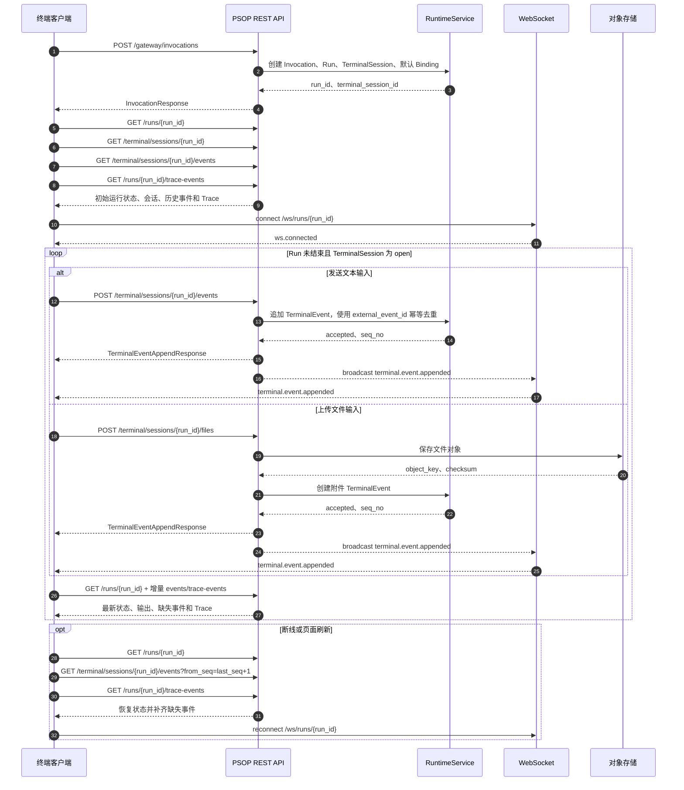

# 终端接入说明

本文档面向负责终端接入的开发者，说明外部终端或 Web 终端如何接入 PSOP Runtime，完成 Skill 发起、终端输入输出、文件上传、运行状态同步、断线恢复和幂等重试。

## 适用范围

当前接入目标是 PSOP 的 Terminal Gateway。终端侧负责提供用户输入、展示运行输出、上传多模态文件，并通过 REST 与 WebSocket 跟踪运行进度。

当前版本的终端能力以文本输入输出为核心，同时支持图片、音频、视频、PDF、JSON、普通文件作为运行时输入附件。复杂设备绑定、多终端协作、端侧权限认证属于后续扩展范围。

## 基础地址

REST API 默认前缀：

```text
http(s)://<psop-host>/api/v1
```

WebSocket 推荐地址：

```text
ws(s)://<psop-host>/ws/runs/{run_id}
```

说明：

- 当前服务也注册了 `/api/v1/ws/runs/{run_id}`，但前端实现使用根路径 `/ws/runs/{run_id}`。
- 本地开发环境常见地址为 `http://127.0.0.1:8001/api/v1`。
- 目前项目内未在这些接口上实现独立鉴权；生产接入时应放在统一网关、反向代理或上层认证体系之后。

## 核心对象

`Invocation` 表示一次 Skill 调用请求。创建 Invocation 后，系统会创建对应的 `Run` 和 `TerminalSession`。

`Run` 表示一次可执行的运行实例，包含运行状态、当前阶段、最新终端事件序号、最新 Trace 序号、等待原因、最终输出等信息。

`TerminalSession` 表示某个 Run 的终端会话。终端会话打开时可以继续追加输入；Run 成功、失败或取消后，终端会话会关闭。

`TerminalEvent` 表示终端输入或输出事件。客户端必须用服务端返回的 `seq_no` 作为事件顺序依据，不要使用客户端时间戳排序。

`TraceEvent` 表示 Runtime 内部执行轨迹，适合用于展示步骤、调试、回放和排障。

`RunCapabilityBinding` 表示运行时能力绑定。当前 MVP 会自动创建 `terminal.input` 与 `terminal.output` 两个默认绑定。

## 接入流程

整体时序：



1. 创建 Invocation，得到 `run_id` 与 `terminal_session_id`。
2. 读取 Run、TerminalSession、历史 TerminalEvent 和 TraceEvent。
3. 连接 WebSocket，订阅增量事件。
4. 用户发送文本时，调用终端事件追加接口。
5. 用户上传文件时，调用终端文件上传接口。
6. 通过 REST 定期或按需刷新 Run、TerminalEvent 和 TraceEvent。
7. 断线或刷新后，通过 REST 读取缺失事件，并用 `seq_no` 合并。
8. Run 进入 `succeeded`、`failed` 或 `cancelled` 后停止发送输入。

## 创建运行

接口：

```http
POST /api/v1/gateway/invocations
Content-Type: application/json
```

请求体：

```json
{
  "skill_key": "install-pc-host",
  "version_selector": "latest",
  "gateway_type": "terminal",
  "terminal_context": {
    "terminal_kind": "external",
    "device_id": "terminal-001",
    "operator": "field-engineer"
  },
  "input_envelope": {
    "user_input": "开始执行这次安装任务"
  },
  "binding_preferences": []
}
```

字段说明：

| 字段 | 必填 | 说明 |
| --- | --- | --- |
| `skill_key` | 是 | 要运行的 Skill key。 |
| `version_selector` | 否 | 当前默认使用 `latest`。 |
| `compile_artifact_id` | 否 | 指定已编译产物；不传时使用最新已发布版本的最新 ready 产物。 |
| `gateway_type` | 否 | Web 和终端接入均传 `terminal`。 |
| `terminal_context` | 否 | 终端类型、设备、连接来源等上下文。 |
| `input_envelope` | 否 | 初始输入。`user_input` 或 `text` 会被记录为初始终端输入。 |
| `binding_preferences` | 否 | 预留给自定义绑定策略。当前可传空数组。 |

成功响应示例：

```json
{
  "id": "invocation-id",
  "skill_definition_id": "skill-id",
  "skill_version_id": "version-id",
  "compile_artifact_id": "artifact-id",
  "gateway_type": "terminal",
  "input_envelope": {
    "user_input": "开始执行这次安装任务"
  },
  "terminal_context": {
    "terminal_kind": "external",
    "device_id": "terminal-001"
  },
  "binding_preferences": [],
  "status": "running",
  "run_id": "run-id",
  "terminal_session_id": "terminal-session-id",
  "created_at": "2026-05-25T00:00:00Z",
  "updated_at": "2026-05-25T00:00:00Z"
}
```

命令示例：

```bash
curl -sS -X POST "$PSOP_API_BASE/gateway/invocations" \
  -H "Content-Type: application/json" \
  -d '{
    "skill_key": "install-pc-host",
    "gateway_type": "terminal",
    "terminal_context": {
      "terminal_kind": "external",
      "device_id": "terminal-001"
    },
    "input_envelope": {
      "user_input": "开始执行这次安装任务"
    }
  }'
```

## 读取运行状态

读取 Run：

```http
GET /api/v1/runs/{run_id}
```

关键字段：

| 字段 | 说明 |
| --- | --- |
| `status` | 运行状态，常见值为 `queued`、`running`、`waiting_input`、`succeeded`、`failed`、`cancelled`。 |
| `runtime_phase` | Runtime 当前阶段。 |
| `latest_terminal_seq` | 最新终端事件序号。 |
| `latest_trace_seq` | 最新 Trace 事件序号。 |
| `terminal_session_id` | 当前终端会话 id。 |
| `current_step` | 当前步骤摘要。 |
| `wait_reason` | 等待用户输入时的原因。 |
| `expected_inputs` | 当前期望输入。 |
| `final_output` | 运行完成后的最终输出。 |
| `exit_reason` | 失败、取消或退出原因。 |

读取终端会话：

```http
GET /api/v1/terminal/sessions/{run_id}
```

响应包含：

```json
{
  "terminal_session": {
    "id": "terminal-session-id",
    "run_id": "run-id",
    "mode": "external",
    "status": "open",
    "opened_at": "2026-05-25T00:00:00Z",
    "closed_at": null,
    "created_at": "2026-05-25T00:00:00Z"
  },
  "transcript_summary": {
    "latest_seq": 3,
    "event_count": 3
  }
}
```

读取终端事件：

```http
GET /api/v1/terminal/sessions/{run_id}/events
GET /api/v1/terminal/sessions/{run_id}/events?from_seq=4
GET /api/v1/terminal/sessions/{run_id}/events?from_seq=4&to_seq=12
```

读取 Trace：

```http
GET /api/v1/runs/{run_id}/trace-events
GET /api/v1/runs/{run_id}/trace-events?event_type=runtime.failed
```

## 发送文本输入

接口：

```http
POST /api/v1/terminal/sessions/{run_id}/events
Content-Type: application/json
Idempotency-Key: <client-event-id>
```

请求体：

```json
{
  "direction": "input",
  "event_kind": "terminal.text.input.v1",
  "mime_type": "text/plain",
  "payload_inline": "我已经完成上一步，请继续。",
  "source": {
    "kind": "external_terminal",
    "device_id": "terminal-001",
    "connection_id": "ws-conn-001"
  },
  "external_event_id": "terminal-001-20260525-000001"
}
```

成功响应：

```json
{
  "accepted": true,
  "event_id": "terminal-event-id",
  "seq_no": 4,
  "event": {
    "id": "terminal-event-id",
    "terminal_session_id": "terminal-session-id",
    "run_id": "run-id",
    "direction": "input",
    "event_kind": "terminal.text.input.v1",
    "mime_type": "text/plain",
    "payload_inline": "我已经完成上一步，请继续。",
    "seq_no": 4,
    "external_event_id": "terminal-001-20260525-000001",
    "source_ref": {
      "kind": "external_terminal",
      "device_id": "terminal-001",
      "connection_id": "ws-conn-001"
    },
    "occurred_at": "2026-05-25T00:00:00Z",
    "created_at": "2026-05-25T00:00:00Z"
  }
}
```

规则：

- `direction` 当前只允许 `input` 或 `output`。终端客户端通常只主动发送 `input`。
- 文本输入推荐直接把字符串放入 `payload_inline`。
- 如果 `payload_inline` 是对象，Runtime 会依次读取 `user_input`、`text`、`value`、`content` 作为文本内容。
- 必须传 `external_event_id` 或 `Idempotency-Key`，用于重试去重。
- Run 已结束或 TerminalSession 已关闭时，服务端会拒绝继续追加输入。

命令示例：

```bash
curl -sS -X POST "$PSOP_API_BASE/terminal/sessions/$RUN_ID/events" \
  -H "Content-Type: application/json" \
  -H "Idempotency-Key: terminal-001-20260525-000001" \
  -d '{
    "direction": "input",
    "event_kind": "terminal.text.input.v1",
    "mime_type": "text/plain",
    "payload_inline": "我已经完成上一步，请继续。",
    "source": {
      "kind": "external_terminal",
      "device_id": "terminal-001",
      "connection_id": "cli-001"
    },
    "external_event_id": "terminal-001-20260525-000001"
  }'
```

## 上传文件输入

接口：

```http
POST /api/v1/terminal/sessions/{run_id}/files
Content-Type: multipart/form-data
Idempotency-Key: <client-event-id>
```

表单字段：

| 字段 | 必填 | 说明 |
| --- | --- | --- |
| `file` | 是 | 要上传的文件。 |
| `caption` | 否 | 文件说明，会写入终端事件 payload。 |

支持的 MIME 类型：

- `text/*`
- `image/*`
- `audio/*`
- `video/*`
- `application/json`
- `application/pdf`
- `application/octet-stream`

文件大小限制由服务端配置 `test_data_max_upload_bytes` 控制，默认值为 25 MiB。

文件上传后，服务端会保存对象存储记录，并自动追加一个终端输入事件。事件类型按 MIME 自动判断：

| MIME | event_kind |
| --- | --- |
| `image/*` | `terminal.image.input.v1` |
| `audio/*` | `terminal.audio.input.v1` |
| `video/*` | `terminal.video.input.v1` |
| 其他支持类型 | `terminal.file.input.v1` |

命令示例：

```bash
curl -sS -X POST "$PSOP_API_BASE/terminal/sessions/$RUN_ID/files" \
  -H "Idempotency-Key: terminal-001-file-000001" \
  -F "file=@/path/to/photo.jpg;type=image/jpeg" \
  -F "caption=现场安装照片"
```

上传事件的 `payload_inline` 示例：

```json
{
  "filename": "photo.jpg",
  "name": "photo.jpg",
  "description": "现场安装照片",
  "caption": "现场安装照片",
  "size_bytes": 123456,
  "checksum": "sha256:...",
  "object_key": "terminal-uploads/run-id/uuid-photo.jpg"
}
```

接入建议：

- 原始文件不要通过 `/events` 的 `payload_inline` 传输。
- 文件类输入统一走 `/files`，让服务端负责对象存储、校验和事件创建。
- 上传失败后可以使用同一个 `Idempotency-Key` 重试，服务端会避免重复创建终端事件。
- 当前上传接口会先写对象存储再追加终端事件；如果首次请求已经成功但响应丢失，重复请求可能产生未引用的重复对象，但不会产生重复终端消息。

## 订阅 WebSocket

连接地址：

```text
ws(s)://<psop-host>/ws/runs/{run_id}
```

连接成功后服务端会发送：

```json
{
  "event_type": "ws.connected",
  "run_id": "run-id",
  "invocation_id": null,
  "seq_no": 0,
  "occurred_at": null,
  "payload": {
    "message": "connected"
  }
}
```

通过 `/events` 或 `/files` 成功追加终端事件后，服务端会广播：

```json
{
  "event_type": "terminal.event.appended",
  "run_id": "run-id",
  "invocation_id": null,
  "seq_no": 4,
  "occurred_at": "2026-05-25T00:00:00Z",
  "payload": {
    "id": "terminal-event-id",
    "direction": "input",
    "event_kind": "terminal.text.input.v1",
    "mime_type": "text/plain",
    "payload_inline": "我已经完成上一步，请继续。",
    "seq_no": 4
  }
}
```

客户端处理规则：

- WebSocket 只作为增量提示通道，REST 仍然是状态恢复和完整数据读取的权威来源。
- 当前 WebSocket 主要覆盖终端 REST 接口追加的事件；Runtime 内部生成的输出、Trace 和状态变化需要通过 REST 刷新补齐。
- 收到事件后按 `payload.id` 去重，按 `payload.seq_no` 排序。
- 断线重连后，用本地最大 `seq_no + 1` 调用 `/terminal/sessions/{run_id}/events?from_seq=...` 补齐缺失事件。
- 客户端不需要向 WebSocket 发送业务消息；当前服务端只保持连接并推送服务端事件。

## 绑定能力

创建 Run 时服务端会自动创建默认绑定：

| requirement_key | capability | channel | 说明 |
| --- | --- | --- | --- |
| `terminal.input` | `terminal.text.input.v1` | `input` | 接收终端输入。 |
| `terminal.output` | `terminal.text.output.v1` | `output` | 输出终端内容。 |

读取绑定：

```http
GET /api/v1/runs/{run_id}/bindings
GET /api/v1/runs/{run_id}/binding-requirements
```

更新绑定：

```http
POST /api/v1/runs/{run_id}/bindings/resolve
Content-Type: application/json
```

请求体：

```json
{
  "bindings": [
    {
      "requirement_key": "terminal.input",
      "target_kind": "external_terminal",
      "target_ref": "terminal-001",
      "channel": "stdin"
    },
    {
      "requirement_key": "terminal.output",
      "target_kind": "external_terminal",
      "target_ref": "terminal-001",
      "channel": "stdout"
    }
  ]
}
```

当前普通终端接入可以不调用绑定更新接口。需要区分多设备、多通道或外部执行器时，再通过该接口声明目标终端。

## 运行状态与输入时机

常见 Run 状态：

| status | 说明 | 终端侧行为 |
| --- | --- | --- |
| `queued` | 已创建，等待处理。 | 展示等待状态，可以保持连接。 |
| `running` | Runtime 正在执行。 | 展示输出，不要假设必须等待输入。 |
| `waiting_input` | Runtime 等待用户输入。 | 可以提示用户按 `expected_inputs` 输入。 |
| `succeeded` | 运行成功。 | 停止输入，展示 `final_output`。 |
| `failed` | 运行失败。 | 停止输入，展示 `exit_reason` 和 Trace。 |
| `cancelled` | 运行取消。 | 停止输入。 |

终端侧可以在 Run 未结束且 TerminalSession 为 `open` 时发送输入。最佳体验是在 `waiting_input` 时突出输入框，在 `running` 时允许用户提前补充信息但降低视觉强调。

## 幂等与重试

终端侧必须为每个输入生成稳定的客户端事件 id，并同时放入：

- HTTP Header `Idempotency-Key`
- JSON 字段 `external_event_id`

推荐格式：

```text
<terminal-id>-<utc-date>-<monotonic-seq>
```

示例：

```text
terminal-001-20260525-000001
```

服务端会按 `run_id + external_event_id` 去重。网络超时后，客户端可使用同一个 id 重试；如果事件已经被服务端接受，会返回同一个已存在事件。

## 断线恢复

终端客户端应保存以下本地状态：

| 状态 | 用途 |
| --- | --- |
| `run_id` | 恢复当前运行。 |
| `terminal_session_id` | 展示会话状态。 |
| `latest_terminal_seq` | 拉取缺失终端事件。 |
| `latest_trace_seq` | 拉取或合并运行轨迹。 |
| 已发送但未确认的 `external_event_id` | 恢复乐观输入状态。 |

恢复流程：

1. 调用 `GET /api/v1/runs/{run_id}` 获取最新 Run。
2. 调用 `GET /api/v1/terminal/sessions/{run_id}` 获取会话状态。
3. 调用 `GET /api/v1/terminal/sessions/{run_id}/events?from_seq=<last_seq+1>` 补齐终端事件。
4. 调用 `GET /api/v1/runs/{run_id}/trace-events` 补齐 Trace。
5. 对本地未确认输入，用 `external_event_id` 在事件列表中查找；找到则标记为已确认，找不到则允许用户重试。
6. 重新连接 WebSocket。

## 错误处理

PSOP 业务错误通常返回：

```json
{
  "code": "skill_validation_error",
  "message": "Run 已结束，不能继续追加终端输入。",
  "details": {
    "run_id": "run-id",
    "status": "succeeded"
  }
}
```

常见错误：

| 场景 | 处理建议 |
| --- | --- |
| Skill 不存在、无发布版本、无 ready 编译产物 | 不创建终端会话，提示调用方检查 Skill 发布与编译状态。 |
| Run 已结束 | 停止输入，引导用户新建 Invocation。 |
| TerminalSession 已关闭 | 停止输入，刷新 Run 状态。 |
| `direction` 非法 | 客户端修正为 `input`。 |
| 缺少 `event_kind` 或 `mime_type` | 客户端按事件类型补齐。 |
| 文件过大 | 提示压缩或拆分文件，必要时调整服务端上传限制。 |
| MIME 不支持 | 转换文件格式或使用支持类型。 |
| WebSocket 断开 | 自动重连，并通过 REST 补齐事件。 |

## 事件展示建议

终端侧应至少支持以下展示：

| event_kind | 展示方式 |
| --- | --- |
| `terminal.text.input.v1` | 用户输入气泡或命令行输入。 |
| `terminal.text.output.v1` | Runtime 输出文本。 |
| `terminal.image.input.v1` | 文件名、缩略图或附件卡片。 |
| `terminal.audio.input.v1` | 文件名、大小、音频附件卡片。 |
| `terminal.video.input.v1` | 文件名、大小、视频附件卡片。 |
| `terminal.file.input.v1` | 通用附件卡片。 |

展示原则：

- 以服务端返回事件为准，乐观消息需要在确认后替换为真实事件。
- 按 `seq_no` 排序。
- 同一个事件 id 只展示一次。
- 输出、输入、附件、错误信息应有清晰区分。
- Run 失败时，同时展示 `exit_reason` 和 `runtime.failed` TraceEvent 的错误摘要。

## 最小接入清单

终端侧完成以下能力即可认为接入可用：

| 项目 | 验收标准 |
| --- | --- |
| 创建运行 | 能通过 `skill_key` 创建 Invocation，并进入对应 Run。 |
| 状态加载 | 能读取 Run、TerminalSession、TerminalEvent、TraceEvent。 |
| 文本输入 | 能发送 `terminal.text.input.v1`，并通过 `external_event_id` 确认服务端接收。 |
| 文件输入 | 能通过 `/files` 上传至少一种附件，并在事件流中展示。 |
| 实时推送 | 能连接 `/ws/runs/{run_id}` 并处理 `terminal.event.appended`。 |
| 断线恢复 | WebSocket 断开后能通过 REST 补齐缺失事件。 |
| 结束保护 | Run 结束或 Session 关闭后禁止继续输入。 |
| 幂等重试 | 网络超时后用相同事件 id 重试，不产生重复消息。 |
| 错误展示 | 能展示服务端 `message` 与关键 `details`。 |

## 相关代码位置

| 模块 | 说明 |
| --- | --- |
| `backend/app/api/routes/runtime.py` | Runtime、Gateway、Terminal、WebSocket API 路由。 |
| `backend/app/domain/runtime/schemas.py` | 请求与响应 schema。 |
| `backend/app/domain/runtime/service.py` | Invocation、Run、TerminalEvent、Binding 的核心业务逻辑。 |
| `static/js/app/runtime.js` | 当前 Web 终端接入实现，可作为客户端参考。 |
| `static/js/app.js` | API Base URL 与 WebSocket URL 解析逻辑。 |
