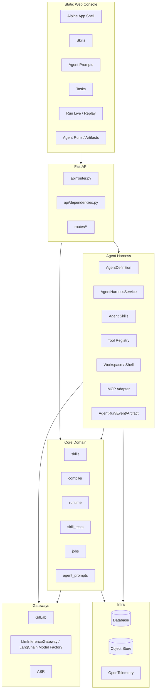

# PSOP 系统架构设计

版本：2026-06  
状态：项目架构基线  
适用范围：PSOP 后端、前端、Runtime、Agent Harness 与后续迭代

## 1. 文档边界

本文是 PSOP 的唯一系统架构设计基线，合并原概要设计、服务端详细设计、前端详细设计与 Agent Harness 设计。

本文负责定义：

- 当前已落地的系统边界。
- 核心对象与形式抽象。
- 后端、前端、Runtime、测试、任务、观测模块边界。
- Agent Harness 的目标架构和接入方式。
- 后续里程碑与迁移路径。

不在本文展开的专题：

- PSOP-EG 形式语义：见 `execution-graph-formal-v5.md`。
- 产品愿景与项目纲领：见 `../overview/vision.md`。
- Agent 协作规则：见 `../engineering/agent-rules.md`。

## 2. 架构总则

PSOP 采用确定性 Runtime 与受治理 Agent Harness 结合的架构。

核心约束：

1. `PSOP Skill` 是现实物理世界技能本体，不是 prompt。
2. `PSOP-EG` 是 formal-v5 执行图，是 runner 的正式输入。
3. `Session Token` 是真实运行实例的一等状态对象。
4. `RuntimeService` 是 `psop-runner-agent` 的正式治理环境。
5. `terminal_event` 是终端输入输出的 append-only 事实源。
6. `trace_event`、`session_token_snapshot`、`terminal_event`、`artifact_object` 是 Replay、Audit、Eval 的事实基础。
7. 既有 Runtime/Domain 服务可继续使用 `LlmInferenceGateway`；Agent Harness 使用 LangChain model factory 直接构造受治理模型。
8. Agent Harness 负责 builder、compiler、tester、audit、eval 的统一定义、运行、tools、MCP、Agent Skills、memory、sandbox、事件与产物治理。

## 3. 当前系统基线

当前代码主链路：

```text
Skills -> Publish -> Auto Compile -> Invocation -> Runtime -> Replay / Observability
```

已落地模块：

```text
backend/app/
  app.py                 FastAPI factory、lifespan、CORS、异常处理、OTel、worker 启动
  main.py                uvicorn 入口
  api/
    router.py            /api/v1 聚合路由
    dependencies.py      Settings/DB/Gateway/Service 注入
    routes/              system/skills/compiler/runtime/skill_tests/agent_prompts/inference
  core/
    config.py            PSOP_* 配置
    logging.py           日志与上下文
    observability.py     OTel 配置与 helper
  domain/
    skills/              Skill、Git-backed source、发布、素材、素材生成
    compiler/            编译请求、formal-v5 校验、EG artifact
    runtime/             Invocation、Run、Session Token、Terminal、Replay
    jobs/                DB-backed runtime_job 队列、worker、任务 read model
    skill_tests/         黑盒时序测试、timeline driver、semantic judge、fork
    agent_prompts/       Prompt Pack 定义、版本、binding
  gateway/
    gitlab.py            GitLab API adapter
    inference.py         OpenAI-compatible LLM adapter
    asr.py               ASR HTTP adapter
  infra/
    database.py          SQLAlchemy engine/session/Base
    object_store.py      S3-compatible object adapter
```

当前前端基线：

```text
static/
  index.html             Alpine App Shell
  css/                   Tailwind 编译产物与字体样式
  js/app.js              全局 helper、路由、初始状态
  js/app/*.js            页面域方法：skills、compiler、runtime、skill-test、tasks、agent-prompts
  pages/*.html           页面片段
  scripts/               CSS 构建与静态 dev server
```

当前前端一级菜单：

| 菜单 | 路由 | 对象 |
| --- | --- | --- |
| `Skills` | `/admin/skills` | Skill 生命周期 |
| `智能体` | `/admin/agent-prompts` | Prompt Pack 管理 |
| `任务` | `/admin/tasks` | Runtime jobs |

编译、运行、测试、Replay 通过 Skill 详情、列表动作或 deep link 进入。

## 4. 核心对象

### 4.1 PSOP Skill

`PSOP Skill` 是现实物理世界技能本体。它既包括用户正在编辑的草稿形态，也包括 Git-backed source、结构化 manifest snapshot、版本化发布记录和运行策略快照。

当前实现对象：

```text
SkillDefinition
SkillVersion
SkillPublishRecord
SkillRawMaterial
SkillRawMaterialAnalysis
SkillRawMaterialDerivedAsset
SkillRawMaterialGeneration
```

当前源码与结构化表达：

```text
README.md
SKILL.md
skill.yaml
manifest_snapshot
runtime_policy_snapshot
raw_material_analysis
```

职责：

- 管理 Skill 元数据。
- 管理 Git-backed source。
- 管理 draft / published 版本。
- 管理 manifest snapshot 与 runtime policy snapshot。
- 管理 raw material、分析结果与生成链路。
- 发布时冻结 source commit 并创建 compile request。

`psop-builder` 生成或更新 PSOP Skill draft。`psop-compiler` 消费 PSOP Skill 并生成 PSOP-EG。

### 4.2 PSOP-EG formal-v5

当前实现对象：

```text
SkillCompileRequest
CompileDiagnostic
ArtifactObject
EgCompileArtifact
```

PSOP-EG 是 formal-v5 执行图，负责定义：

```text
nodes
actors
guards
merge rules
halt conditions
runtime policies
capability summary
view graph summary
```

当前 MVP 支持：

| 类别 | 支持项 |
| --- | --- |
| node kind | `start`、`input`、`llm`、`tool`、`terminal` |
| actor | `runtime.start`、`runtime.input`、`agent.llm`、`capability.demo_tool`、`runtime.terminal` |
| tool | `psop.demo.inspect_input` |
| guard DSL | `always`、`phase_is`、`field_exists`、`field_equals`、`all`、`any`、`not` |
| merge DSL | `op=set` |

### 4.3 Runtime Run

当前实现对象：

```text
SkillInvocation
Run
TerminalSession
RunCapabilityBinding
SessionTokenSnapshot
TraceEvent
TerminalEvent
TerminalEventPart
```

一次 invocation 创建一个逻辑 run。run 不是 OS 进程，而是可持久化、可回放、可审计的执行实例。

### 4.4 Session Token

Session Token 是运行实例的正式状态对象。工程实现为 `session_token_snapshot.token_payload`。

典型字段：

```json
{
  "phase": "start",
  "input_envelope": {},
  "observations": {},
  "budgets": {"llm_calls": 0, "tool_calls": 0},
  "outputs": {},
  "control": {},
  "metadata": {"artifact_version": "...", "terminal_cursor": 0},
  "terminal": {"events": [], "latest_seq": 0},
  "facts": {},
  "registers": {},
  "memory": {},
  "trace": [],
  "status": "running"
}
```

RuntimeService 只能通过受控 merge 与 snapshot 追加推进 Session Token。

### 4.5 Terminal Facts

`terminal_event` 是终端输入输出的 append-only 事实源。

`terminal_event_part` 表示输入事件中的多模态 part，例如文本、图片、音频、视频或文件。非文本内容通过 `artifact_object` 关联对象存储。

### 4.6 Agent Harness Objects

新增对象：

| 对象 | 定义 |
| --- | --- |
| `AgentDefinition` | 智能体声明式定义。 |
| `AgentSkill` | 智能体按需加载的方法、模板、规则和脚本。 |
| `AgentRun` | 一次智能体运行。 |
| `AgentEvent` | 智能体内部事件。 |
| `AgentArtifact` | 智能体输入输出产物。 |
| `AgentMemoryItem` | 后续长期记忆项。 |

Agent Harness 对象不替代 Runtime 对象，而是补充 builder、compiler、tester、audit、eval 的事实链。

## 5. 总体架构



## 6. Runtime 架构

### 6.1 RuntimeService 职责

`RuntimeService` 是 `psop-runner-agent` 的治理环境。

职责：

- 创建 invocation、run、terminal session、默认 binding、初始 snapshot。
- 读取 compile artifact。
- 从最新 Session Token snapshot 恢复状态。
- 同步 terminal events。
- 计算 enabled nodes。
- 选择节点。
- 执行 actor。
- 合并 observation。
- 追加 snapshot 和 trace。
- 追加 terminal output。
- 处理 wait、success、aborted、failed、cancelled。
- 构建 replay detail。

### 6.2 Runtime Loop

```text
load latest snapshot
sync terminal events
evaluate enabled nodes
select node
execute actor
merge observation
apply terminal interaction
append snapshot
append trace
halt / wait / continue
```

### 6.3 Runner 与 Agent Harness 的关系

`psop-runner` 是特殊智能体：

```text
runner_kind: psop_runtime
implementation: RuntimeService
state_authority: SessionTokenSnapshot
```

LangChain Agent / LangGraph 不接管 runner 的正式状态。后续 Runtime 中的 LLM 节点可以通过 Agent Harness 执行，但输出仍以 observation 形式回到 RuntimeService merge。

## 7. Agent Harness 架构

### 7.1 目标

Agent Harness 为以下智能体提供统一底座：

```text
psop-builder
psop-compiler
psop-tester
psop-audit
psop-eval
```

顶层只暴露一个：

```text
AgentHarnessService
```

内部策略：

- LangChain `create_agent` first。
- LangGraph 作为 LangChain agent 底层能力，不作为业务层 runner 分类。
- Skills-first，Subagents-later。
- dev_open profile 优先跑通闭环。
- Runtime 等既有域服务可继续使用 `LlmInferenceGateway`；Agent Harness 使用 LangChain `BaseChatModel` factory。

### 7.2 模块目录

```text
backend/app/agent_harness/
  schemas.py
  service.py
  events.py
  errors.py

  runners/
    langchain_agent_executor.py

  models/
    factory.py
    scripted_chat_model.py

  middlewares/
    dangling_tool_call.py
    model_events.py
    token_usage.py
    tool_calls.py

  sandbox/
    base.py
    provider.py
    local.py

  skills/
    loader.py
    manifest.py

  tools/
    base.py
    registry.py
    workspace_tools.py
    mcp_tools.py
    psop_skill_tools.py
    psop_compiler_tools.py
    psop_runtime_tools.py
    psop_test_tools.py
    psop_audit_tools.py
    psop_eval_tools.py

  memory/
    scopes.py
    store.py
    workspace_memory.py

  persistence/
    models.py
    repository.py
    service.py

  agents/
    context.py
    factory.py
    registry.py
    builder/agent.py
    builder/prompt.py
    builder/agent.yaml
    compiler/agent.py
    compiler/prompt.py
    compiler/agent.yaml
    tester/agent.py
    tester/prompt.py
    tester/agent.yaml
    audit/agent.py
    audit/prompt.py
    audit/agent.yaml
    eval/agent.py
    eval/prompt.py
    eval/agent.yaml
```

Agent Skill 源统一放在仓库根目录 `skills/`。`backend/app/agent_harness/skills/` 只包含加载、解析和治理代码，不存放具体 Skill 内容。

### 7.3 AgentDefinition

`psop.builder` 的详细职责、工具、Agent Skills、输入输出、校验和审计约束见 [PSOP Builder Agent 详细设计](psop-builder-agent-design.md)。

```yaml
agent_key: psop.builder
version: v1
runner_kind: langchain_agent
factory: make_builder_agent
profile: dev_open
purpose: Build PSOP Skill draft candidates from raw materials and standards.
model:
  name: default
  thinking_enabled: false
skills:
  - psop-builder-core
  - psop-builder-evidence-mapping
  - psop-builder-quality-review
tools:
  - workspace.read_text
  - workspace.write_text
  - workspace.list
  - psop.builder.read_current_source
  - psop.builder.list_materials
  - psop.builder.read_material_analysis
  - psop.builder.list_reference_assets
  - psop.standard.search
  - psop.builder.submit_candidate
mcp:
  enabled: false
  servers: []
memory_scope: psop.builder
input_schema_ref: psop.builder.input.v1
output_schema_ref: psop.builder.output.v1
```

### 7.4 AgentHarnessService

调用流程：

```text
resolve AgentDefinition
create AgentRun
prepare sandbox
load Agent Skill metadata
call agent factory
resolve tools, middleware, model and prompt
create LangChain agent
invoke agent
record AgentEvents
persist AgentArtifacts
return AgentResult
```

### 7.5 Tool Registry

工具命名空间：

| 命名空间 | 职责 |
| --- | --- |
| `workspace.*` | sandbox 虚拟 workspace 文件读写、目录、grep、glob。 |
| `outputs.*` | sandbox 虚拟 outputs 产物写入与登记。 |
| `shell.*` | 后续可选能力；首版不开放 shell/bash。 |
| `mcp.*` | MCP tools adapter。 |
| `psop.raw_material.*` | 素材、关键帧、ASR/OCR、分析结果读取。 |
| `psop.skill.*` | PSOP Skill source / draft 读写。 |
| `psop.compiler.*` | formal-v5 validator、artifact writer、diagnostics。 |
| `psop.runtime.*` | invocation、terminal event、replay、trace 读取。 |
| `psop.test.*` | test scenario、timeline、judge、coverage。 |
| `psop.audit.*` | replay facts、quality attribution artifact。 |
| `psop.eval.*` | proposal、patch draft、test plan。 |

首版默认只开启 local sandbox 和内置工具，工具只暴露 `/mnt/psop/workspace`、`/mnt/psop/outputs` 虚拟路径；MCP 保留 skeleton，不默认连接真实 server；首版不开放 shell/bash。所有工具调用通过 middleware 记录 `agent_event`。

### 7.6 Agent Skills

Agent Skill 目录结构：

```text
skills/<skill-name>/
  SKILL.md
  schemas/
  templates/
  scripts/
  examples/
  references/
```

用途：

- 领域方法。
- 输出模板。
- 编译规则说明。
- 测试生成策略。
- 审计归因准则。
- Eval patch 策略。

Agent Skill 与 PSOP Skill 是不同对象。

### 7.7 Memory

首版：

- sandbox workspace memory：agent run 内文件和中间产物。
- artifact memory：历史 audit/test/eval artifact 摘要。

后续：

- semantic memory：行业标准、设备知识、企业规范。
- episodic memory：历史失败、历史决策、历史修复。
- procedural memory：prompt、rubric、compiler rule、testing strategy。

## 8. 智能体设计

| 智能体 | runner_kind | 输入 | 输出 | 首版工具 |
| --- | --- | --- | --- | --- |
| `psop-builder` | `langchain_agent` | raw material、keyframes、transcript、LightRAG standards、user goal | PSOP Skill draft candidate、evidence map、standard usage、missing questions、safety constraints | raw_material read、reference assets read、standard search、builder candidate、workspace |
| `psop-compiler` | `langchain_agent` | PSOP Skill、manifest、domain pack、allowed runtime | PSOP-EG、compile diagnostics、summary | skill read、formal-v5 validate、artifact write、workspace |
| `psop-tester` | `langchain_agent` | PSOP Skill、PSOP-EG、world model | test suite、scenario runs、coverage、feedback | test scenario、runtime invocation、terminal event、replay、judge |
| `psop-runner` | `psop_runtime` | invocation、PSOP-EG、terminal events | Run Package、Replay、final output | RuntimeService 内置 actor/tool |
| `psop-audit` | `langchain_agent` | replay、trace、terminal events、PSOP Skill、EG、test report | audit report、quality attribution、evidence refs | replay read、trace read、skill/EG read、workspace |
| `psop-eval` | `langchain_agent` | audit reports、test reports、diagnostics、prompt/code history | improvement proposal、patch draft、test plan、release checklist | audit/test read、prompt draft、skill patch、workspace、MCP skeleton |

## 9. 数据模型

### 9.1 现有核心表

| 领域 | 表 |
| --- | --- |
| Skills | `skill_definition`、`skill_version`、`skill_publish_record`、`skill_raw_material`、`skill_raw_material_analysis`、`skill_raw_material_derived_asset`、`skill_raw_material_generation` |
| Compiler | `skill_compile_request`、`compile_diagnostic`、`artifact_object`、`eg_compile_artifact` |
| Runtime | `skill_invocation`、`run`、`session_token_snapshot`、`trace_event`、`terminal_session`、`run_capability_binding`、`terminal_event`、`terminal_event_part` |
| Jobs | `runtime_job` |
| Skill Tests | `skill_test_scenario`、`skill_test_asset`、`skill_test_scenario_run`、`skill_test_expectation_evaluation` |
| Prompts | `agent_prompt_definition`、`agent_prompt_version`、`agent_prompt_binding` |

### 9.2 新增 Agent Harness 表

#### agent_run

| 字段 | 说明 |
| --- | --- |
| `id` | Agent Run ID |
| `agent_key` | 智能体 key |
| `agent_version` | 智能体版本 |
| `runner_kind` | `langchain_agent` / `psop_runtime` |
| `profile` | `dev_open` / `prod_guarded` |
| `status` | pending / running / succeeded / failed / cancelled |
| `parent_agent_run_id` | 父 Agent Run |
| `related_skill_definition_id` | 关联 Skill |
| `related_skill_version_id` | 关联 Skill Version |
| `related_compile_request_id` | 关联 Compile Request |
| `related_runtime_run_id` | 关联 Runtime Run |
| `input_payload` | 输入摘要 |
| `output_payload` | 输出摘要 |
| `sandbox_path` | sandbox 根路径 |
| `model_provider` | 模型 provider |
| `model_name` | 模型名 |
| `token_usage` | token usage |
| `error_message` | 错误 |
| `started_at` / `finished_at` | 运行时间 |

#### agent_event

| 字段 | 说明 |
| --- | --- |
| `id` | Event ID |
| `agent_run_id` | Agent Run |
| `seq_no` | 递增序号 |
| `event_type` | 事件类型 |
| `payload` | 事件内容 |
| `trace_event_id` | 可选映射到 Runtime trace |
| `occurred_at` | 发生时间 |

#### agent_artifact

| 字段 | 说明 |
| --- | --- |
| `id` | Artifact ID |
| `agent_run_id` | Agent Run |
| `artifact_type` | skill_draft / eg_candidate / test_report / audit_report / proposal 等 |
| `artifact_object_id` | 对应 artifact_object |
| `inline_content` | 小型 JSON 产物 |
| `content_hash` | 内容哈希 |
| `provenance` | 来源、输入、工具、事件引用 |
| `status` | draft / ready / superseded |

#### agent_memory_item（后续）

| 字段 | 说明 |
| --- | --- |
| `scope_type` | domain / skill / agent / system |
| `scope_id` | scope 标识 |
| `memory_kind` | semantic / episodic / procedural |
| `content` | 记忆内容 |
| `metadata` | 元数据 |
| `source_artifact_id` | 来源 artifact |
| `status` | active / archived |

## 10. API 架构

### 10.1 现有 API 分组

| 分组 | 路径前缀 | 职责 |
| --- | --- | --- |
| System | `/api/v1/system` | 服务信息与健康检查 |
| Skills | `/api/v1/skills` | Skill 生命周期、source、repository、raw materials、publish |
| Compiler | `/api/v1/compiler` | compile request、progress、artifact |
| Runtime Gateway | `/api/v1/gateway/invocations` | 创建 invocation |
| Runtime | `/api/v1/runs`、`/api/v1/terminal`、`/api/v1/replay` | run、snapshot、trace、terminal、replay |
| Skill Tests | `/api/v1/skills/{skill_id}/test-scenarios`、`/api/v1/skill-test-scenario-runs` | 测试场景和测试运行 |
| Agent Prompts | `/api/v1/agent-prompts`、`/api/v1/agent-prompt-bindings` | Prompt Pack 管理 |
| Inference | `/api/v1/gateway/inference/models` | 模型能力 |
| Jobs | `/api/v1/runtime/jobs` | runtime_job read model |

### 10.2 新增 Agent API

首版：

```text
POST /api/v1/agents/{agent_key}/runs
GET  /api/v1/agents/runs/{agent_run_id}
GET  /api/v1/agents/runs/{agent_run_id}/events
GET  /api/v1/agents/runs/{agent_run_id}/artifacts
```

后续：

```text
GET  /api/v1/agents/definitions
GET  /api/v1/agents/definitions/{agent_key}
POST /api/v1/agents/definitions/{agent_key}/versions
POST /api/v1/agents/runs/{agent_run_id}/cancel
POST /api/v1/agents/approvals/{approval_id}/approve
```

## 11. Job 与执行调度

当前系统使用 `runtime_job` 表作为 DB-backed 任务队列。

现有 job type：

```text
compile
runtime
skill_test_timeline_driver
raw_material_analysis
skill_raw_material_generation
```

新增首版 job type：

```text
agent_run
```

payload：

```json
{
  "agent_run_id": "...",
  "agent_key": "psop-builder"
}
```

后续如需要队列隔离，再拆分：

```text
agent_builder
agent_compiler
agent_tester
agent_audit
agent_eval
```

## 12. Sandbox 与工具执行

每个 AgentRun 创建独立 local sandbox：

```text
.psop/agent-runs/{agent_run_id}/
```

目录：

```text
input.json
output.json
events.jsonl
memory.json
workspace/
outputs/
```

`dev_open` 规则：

- 默认允许工具读写 `/mnt/psop/workspace` 与 `/mnt/psop/outputs` 对应的 sandbox 内目录。
- 首版 local sandbox 不是安全隔离边界，不开放 shell/bash。
- 输入材料通过 `input.json` 或后续 provider 挂载进入 sandbox。
- 输出产物写入 `workspace/` 或 `outputs/`。
- 禁止默认写项目根目录、`.env`、数据库文件、对象存储根路径。
- 禁止 host 绝对路径、`..` 和越界 symlink。
- 重要输出登记为 `agent_artifact`。

## 13. Observability 与 Replay

### 13.1 Runtime 事件

Runtime 事件继续写入：

```text
trace_event
terminal_event
session_token_snapshot
```

### 13.2 Agent 事件

建议事件类型：

```text
agent.started
agent.completed
agent.failed
agent.model.requested
agent.model.completed
agent.model.failed
agent.tool.started
agent.tool.completed
agent.tool.failed
agent.file.read
agent.file.written
agent.shell.started
agent.shell.completed
agent.mcp.tool_started
agent.mcp.tool_completed
agent.artifact.created
agent.memory.read
agent.memory.written
```

### 13.3 Replay 扩展

后续 Replay 可以展示：

```text
Run timeline
Agent timeline
Tool timeline
Artifact lineage
Audit attribution
Eval proposal
```

## 14. 前端演进

当前前端保持静态 Alpine 控制台。

新增 Agent Harness 后，前端应增加：

| 页面 | 说明 |
| --- | --- |
| Agent Runs | 查看 AgentRun 列表、状态、输入输出摘要。 |
| Agent Run Detail | 查看 AgentEvent timeline、sandbox artifact、错误信息。 |
| Build Workspace | 触发 builder，查看 PSOP Skill draft、evidence map、missing questions。 |
| Test Feedback | 查看 tester 生成的测试、执行结果和覆盖度。 |
| Audit Reports | 查看质量归因。 |
| Eval Proposals | 查看改进提案和 patch draft。 |

首版可复用现有 `任务` 和 Skill 详情页，不强制新增完整一级导航。

## 15. Milestone 计划

### Milestone 1：Agent Harness MVP + Build/Compile/Test 闭环

范围：

- `backend/app/agent_harness/` 基础模块。
- LangChain `create_agent` based agent factory and executor。
- LangChain model factory。
- AgentDefinition YAML loader。
- AgentRun / AgentEvent / AgentArtifact 持久化。
- Agent Skills loader。
- sandbox file tools。
- MCP adapter skeleton。
- `psop-builder` MVP。
- `psop-compiler` MVP。
- `psop-tester` MVP。
- 调用现有 `psop-runner` 执行测试。

验收链路：

```text
raw material summary + standard snippets
  -> PSOP Skill draft
  -> PSOP-EG
  -> generated positive/negative tests
  -> runner execution
  -> tester feedback
```

### Milestone 2：Audit + Eval 闭环

范围：

- `psop-audit` MVP。
- audit report schema。
- `psop-eval` MVP。
- improvement proposal schema。
- sandbox patch draft。
- 测试运行能力。

验收链路：

```text
run replay/test report
  -> audit attribution
  -> eval improvement proposal
  -> prompt/skill/test/code patch draft
```

### Milestone 3：生产治理强化

范围：

- `prod_guarded` profile。
- MCP trust registry。
- tool allowlist / denylist。
- human approval。
- sandbox hardening。
- long-term memory。
- release gate。
- 自动 PR / staged release。

## 16. 迁移策略

### 16.1 文档迁移

项目文档结构以 `docs/README.md` 为准；本文只维护系统架构基线，不再重复定义文档目录治理规则。

### 16.2 代码迁移

优先顺序：

1. 新增 Agent Harness 基础模块。
2. 接入 AgentRun / AgentEvent / AgentArtifact。
3. 新增 sandbox file tools 与 MCP adapter skeleton。
4. 迁移 compiler 到 `psop-compiler` agent，保留 formal-v5 validator 和现有 artifact 写入。
5. 实现 builder。
6. 实现 tester，并调用现有 RuntimeService 执行测试。
7. 实现 audit。
8. 实现 eval。
9. 强化 production governance。

## 17. 非目标

当前阶段不实现：

- 完整租户、用户、权限、审批流。
- 生产级 MCP security scanner。
- 自动 merge / deploy。
- 大规模 subagent 自治协作。
- 用 Agent Harness 替换 RuntimeService。
- 将 Agent Skill 与 PSOP Skill 合并为同一对象。

## 18. 架构结论

PSOP 的系统架构基线是：

```text
formal-v5 PSOP-EG + Session Token Runtime + Agent Harness Governance
```

其中：

- PSOP-EG 提供确定性执行骨架。
- Session Token Runtime 提供真实运行状态主权。
- Agent Harness 提供构建、编译、测试、审计、评估和改进的统一智能体底座。

后续工程迭代必须保持这三层边界清晰。
