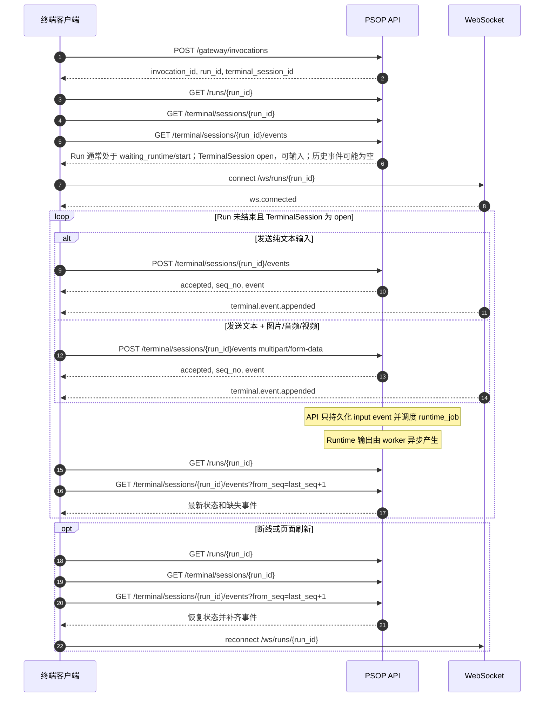

# PSOP 终端接入说明

本文档面向终端开发者，说明外部终端或 Web 终端如何接入 PSOP，完成 Skill 发起、状态展示、多模态输入、事件同步、断线恢复和幂等重试。

本文只描述终端接入边界，不包含平台内部实现细节。

## 接入目标

终端侧需要实现以下能力：

- 通过 `skill_key` 发起一次运行。
- 展示当前运行状态、当前等待原因、期望输入和最终输出。
- 展示终端输入/输出事件流。
- 发送文本、图片、音频、视频输入。
- 在同一次输入事件中同时提交文本和多个多媒体文件。
- 通过 WebSocket 接收增量提示，并通过 REST 补齐权威状态。
- 在断线、刷新或网络超时时恢复会话，并避免重复提交输入。

当前版本的正式输入模型是“一个终端输入事件由服务端规范化为多个 part”。终端请求只提交自然语言 `text` 与图片、音频、视频文件；`part_id`、part 类型和内部展示顺序均由服务端生成。支持的 part 类型为 `text`、`image`、`audio`、`video`。PDF、JSON 文件和普通文件暂不作为正式大模型推理输入；如需使用，应先由终端或上游系统转换为文本、图片、音频或视频。复杂设备绑定、多终端协作和端侧权限体系不属于本文范围。

## 基础地址

REST API 默认前缀：

```text
http(s)://<psop-host>/api/v1
```

WebSocket 地址：

```text
ws(s)://<psop-host>/ws/runs/{run_id}
```

说明：

- 本地开发环境常见 REST 地址为 `http://127.0.0.1:8011/api/v1`。
- 当前服务也注册了 `/api/v1/ws/runs/{run_id}`，但推荐使用根路径 `/ws/runs/{run_id}`。
- 鉴权由部署方统一处理。终端客户端按实际部署要求携带网关 token、cookie 或其他认证信息。

## 终端需要关心的对象

### Invocation

一次 Skill 调用请求。终端创建 Invocation 后，会得到对应的 `run_id` 和 `terminal_session_id`。

### Run

一次运行实例。终端主要读取以下信息：

| 字段 | 说明 |
| --- | --- |
| `id` | Run ID。 |
| `status` | 当前运行状态。 |
| `runtime_phase` | 当前运行阶段标识，仅用于展示或调试提示，不应写业务逻辑强依赖。 |
| `latest_terminal_seq` | 最新终端事件序号。 |
| `terminal_session_id` | 当前终端会话 ID。 |
| `current_step` | 当前等待的业务步骤。 |
| `wait_reason` | 等待用户输入的原因。 |
| `expected_inputs` | 当前期望输入类型。 |
| `checkpoint_id` | 当前等待点 ID，可用于 UI 标识。 |
| `final_output` | 运行结束后的最终输出。 |
| `exit_reason` | 失败、取消或中止原因。 |

常见状态：

| status | 说明 | 终端侧行为 |
| --- | --- | --- |
| `queued` | 已创建，等待处理。 | 展示等待状态。 |
| `waiting_runtime` | Runtime 正在异步初始化或预热任务上下文。 | 可以继续接收用户输入；展示准备状态，不要禁用输入框。 |
| `running` | 系统正在执行。 | 展示输出和进度，不要强制用户输入。 |
| `waiting_input` | 系统等待用户输入。 | 突出输入框，并按 `expected_inputs` 引导用户提交内容。 |
| `succeeded` | 运行成功。 | 停止输入，展示 `final_output`。 |
| `failed` | 运行失败。 | 停止输入，展示 `exit_reason`。 |
| `cancelled` | 运行被取消。 | 停止输入。 |
| `aborted` | 运行因业务安全、边界或不适用条件被中止。 | 停止输入，展示 `final_output` 或 `exit_reason`。 |

### TerminalSession

某个 Run 的终端会话。会话为 `open` 时终端可以继续提交输入；Run 结束后会话会变为 `closed`。

### TerminalEvent

终端输入或输出事件。客户端必须使用服务端返回的 `seq_no` 排序，不要使用客户端时间戳排序。

终端事件常见类型：

| event_kind | 方向 | 展示建议 |
| --- | --- | --- |
| `terminal.multimodal.input.v1` | input | 同一条用户输入气泡内展示文本、图片、音频、视频 part。 |
| `terminal.text.output.v1` | output | 系统输出文本；正式文本位于 text part。 |
| `terminal.multimodal.output.v1` | output | 同一条系统输出气泡内展示文本和参考图片 part。 |

终端事件的正式展示内容优先读取 `parts[]`。`payload_inline` 只作为事件级摘要、小文本摘要或旧客户端兼容字段，不应承载二进制内容、对象存储地址或 MinIO object key。旧数据或少量兼容事件可能没有 `parts[]`，客户端可在这种情况下回退读取 `payload_inline`。

part 常见类型：

| part.kind | 内容来源 | 展示建议 |
| --- | --- | --- |
| `text` | `parts[].text` | 文本段落。 |
| `image` | part content endpoint | 图片缩略图，可点击预览；对 output 事件通常是当前步骤参考图。 |
| `audio` | part content endpoint | 音频播放器。 |
| `video` | part content endpoint | 视频播放器。 |

## 接入流程



推荐流程：

1. 创建 Invocation，保存 `run_id` 与 `terminal_session_id`。
2. 读取 Run、TerminalSession 和历史 TerminalEvent。
3. 连接 WebSocket。
4. 用户发送纯文本时，调用终端事件追加接口并提交 JSON。
5. 用户同时发送文本、图片、音频或视频时，仍调用同一个终端事件追加接口，提交 `multipart/form-data`。
6. 每次提交输入后，通过 REST 刷新 Run，并拉取缺失事件；不要假定 POST event 返回时 Runtime 已完成推进。
7. 断线或刷新后，通过 REST 读取状态和缺失事件，再重连 WebSocket。
8. Run 进入 `succeeded`、`failed`、`cancelled` 或 `aborted` 后停止发送输入。

## 创建运行

说明：本文接口示例只列出终端客户端需要读取或提交的字段。服务端响应可能包含额外平台内部字段，终端侧应忽略未在字段说明中列出的字段。

接口：

```http
POST /api/v1/gateway/invocations
Content-Type: application/json
```

请求体：

```json
{
  "skill_key": "install-pc-host",
  "version_selector": "latest",
  "gateway_type": "terminal",
  "terminal_context": {
    "terminal_kind": "external",
    "device_id": "terminal-001",
    "operator": "field-engineer"
  }
}
```

字段说明：

| 字段 | 必填 | 说明 |
| --- | --- | --- |
| `skill_key` | 是 | 要运行的 Skill key。 |
| `version_selector` | 否 | 当前默认使用 `latest`。 |
| `gateway_type` | 否 | 终端接入传 `terminal`。 |
| `terminal_context` | 否 | 终端类型、设备、连接来源等上下文。 |
| `input_envelope` | 否 | 不推荐新终端使用。Invocation 只负责建立运行会话，真实用户输入应在创建成功后通过 terminal event 提交。 |

`terminal_context` 建议字段：

| 字段 | 必填 | 说明 |
| --- | --- | --- |
| `terminal_kind` | 否 | 终端类型，例如 `web`、`external`、`mobile`、`cli`。 |
| `device_id` | 否 | 终端设备或客户端实例 ID。 |
| `operator` | 否 | 当前操作员、坐席或外部系统标识。 |

新终端接入建议不传 `input_envelope`。如果首屏就有用户文本或媒体，应先创建 Invocation，拿到 `run_id` 后调用 `/terminal/sessions/{run_id}/events` 追加输入。

创建成功后，服务端只保证 Run、TerminalSession、binding、初始 Session Token 已创建，并已调度 `job:runtime:{run_id}` 进行异步 Runtime 预热。此时 Run 通常处于 `waiting_runtime/start`，还没有任何 terminal output，`GET /terminal/sessions/{run_id}/events` 可以返回空数组。终端不应等待“首条系统提示”才允许用户输入。

如果创建 invocation 后用户已经有首条输入，终端应立即通过 terminal event 提交。该输入会先作为 pending terminal fact 持久化在 `terminal_event` 中；Runtime worker 建立首个匹配的 wait checkpoint 后，再把这些 pending input 批量交付为 checkpoint evidence。若首个 checkpoint 因早到输入直接进入 evaluation，Runtime 会抑制被跳过的 instruct 提示，只输出 evaluation 的正式反馈。


终端侧可用响应示例：

```json
{
  "id": "invocation-id",
  "gateway_type": "terminal",
  "input_envelope": {},
  "terminal_context": {
    "terminal_kind": "external",
    "device_id": "terminal-001"
  },
  "status": "running",
  "run_id": "run-id",
  "terminal_session_id": "terminal-session-id",
  "created_at": "2026-05-25T00:00:00Z",
  "updated_at": "2026-05-25T00:00:00Z"
}
```

终端侧重点响应字段：

| 字段 | 说明 |
| --- | --- |
| `id` | Invocation ID。 |
| `status` | Invocation 状态，创建后通常为 `running`。 |
| `run_id` | 后续读取状态、发送事件、连接 WebSocket 使用的 Run ID。 |
| `terminal_session_id` | 终端会话 ID。 |
| `gateway_type` | 网关类型，终端接入通常为 `terminal`。 |
| `input_envelope` | 新终端接入通常为空。 |
| `terminal_context` | 服务端记录的终端上下文。 |
| `created_at` / `updated_at` | 创建和更新时间。 |

接口响应可能包含平台内部字段。终端侧不应依赖未在上表列出的字段。

命令示例：

```bash
curl -sS -X POST "$PSOP_API_BASE/gateway/invocations" \
  -H "Content-Type: application/json" \
  -d '{
    "skill_key": "install-pc-host",
    "gateway_type": "terminal",
    "terminal_context": {
      "terminal_kind": "external",
      "device_id": "terminal-001"
    }
  }'
```

## 读取状态和事件

读取 Run：

```http
GET /api/v1/runs/{run_id}
```

路径参数：

| 参数 | 必填 | 说明 |
| --- | --- | --- |
| `run_id` | 是 | 创建 Invocation 后返回的 Run ID。 |

终端侧可用响应示例：

```json
{
  "id": "run-id",
  "invocation_id": "invocation-id",
  "status": "waiting_input",
  "runtime_phase": "collect_context_evidence",
  "latest_terminal_seq": 3,
  "terminal_session_id": "terminal-session-id",
  "current_step": "collect_context",
  "wait_reason": "等待用户提交当前真实场景的说明或多模态证据。",
  "expected_inputs": [
    {
      "kind": "text",
      "event_kind": "terminal.multimodal.input.v1"
    },
    {
      "kind": "image",
      "event_kind": "terminal.multimodal.input.v1"
    }
  ],
  "checkpoint_id": "collect_context_evidence",
  "resume_phase": "evaluate_collect_context",
  "latest_evaluation": {},
  "final_output": "",
  "exit_reason": "",
  "created_at": "2026-05-25T00:00:00Z",
  "started_at": "2026-05-25T00:00:02Z",
  "ended_at": null,
  "updated_at": "2026-05-25T00:00:04Z"
}
```

终端侧重点响应字段：

| 字段 | 说明 |
| --- | --- |
| `id` | Run ID。 |
| `status` | 当前状态，决定是否允许继续输入。 |
| `runtime_phase` | 当前阶段标识，仅用于展示。 |
| `latest_terminal_seq` | 最新终端事件序号，用于增量拉取。 |
| `terminal_session_id` | 终端会话 ID。 |
| `current_step` | 当前等待的业务步骤。 |
| `wait_reason` | 等待用户输入的提示文案。 |
| `expected_inputs` | 当前期望输入类型列表。 |
| `checkpoint_id` | 当前等待点 ID。 |
| `resume_phase` | 收到输入后系统将恢复到的阶段标识，仅用于展示。 |
| `latest_evaluation` | 最近一次步骤判断摘要；可用于展示“已确认/需补充/已中止”等状态。 |
| `final_output` | 成功或中止后的最终输出。 |
| `exit_reason` | 失败、取消或中止原因。 |
| `created_at` / `started_at` / `ended_at` / `updated_at` | 生命周期时间。 |

读取终端会话：

```http
GET /api/v1/terminal/sessions/{run_id}
```

路径参数：

| 参数 | 必填 | 说明 |
| --- | --- | --- |
| `run_id` | 是 | Run ID。 |

终端侧可用响应示例：

```json
{
  "terminal_session": {
    "id": "terminal-session-id",
    "run_id": "run-id",
    "mode": "external",
    "status": "open",
    "opened_at": "2026-05-25T00:00:00Z",
    "closed_at": null,
    "created_at": "2026-05-25T00:00:00Z"
  },
  "transcript_summary": {
    "latest_seq": 3,
    "event_count": 3
  }
}
```

响应字段：

| 字段 | 说明 |
| --- | --- |
| `terminal_session.id` | TerminalSession ID。 |
| `terminal_session.run_id` | 所属 Run ID。 |
| `terminal_session.mode` | 终端模式，来自创建运行时的终端上下文。 |
| `terminal_session.status` | 会话状态，`open` 时可继续输入，`closed` 时禁止输入。 |
| `terminal_session.opened_at` | 会话打开时间。 |
| `terminal_session.closed_at` | 会话关闭时间，未关闭时为 `null`。 |
| `transcript_summary.latest_seq` | 当前已保存的最新终端事件序号。 |
| `transcript_summary.event_count` | 当前已保存的终端事件数量。 |

读取终端事件：

```http
GET /api/v1/terminal/sessions/{run_id}/events
GET /api/v1/terminal/sessions/{run_id}/events?from_seq=4
GET /api/v1/terminal/sessions/{run_id}/events?from_seq=4&to_seq=12
```

路径和查询参数：

| 参数 | 必填 | 说明 |
| --- | --- | --- |
| `run_id` | 是 | Run ID。 |
| `from_seq` | 否 | 起始事件序号，包含该序号。用于断线恢复或增量拉取。 |
| `to_seq` | 否 | 结束事件序号，包含该序号。用于拉取一个闭区间。 |

终端侧可用响应示例：

```json
[
  {
    "id": "terminal-event-output-1",
    "terminal_session_id": "terminal-session-id",
    "run_id": "run-id",
    "direction": "output",
    "event_kind": "terminal.multimodal.output.v1",
    "mime_type": "multipart/mixed",
    "payload_inline": {
      "summary": "请先确认电源线已断开，并上传当前机箱内部照片。",
      "reference_image_count": 1
    },
    "parts": [
      {
        "id": "terminal-event-part-output-text-1",
        "terminal_event_id": "terminal-event-output-1",
        "run_id": "run-id",
        "artifact_object_id": null,
        "part_id": "text_1",
        "order_index": 1,
        "kind": "text",
        "mime_type": "text/markdown",
        "text": "请先确认电源线已断开，并上传当前机箱内部照片。",
        "size_bytes": 0,
        "checksum": "",
        "metadata": {},
        "created_at": "2026-05-25T00:00:03Z"
      },
      {
        "id": "terminal-event-part-reference-image-1",
        "terminal_event_id": "terminal-event-output-1",
        "run_id": "run-id",
        "artifact_object_id": "reference-image-artifact-object-id",
        "part_id": "image_1",
        "order_index": 2,
        "kind": "image",
        "mime_type": "image/jpeg",
        "text": "",
        "size_bytes": 123456,
        "checksum": "sha256:...",
        "metadata": {
          "title": "电源线断开参考图",
          "caption": "请对照参考图确认电源线已完全断开。",
          "source_ref": "runtime_contract.workflow_steps.power_off.reference_images.power-cable-off",
          "reference_image_ref": "skill-reference://steps/power-off/power-cable-off"
        },
        "created_at": "2026-05-25T00:00:03Z"
      }
    ],
    "seq_no": 1,
    "external_event_id": null,
    "source_ref": {
      "kind": "runtime",
      "node_id": "instruct_collect_context"
    },
    "occurred_at": "2026-05-25T00:00:03Z",
    "created_at": "2026-05-25T00:00:03Z"
  },
  {
    "id": "terminal-event-input-2",
    "terminal_session_id": "terminal-session-id",
    "run_id": "run-id",
    "direction": "input",
    "event_kind": "terminal.multimodal.input.v1",
    "mime_type": "multipart/mixed",
    "payload_inline": {
      "summary": "我已断开电源，请结合照片确认。",
      "part_count": 2
    },
    "parts": [
      {
        "id": "terminal-event-part-text-1",
        "terminal_event_id": "terminal-event-input-2",
        "run_id": "run-id",
        "artifact_object_id": null,
        "part_id": "text_1",
        "order_index": 1,
        "kind": "text",
        "mime_type": "text/plain",
        "text": "我已断开电源，请结合照片确认。",
        "size_bytes": 0,
        "checksum": "",
        "metadata": {},
        "created_at": "2026-05-25T00:01:00Z"
      },
      {
        "id": "terminal-event-part-image-1",
        "terminal_event_id": "terminal-event-input-2",
        "run_id": "run-id",
        "artifact_object_id": "artifact-object-id",
        "part_id": "image_1",
        "order_index": 2,
        "kind": "image",
        "mime_type": "image/jpeg",
        "text": "",
        "size_bytes": 123456,
        "checksum": "sha256:...",
        "metadata": {
          "filename": "photo.jpg",
          "name": "photo.jpg"
        },
        "created_at": "2026-05-25T00:01:00Z"
      }
    ],
    "seq_no": 2,
    "external_event_id": "terminal-001-20260525-000001",
    "source_ref": {
      "kind": "external_terminal",
      "device_id": "terminal-001"
    },
    "occurred_at": "2026-05-25T00:01:00Z",
    "created_at": "2026-05-25T00:01:00Z"
  }
]
```

终端事件响应中的关键字段：

| 字段 | 说明 |
| --- | --- |
| `id` | 服务端事件 ID。 |
| `run_id` | 所属 Run。 |
| `terminal_session_id` | 所属终端会话。 |
| `direction` | `input` 或 `output`。 |
| `event_kind` | 事件类型。 |
| `mime_type` | 内容 MIME。 |
| `payload_inline` | 事件级摘要、小文本或结构化小 JSON；客户端不要依赖这里获取完整展示内容。 |
| `parts` | 服务端生成的事件内容单元。纯文本输入和纯文本输出通常包含一个 text part；多模态输入可同时包含 text、image、audio、video part；多模态输出通常包含 text 和当前步骤参考 image part。 |
| `parts[].part_id` | 服务端生成的同一事件内稳定 part ID，用于构造内容读取 URL。 |
| `parts[].kind` | 服务端根据文本字段或 MIME 推导出的 `text`、`image`、`audio` 或 `video`。 |
| `parts[].mime_type` | 服务端保存的内容 MIME。 |
| `parts[].text` | text part 的文本内容。 |
| `parts[].metadata.filename` | 媒体 part 原始文件名，用于展示。 |
| `parts[].size_bytes` / `parts[].checksum` | 媒体 part 大小和校验和。 |
| `seq_no` | 服务端事件顺序号。 |
| `external_event_id` | 终端侧提交的幂等 ID。 |
| `source_ref` | 终端侧提交的来源信息。 |
| `occurred_at` | 事件发生时间。 |
| `created_at` | 服务端创建时间。 |

客户端合并规则：

- 按 `seq_no` 升序展示。
- 同一个 `id` 只展示一次。
- 如果本地存在乐观消息，收到相同 `external_event_id` 的服务端事件后，用服务端事件替换。
- 发现 `seq_no` 不连续时，通过 `from_seq` 拉取缺失事件。
- 渲染输入事件时优先遍历 `parts[]`，在同一条用户消息内展示。服务端返回顺序只作为默认展示顺序，不承载业务语义。
- 读取媒体内容时使用 part 内容接口，不要拼接对象存储地址。

读取 part 二进制内容：

```http
GET /api/v1/terminal/sessions/{run_id}/events/{event_id}/parts/{part_id}/content
Range: bytes=0-1048575
```

说明：

- `run_id`、`event_id`、`part_id` 均来自终端事件响应。
- `Range` 可选；图片缩略图、音频和视频播放器可以按浏览器默认行为请求范围内容。
- 响应的 `Content-Type` 使用 part 的 `mime_type`。
- 终端侧不需要也不应该读取或保存 MinIO bucket/object key。

## 接收 Runner 参考图片输出

`psop.runner` 在协助终端用户执行 PSOP Skill 时，可能会把当前步骤的参考图片作为回答的一部分返回给终端。Runtime 会把这类回答保存为 `direction = "output"`、`event_kind = "terminal.multimodal.output.v1"` 的终端事件；终端可以通过事件列表 REST 接口或 WebSocket `terminal.event.appended` 增量消息接收。

参考图片来自已发布 Skill source 的 `references/` 目录，并在编译阶段被镜像为受控 `ArtifactObject` 写入 `runtime_contract.workflow_steps[*].reference_images`。Runner 运行时只选择当前步骤允许的 `reference_image_ref`；最终 image part 由 Runtime 校验并补齐。因此终端协议不需要新增上传、下载或附件字段，也不应把参考图片理解为 Runner 临时生成的外部附件。

终端侧处理规则：

- 按 `parts[].order_index` 在同一条系统消息内展示所有 part。
- `kind = "text"` 的 part 直接展示 `parts[].text`。
- `kind = "image"` 的 part 通过 part 内容接口读取二进制内容，使用 `event.id` 和 `part.part_id` 构造 URL。
- 可使用 `parts[].metadata.title`、`parts[].metadata.caption` 展示参考图片标题和说明。
- 不要从 `artifact_object_id` 拼接下载地址，也不要期待 `payload_inline` 或 `parts[]` 中出现图片 base64。
- 如果 output 事件中没有 image part，说明本次输出没有可展示的参考图片；终端只展示 text part 即可。旧事件没有 `parts[]` 时再回退展示 `payload_inline`。

前端展示示例：

```js
function terminalPartContentUrl(event, part) {
  return `/api/v1/terminal/sessions/${event.run_id}/events/${event.id}/parts/${part.part_id}/content`;
}

function renderRunnerOutput(event) {
  const parts = [...(event.parts || [])].sort((a, b) => a.order_index - b.order_index);

  for (const part of parts) {
    if (part.kind === "text") {
      renderSystemText(part.text || "");
      continue;
    }

    if (part.kind === "image") {
      renderSystemImage({
        src: terminalPartContentUrl(event, part),
        title: part.metadata?.title || "",
        caption: part.metadata?.caption || "",
      });
    }
  }
}
```

## 发送文本输入

接口：

```http
POST /api/v1/terminal/sessions/{run_id}/events
Content-Type: application/json
Idempotency-Key: <client-event-id>
```

请求体：

```json
{
  "direction": "input",
  "text": "我已经完成上一步，请继续。",
  "source": {
    "kind": "external_terminal",
    "device_id": "terminal-001",
    "connection_id": "ws-conn-001"
  },
  "external_event_id": "terminal-001-20260525-000001"
}
```

请求字段：

| 字段 | 必填 | 说明 |
| --- | --- | --- |
| `direction` | 是 | 终端主动提交时固定为 `input`。 |
| `text` | 是 | 本次输入中的自然语言文本。服务端会把它规范化为 text part。 |
| `event_kind` | 否 | 可省略；服务端默认使用 `terminal.multimodal.input.v1`。 |
| `mime_type` | 否 | 可省略；服务端默认使用 `multipart/mixed`。 |
| `payload_inline` | 否 | 事件级摘要；不传时服务端使用 `text`。 |
| `source.kind` | 否 | 来源类型，例如 `external_terminal`、`web`、`cli`。 |
| `source.device_id` | 否 | 设备或客户端实例 ID。 |
| `source.connection_id` | 否 | 当前连接 ID。 |
| `external_event_id` | 强烈建议 | 终端侧事件 ID，用于幂等重试。 |
| `occurred_at` | 否 | 终端侧事件发生时间；不传时服务端使用当前时间。 |

成功响应：

```json
{
  "accepted": true,
  "event_id": "terminal-event-id",
  "seq_no": 4,
  "event": {
    "id": "terminal-event-id",
    "terminal_session_id": "terminal-session-id",
    "run_id": "run-id",
    "direction": "input",
    "event_kind": "terminal.multimodal.input.v1",
    "mime_type": "multipart/mixed",
    "payload_inline": "我已经完成上一步，请继续。",
    "parts": [
      {
        "id": "terminal-event-part-text-1",
        "terminal_event_id": "terminal-event-id",
        "run_id": "run-id",
        "artifact_object_id": null,
        "part_id": "text_1",
        "order_index": 1,
        "kind": "text",
        "mime_type": "text/plain",
        "text": "我已经完成上一步，请继续。",
        "size_bytes": 0,
        "checksum": "",
        "metadata": {},
        "created_at": "2026-05-25T00:00:00Z"
      }
    ],
    "seq_no": 4,
    "external_event_id": "terminal-001-20260525-000001",
    "source_ref": {
      "kind": "external_terminal",
      "device_id": "terminal-001",
      "connection_id": "ws-conn-001"
    },
    "occurred_at": "2026-05-25T00:00:00Z",
    "created_at": "2026-05-25T00:00:00Z"
  }
}
```

响应字段：

| 字段 | 说明 |
| --- | --- |
| `accepted` | 是否接受事件。幂等命中时也返回 `true`。 |
| `event_id` | 服务端事件 ID。 |
| `seq_no` | 服务端事件序号。 |
| `event` | 完整终端事件对象。 |

规则：

- 终端客户端只应主动发送 `direction=input`。
- 成功响应只表示事件已被接受并持久化；Runtime worker 会异步读取 `runtime_job` 并推进 Run。
- POST 返回时，Run 可能仍是 `waiting_runtime/start` 或 `waiting_input`，output terminal events 和 trace events 需要随后通过 WebSocket 或 REST 获取。
- Runtime output 现在按节点级提交后增量可见；同一次输入触发多个节点时，终端可能陆续收到多条 output/trace，而不是等整轮 Runtime 完成后一次性出现。
- Runtime 只会把 input 消费到当前 wait checkpoint 的输入窗口内。已被一个 checkpoint 记入 `control.terminal_consumption` 的 input，不会被后续 checkpoint 自动复用为 evidence。
- 如果一条 input 只是触发 Runtime 输出下一阶段指令，Runtime 创建的新 checkpoint 会从该 input 之后开始接收证据；终端用户需要再发送新消息或新附件，才会被作为新 checkpoint 的 evidence。
- 终端客户端不要构造 `parts[]`；服务端会根据 `text` 和文件字段生成 part。
- `payload_inline` 只作为摘要或旧展示兼容字段；正式文本内容以服务端生成的 text part 为准。
- 必须传 `external_event_id` 或 `Idempotency-Key`，用于重试去重。
- Run 已结束或 TerminalSession 已关闭时，服务端会拒绝继续追加输入。

命令示例：

```bash
curl -sS -X POST "$PSOP_API_BASE/terminal/sessions/$RUN_ID/events" \
  -H "Content-Type: application/json" \
  -H "Idempotency-Key: terminal-001-20260525-000001" \
  -d '{
	    "direction": "input",
	    "text": "我已经完成上一步，请继续。",
	    "source": {
      "kind": "external_terminal",
      "device_id": "terminal-001",
      "connection_id": "cli-001"
    },
    "external_event_id": "terminal-001-20260525-000001"
  }'
```

## 发送多模态输入

接口：

```http
POST /api/v1/terminal/sessions/{run_id}/events
Content-Type: multipart/form-data
Idempotency-Key: <client-event-id>
```

同一个请求内必须包含：

- 一个名为 `event` 的 JSON 表单字段。
- 一个或多个名为 `files` 的二进制文件字段。服务端按请求中的文件列表生成媒体 part。

表单字段：

| 字段 | 必填 | 说明 |
| --- | --- | --- |
| `event` | 是 | JSON 字符串，包含 `text?`、`source?`、`external_event_id?` 等事件级字段。 |
| `files` | 是 | 可重复的文件字段，支持图片、音频、视频。 |

`event` JSON 字段示例：

```json
{
  "direction": "input",
  "text": "我已断开电源，请结合照片和视频确认。",
  "source": {
    "kind": "external_terminal",
    "device_id": "terminal-001",
    "connection_id": "cli-001"
  },
  "external_event_id": "terminal-001-20260525-000002"
}
```

正式多模态 part 支持的 MIME 类型：

- `image/*`
- `audio/*`
- `video/*`

说明：

- 文本直接写在 `event` JSON 的 `text` 字段中。没有文本时可以省略。
- 图片、音频、视频通过重复的 `files` 字段提交。服务端根据每个文件的 MIME 推导 part kind。
- 文件大小限制由服务端配置控制，默认值为 25 MiB。
- 终端侧不要上传对象存储 key；服务端会在同一次请求内保存文件并创建 part 级对象引用。

命令示例：

```bash
curl -sS -X POST "$PSOP_API_BASE/terminal/sessions/$RUN_ID/events" \
  -H "Idempotency-Key: terminal-001-20260525-000002" \
  -F 'event={
    "direction": "input",
    "text": "我已断开电源，请结合照片确认。",
    "source": {
      "kind": "external_terminal",
      "device_id": "terminal-001"
    },
    "external_event_id": "terminal-001-20260525-000002"
  };type=application/json' \
  -F "files=@/path/to/photo.jpg;type=image/jpeg"
```

终端侧可用响应示例：

```json
{
  "accepted": true,
  "event_id": "terminal-event-input-5",
  "seq_no": 5,
  "event": {
    "id": "terminal-event-input-5",
    "terminal_session_id": "terminal-session-id",
    "run_id": "run-id",
    "direction": "input",
    "event_kind": "terminal.multimodal.input.v1",
    "mime_type": "multipart/mixed",
    "payload_inline": {
      "summary": "我已断开电源，请结合照片确认。",
      "part_count": 2
    },
    "parts": [
      {
        "id": "terminal-event-part-text-1",
        "terminal_event_id": "terminal-event-input-5",
        "run_id": "run-id",
        "artifact_object_id": null,
        "part_id": "text_1",
        "order_index": 1,
        "kind": "text",
        "mime_type": "text/plain",
        "text": "我已断开电源，请结合照片确认。",
        "size_bytes": 0,
        "checksum": "",
        "metadata": {},
        "created_at": "2026-05-25T00:02:00Z"
      },
      {
        "id": "terminal-event-part-image-1",
        "terminal_event_id": "terminal-event-input-5",
        "run_id": "run-id",
        "artifact_object_id": "artifact-object-id",
        "part_id": "image_1",
        "order_index": 2,
        "kind": "image",
        "mime_type": "image/jpeg",
        "text": "",
        "size_bytes": 123456,
        "checksum": "sha256:...",
        "metadata": {
          "filename": "photo.jpg",
          "name": "photo.jpg"
        },
        "created_at": "2026-05-25T00:02:00Z"
      }
    ],
    "seq_no": 5,
    "external_event_id": "terminal-001-20260525-000002",
    "source_ref": {
      "kind": "external_terminal",
      "device_id": "terminal-001"
    },
    "occurred_at": "2026-05-25T00:02:00Z",
    "created_at": "2026-05-25T00:02:00Z"
  }
}
```

响应字段：

| 字段 | 说明 |
| --- | --- |
| `accepted` | 是否接受事件。 |
| `event_id` | 服务端终端事件 ID。 |
| `seq_no` | 服务端终端事件序号。 |
| `event.parts[]` | 服务端保存后的 part 列表。 |
| `event.parts[].metadata.filename` | 原始文件名。 |
| `event.parts[].size_bytes` | 文件大小。 |
| `event.parts[].checksum` | 服务端保存后的校验和。 |

接入建议：

- 同一批现场证据应作为同一个 `terminal_event` 提交，不要拆成多条独立输入事件。
- 原始二进制不要通过 `payload_inline` 传输。
- 上传失败或响应丢失后可以使用同一个 `Idempotency-Key` 和 `external_event_id` 重试，服务端会避免重复创建终端消息。
- 终端展示媒体时调用 `/terminal/sessions/{run_id}/events/{event_id}/parts/{part_id}/content`，不要使用 `artifact_object_id` 拼接下载地址。
- 终端展示 output 事件时，应在同一条系统消息内按 `order_index` 展示 text part 和参考图片 part；参考图片可使用 `metadata.title`、`metadata.caption` 作为辅助说明。

## 订阅 WebSocket

连接地址：

```text
ws(s)://<psop-host>/ws/runs/{run_id}
```

连接输入字段：

| 字段 | 必填 | 说明 |
| --- | --- | --- |
| `run_id` | 是 | 路径参数，创建 Invocation 后返回的 Run ID。 |
| 认证信息 | 按部署要求 | 如果生产环境网关要求鉴权，通过 cookie、header 转换、query token 或网关注入方式携带。 |

JavaScript 连接示例：

```js
const ws = new WebSocket(`${PSOP_WS_BASE}/runs/${runId}`);

ws.onmessage = (message) => {
  const event = JSON.parse(message.data);
  if (event.event_type === "terminal.event.appended") {
    mergeTerminalEvent(event.payload);
  }
};

ws.onclose = () => {
  scheduleReconnect();
};
```

客户端输入规则：

- 当前 WebSocket 不接收业务输入。文本和多模态输入必须走 REST `/terminal/sessions/{run_id}/events`。
- 连接建立后客户端无需发送消息。
- 如果客户端框架需要心跳，优先使用 WebSocket 协议层 ping/pong；不要通过业务消息承载用户输入。

WebSocket 服务端消息统一外层结构：

| 字段 | 说明 |
| --- | --- |
| `event_type` | 事件类型，例如 `ws.connected`、`terminal.event.appended`、`trace.event.appended`。 |
| `run_id` | 当前 Run ID。 |
| `invocation_id` | 当前版本通常为 `null`，终端侧无需依赖。 |
| `seq_no` | 事件序号。对 `terminal.event.appended`，与 `payload.seq_no` 一致；连接确认事件为 `0`。 |
| `occurred_at` | 事件发生时间。连接确认事件可能为 `null`。 |
| `payload` | 事件载荷。不同 `event_type` 的结构不同。 |

连接成功后服务端会发送：

```json
{
  "event_type": "ws.connected",
  "run_id": "run-id",
  "invocation_id": null,
  "seq_no": 0,
  "occurred_at": null,
  "payload": {
    "message": "connected"
  }
}
```

`ws.connected` 载荷字段：

| 字段 | 说明 |
| --- | --- |
| `payload.message` | 固定为连接确认信息。 |

通过 REST 成功追加终端事件后，服务端会广播已接受的输入事件。后续 Runtime worker 推进产生的终端输出事件会在节点级 commit 后另行广播。两者不保证出现在同一个 HTTP 请求返回周期内。

```json
{
  "event_type": "terminal.event.appended",
  "run_id": "run-id",
  "invocation_id": null,
  "seq_no": 4,
  "occurred_at": "2026-05-25T00:00:00Z",
  "payload": {
    "id": "terminal-event-id",
    "direction": "input",
    "event_kind": "terminal.multimodal.input.v1",
    "mime_type": "multipart/mixed",
    "payload_inline": "我已经完成上一步，请继续。",
    "parts": [
      {
        "part_id": "text_1",
        "order_index": 1,
        "kind": "text",
        "mime_type": "text/plain",
        "text": "我已经完成上一步，请继续。"
      }
    ],
    "seq_no": 4
  }
}
```

`terminal.event.appended` 载荷字段：

| 字段 | 说明 |
| --- | --- |
| `payload.id` | 服务端终端事件 ID。 |
| `payload.terminal_session_id` | 所属终端会话 ID。 |
| `payload.run_id` | 所属 Run ID。 |
| `payload.direction` | `input` 或 `output`。 |
| `payload.event_kind` | 终端事件类型。 |
| `payload.mime_type` | 内容 MIME。 |
| `payload.payload_inline` | 事件级摘要、小文本或结构化小 JSON。 |
| `payload.parts` | 服务端生成的事件 part 列表；output 事件可能包含当前步骤参考图片。 |
| `payload.seq_no` | 服务端终端事件序号。 |
| `payload.external_event_id` | 终端侧提交的幂等 ID。 |
| `payload.source_ref` | 终端侧提交的来源信息。 |
| `payload.occurred_at` | 事件发生时间。 |
| `payload.created_at` | 服务端创建时间。 |

Runtime trace 增量会以 `trace.event.appended` 推送，终端可用于调试面板或实时日志；普通终端 UI 不需要依赖它完成恢复。

```json
{
  "event_type": "trace.event.appended",
  "run_id": "run-id",
  "invocation_id": null,
  "seq_no": 3,
  "occurred_at": "2026-05-25T00:02:03Z",
  "payload": {
    "event_type": "runtime.agent.completed",
    "phase": "evaluate_collect_context",
    "summary": "Runner 节点执行完成。"
  }
}
```

多模态事件推送示例：

```json
{
  "event_type": "terminal.event.appended",
  "run_id": "run-id",
  "invocation_id": null,
  "seq_no": 5,
  "occurred_at": "2026-05-25T00:02:00Z",
  "payload": {
    "id": "terminal-event-input-5",
    "terminal_session_id": "terminal-session-id",
    "run_id": "run-id",
    "direction": "input",
    "event_kind": "terminal.multimodal.input.v1",
    "mime_type": "multipart/mixed",
    "payload_inline": {
      "summary": "我已断开电源，请结合照片确认。",
      "part_count": 2
    },
    "parts": [
      {
        "part_id": "text_1",
        "order_index": 1,
        "kind": "text",
        "mime_type": "text/plain",
        "text": "我已断开电源，请结合照片确认。"
      },
      {
        "part_id": "image_1",
        "order_index": 2,
        "kind": "image",
        "mime_type": "image/jpeg",
        "size_bytes": 123456,
        "checksum": "sha256:...",
        "metadata": {
          "filename": "photo.jpg"
        }
      }
    ],
    "seq_no": 5,
    "external_event_id": "terminal-001-20260525-000002",
    "source_ref": {
      "kind": "external_terminal",
      "device_id": "terminal-001"
    },
    "occurred_at": "2026-05-25T00:02:00Z",
    "created_at": "2026-05-25T00:02:00Z"
  }
}
```

Runner 参考图片输出推送示例：

```json
{
  "event_type": "terminal.event.appended",
  "run_id": "run-id",
  "invocation_id": null,
  "seq_no": 6,
  "occurred_at": "2026-05-25T00:02:03Z",
  "payload": {
    "id": "terminal-event-output-6",
    "terminal_session_id": "terminal-session-id",
    "run_id": "run-id",
    "direction": "output",
    "event_kind": "terminal.multimodal.output.v1",
    "mime_type": "multipart/mixed",
    "payload_inline": {
      "summary": "请对照参考图确认电源线已经完全断开，然后上传机箱内部照片。",
      "reference_image_count": 1
    },
    "parts": [
      {
        "part_id": "text_1",
        "order_index": 1,
        "kind": "text",
        "mime_type": "text/markdown",
        "text": "请对照参考图确认电源线已经完全断开，然后上传机箱内部照片。"
      },
      {
        "part_id": "image_1",
        "order_index": 2,
        "kind": "image",
        "mime_type": "image/jpeg",
        "size_bytes": 123456,
        "checksum": "sha256:...",
        "metadata": {
          "title": "电源线断开参考图",
          "caption": "确认电源线插头已完全离开电源接口。",
          "source_ref": "runtime_contract.workflow_steps.power_off.reference_images.power-cable-off",
          "reference_image_ref": "skill-reference://steps/power-off/power-cable-off"
        }
      }
    ],
    "seq_no": 6,
    "external_event_id": null,
    "source_ref": {
      "kind": "runtime",
      "node_id": "instruct_collect_context",
      "agent_key": "psop.runner"
    },
    "occurred_at": "2026-05-25T00:02:03Z",
    "created_at": "2026-05-25T00:02:03Z"
  }
}
```

客户端处理规则：

- WebSocket 只作为增量提示通道，REST 是状态恢复和完整数据读取的权威来源。
- 一次输入可能先触发一个 input `terminal.event.appended`，稍后再由 worker 按节点提交触发多个 output `terminal.event.appended` 和 `trace.event.appended`；客户端应逐条合并，而不是假定一次 REST 请求只对应一个 WebSocket 消息。
- 收到 WebSocket 事件后，按 `payload.id` 去重，按 `payload.seq_no` 排序。
- 如果需要完整事件字段，收到推送后再调用 `/terminal/sessions/{run_id}/events?from_seq=...` 拉取。
- 断线重连后，用本地最大 `seq_no + 1` 调用 `/terminal/sessions/{run_id}/events?from_seq=...` 补齐缺失事件。
- 客户端不需要向 WebSocket 发送业务消息。

## 幂等与重试

终端侧必须为每个输入生成稳定的客户端事件 ID，并同时放入：

- HTTP Header `Idempotency-Key`
- JSON 字段 `external_event_id`

推荐格式：

```text
<terminal-id>-<utc-date>-<monotonic-seq>
```

示例：

```text
terminal-001-20260525-000001
```

服务端会按 `run_id + external_event_id` 去重。网络超时后，客户端可使用同一个 ID 重试；如果事件已经被服务端接受，会返回同一个已存在事件。

## 断线恢复

终端客户端应保存以下本地状态：

| 状态 | 用途 |
| --- | --- |
| `run_id` | 恢复当前运行。 |
| `terminal_session_id` | 展示会话状态。 |
| `latest_terminal_seq` | 拉取缺失终端事件。 |
| 已发送但未确认的 `external_event_id` | 恢复乐观输入状态。 |

恢复流程：

1. 调用 `GET /api/v1/runs/{run_id}` 获取最新 Run。
2. 调用 `GET /api/v1/terminal/sessions/{run_id}` 获取会话状态。
3. 调用 `GET /api/v1/terminal/sessions/{run_id}/events?from_seq=<last_seq+1>` 补齐终端事件。
4. 对本地未确认输入，用 `external_event_id` 在事件列表中查找；找到则标记为已确认，找不到则允许用户重试。
5. 重新连接 WebSocket。

## 错误处理

PSOP 业务错误通常返回：

```json
{
  "code": "skill_validation_error",
  "message": "Run 已结束，不能继续追加终端输入。",
  "details": {
    "run_id": "run-id",
    "status": "succeeded"
  }
}
```

常见错误：

| 场景 | 处理建议 |
| --- | --- |
| Skill 不存在、无发布版本、无可运行版本 | 不创建终端会话，提示调用方检查 Skill 发布状态。 |
| Run 已结束 | 停止输入，引导用户新建运行。 |
| TerminalSession 已关闭 | 停止输入，刷新 Run 状态。 |
| `direction` 非法 | 客户端修正为 `input`。 |
| 缺少 `event_kind` 或 `mime_type` | 无需处理；服务端会使用 `terminal.multimodal.input.v1` 和 `multipart/mixed` 默认值。 |
| 媒体文件过大 | 提示压缩或拆分媒体，必要时联系服务端调整上传限制。 |
| MIME 不支持 | 转换为 `image/*`、`audio/*`、`video/*` 或文本输入。 |
| WebSocket 断开 | 自动重连，并通过 REST 补齐事件。 |

## 展示建议

终端侧应至少支持以下展示：

- 当前运行状态。
- 当前等待原因和期望输入。
- 用户文本输入。
- 系统文本输出。
- 同一条输入事件内的图片、音频、视频 part。
- 运行成功、失败、取消或中止后的最终状态。

展示原则：

- 以服务端返回事件为准，乐观消息需要在确认后替换为真实事件。
- 按 `seq_no` 排序。
- 同一个事件 `id` 只展示一次。
- 输出、输入、媒体 part、错误信息应有清晰区分。
- 同一个输入事件的 `parts[]` 应在同一条用户消息内整体展示。
- Run 失败时展示 `exit_reason`。
- Run 被中止时优先展示 `final_output`，没有最终输出时展示 `exit_reason`。

## 最小接入清单

终端侧完成以下能力即可认为接入可用：

| 项目 | 验收标准 |
| --- | --- |
| 创建运行 | 能通过 `skill_key` 创建 Invocation，并得到 `run_id`。 |
| 状态加载 | 能读取 Run、TerminalSession 和 TerminalEvent。 |
| 文本输入 | 能发送带 text part 的 `terminal.multimodal.input.v1`，并通过 `external_event_id` 确认服务端接收。 |
| 多模态输入 | 能通过 `/events` multipart 在同一事件内发送文本和至少一种图片、音频或视频 part，并在事件流中同气泡展示。 |
| 媒体读取 | 能通过 `/events/{event_id}/parts/{part_id}/content` 展示媒体内容。 |
| 实时提示 | 能连接 `/ws/runs/{run_id}` 并处理 `terminal.event.appended`。 |
| 断线恢复 | WebSocket 断开后能通过 REST 补齐缺失事件。 |
| 结束保护 | Run 结束或 TerminalSession 关闭后禁止继续输入。 |
| 幂等重试 | 网络超时后用相同事件 ID 重试，不产生重复消息。 |
| 错误展示 | 能展示服务端 `message` 与关键 `details`。 |

## 客户端参考

当前 Web 终端实现可作为客户端参考：

| 文件 | 说明 |
| --- | --- |
| `static/js/app/runtime.js` | Web 终端运行、输入、事件展示和刷新逻辑。 |
| `static/js/app.js` | API Base URL 与 WebSocket URL 解析逻辑。 |
