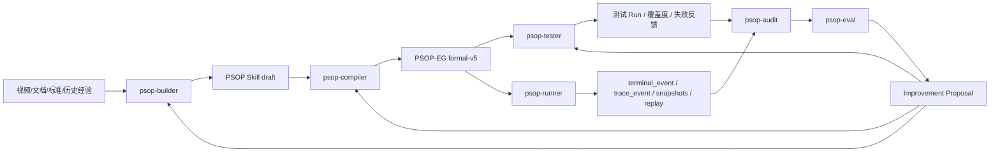

# PSOP Vision

版本：2026-06  
状态：项目核心纲领  
适用范围：PSOP 产品、架构、智能体与工程迭代

## 1. 文档定位

本文定义 PSOP 的产品愿景、系统公理、智能体治理方向与阶段性演进目标。它不是对已经落地代码的逐项说明，而是用于统一后续架构、产品、智能体和工程实现的目标文档。

系统工程实现以 [系统架构设计](../architecture/system-architecture.md) 为准。PSOP-EG 形式语义以 [Execution Graph 形式定义](../architecture/execution-graph-formal-v5.md) 为准。

## 2. 愿景

PSOP 是面向物理世界现场作业的任务操作系统。

PSOP 将 SOP、专家经验、现场证据、安全约束、企业系统、工具能力与 AI 智能体沉淀为可执行、可验证、可回放、可审计、可持续进化的 Skill。

PSOP 的长期目标不是再做一个“会调用大模型的工作流系统”，也不是普通聊天式 Agent 平台。PSOP 要构建的是一套面向现实物理世界现场作业的 AI Skill 操作系统：把现场作业知识、行业标准、专家经验、运行证据、安全约束、测试反馈、审计归因和系统迭代全部纳入治理闭环。

PSOP 的核心路线是：

> 在确定性的执行骨架上，生长出柔性的智能。

## 3. 产品定位

PSOP 不是聊天助手，也不是单次自动化脚本。

PSOP 是围绕现实现场任务构建的 Skill 平台与智能体治理平台。它负责将现实作业能力转化为可运行资产，并通过智能体闭环持续提升 Skill、执行图、测试、运行质量和系统能力。

PSOP 的核心对象不是 prompt，不是一次性脚本，也不是普通 workflow。PSOP 的核心对象是 `PSOP Skill`。

`PSOP Skill` 是一个现实世界任务契约。它描述作业目标、适用边界、现场步骤、证据要求、安全约束、异常恢复路径和完成标准。系统将 Skill 编译为正式的 `PSOP-EG`，再由受控运行时智能体 `psop-runner` 引导现场人员完成真实作业。

因此，PSOP 必须同时具备三类能力：

1. **构建能力**：从视频、关键帧、转写文本、行业标准、专家经验中生成可维护的 pskill。
2. **执行能力**：把 pskill 编译为可运行的 PSOP-EG，并在 runtime 中安全推进真实作业。
3. **治理能力**：通过测试、运行、回放、审计和评估形成质量归因与系统迭代。

## 4. 正式资产

PSOP 的正式业务资产包括：

| 资产 | 定义 |
| --- | --- |
| `PSOP Skill` | 现实物理世界技能本体；描述目标、适用边界、步骤、证据、安全约束、异常恢复和完成标准。它同时覆盖源码、草稿、结构化契约和版本化发布形态。 |
| `PSOP-EG` | 由 PSOP Skill 编译得到的 formal-v5 Execution Graph，是 runner 的正式输入。 |
| `Run Package` | 一次运行产生的 terminal events、trace events、Session Token snapshots、附件与 replay 事实。 |
| `Audit Report` | 对真实运行或测试运行的质量归因结果。 |
| `Improvement Proposal` | 基于质量归因生成的 Skill、测试、prompt、工具、代码或发布改进提案。 |

PSOP 的正式智能体资产包括：

| 资产 | 定义 |
| --- | --- |
| `Agent Definition` | 智能体目标、输入输出、模型、tools、MCP、Agent Skills、memory、workspace 和 profile 的声明式定义。 |
| `Agent Skill` | 智能体按需加载的方法、模板、规则、脚本和领域知识；不等同于 PSOP Skill。 |
| `Agent Run` | 一次智能体运行记录。 |
| `Agent Event` | 模型调用、工具调用、文件写入、shell 执行、MCP 调用、产物生成和错误事件。 |
| `Agent Artifact` | 智能体生成或消费的结构化产物。 |

## 5. 系统公理

### 5.1 Skill 不是 prompt

PSOP Skill 是现实物理世界技能本体，不是一次性提示词。

一个合格的 PSOP Skill 必须表达：

- 作业目标。
- 适用边界。
- 现场步骤。
- 证据要求。
- 安全约束。
- 异常恢复路径。
- 完成标准。
- 版本与发布策略。

### 5.2 PSOP-EG 是执行骨架

正式运行必须基于 PSOP-EG。

PSOP-EG 负责节点、guard、enabledness、actor、merge、halt 与运行策略。自由智能体可以参与构建、编译、测试、审计和改进，但不能绕过 PSOP-EG 接管真实现场执行。

### 5.3 Session Token 是运行状态主权

一次真实 run 的正式状态是 Session Token snapshot 链，而不是模型上下文、LangGraph thread state 或 DeepAgents 内部状态。

Agent Harness 可以拥有内部 thread state、memory、workspace 和中间产物，但不能替代：

- `run.status`
- `runtime_phase`
- `session_token_snapshot`
- `terminal_event`
- `trace_event`
- `replay`

### 5.4 事实源必须 append-only

PSOP 的运行、测试、审计和演进必须基于持久化事实。

核心事实源包括：

- `terminal_event`
- `terminal_event_part`
- `trace_event`
- `session_token_snapshot`
- `artifact_object`
- `agent_event`
- `agent_artifact`

已发生事实不得就地改写，只能通过追加事件、追加诊断或生成新版本表达新的结论。

### 5.5 LLM 调用必须经过受治理入口

生产链路中的模型调用必须经过平台认可的受治理入口，避免业务代码分散直连具体模型厂商。

当前实现中，Runtime LLM / evidence evaluation 节点通过 `psop.runner` 进入 Agent Harness；Compiler、skill test judge、素材分析等非 Runtime Runner 域服务仍可继续使用 `LlmInferenceGateway`。Agent Harness 使用 `backend/app/agent_harness/models/` 中的 model factory 构造 LangChain `BaseChatModel`。因此 `LlmInferenceGateway` 不再是唯一的大模型调用入口。

## 6. 北极星闭环

当前 MVP 主链路已经形成：

```text
Skills -> Publish -> Auto Compile -> Invocation -> Runtime -> Replay / Observability
```

下一阶段的完整业务闭环是：

```text
Build -> Compile -> Test -> Run -> Audit -> Eval -> Improve
```



`psop-runner` 对应当前 RuntimeService 管理的运行时治理环境。它是 PSOP 运行真实作业的正式状态主权者，负责 Run、Session Token、Terminal Event、Trace Event、Replay 等事实对象。其它智能体围绕它构建、编译、测试、审计和改进。

## 7. 智能体职责

| 智能体 | 职责 | 主要产物 |
| --- | --- | --- |
| `psop-builder` | 使用视频解析结果、关键帧、文字、行业标准、企业规范和历史经验构建 PSOP Skill draft。 | PSOP Skill draft、evidence map、missing questions、safety constraints。 |
| `psop-compiler` | 将 PSOP Skill 编译为 formal-v5 PSOP-EG，并输出诊断与能力要求。 | EG artifact、compile diagnostics、graph summary、capability summary。 |
| `psop-tester` | 基于世界模型生成正例、反例和边界用例，调用 psop-runner 执行测试并输出反馈。 | test suite、scenario runs、coverage report、failure feedback。 |
| `psop-runner` | 运行 PSOP-EG，管理真实现场状态、Session Token、terminal events、trace 与 replay。 | Run Package、final output、replay facts。 |
| `psop-audit` | 基于真实 run 或测试 run 的持久化事实做执行审计与质量归因。 | audit report、deviation list、quality attribution、evidence refs。 |
| `psop-eval` | 基于测试反馈和审计归因生成系统迭代提案。 | improvement proposal、patch draft、test plan、release checklist。 |

### 7.1 psop-builder

`psop-builder` 负责帮助用户构建 PSOP Skill。

输入包括：

- 视频解析结果。
- 关键帧、图片、OCR、ASR、人工标注。
- 行业标准、企业制度、安全规范。
- 历史 Skill、测试反馈、审计归因。
- 用户补充的现场知识。

输出包括：

- pskill draft。
- evidence map。
- missing questions。
- safety constraints。
- workflow step candidates。
- expected evidence requirements。

builder 应采用 skills-first 的智能体实现方式：具体动作由 tools 执行，专业方法由 agent skills 提供，只有在上下文隔离、并行分析或长程任务时才引入 subagents。

### 7.2 psop-compiler

`psop-compiler` 负责将 pskill 编译为可由 `psop-runner` 执行的 PSOP-EG。

它不是开放式创作 agent，而是受约束的编译 agent。它必须遵守 formal revision、runtime actor 白名单、guard DSL、merge DSL、tool capability policy，并把所有编译失败转化为结构化 diagnostics。

输出包括：

- PSOP-EG artifact。
- compile diagnostics。
- capability summary。
- graph summary。
- source/evidence provenance。

### 7.3 psop-tester

`psop-tester` 负责基于世界模型生成大量正例、反例、边界场景和异常场景，并通过真实 runner 执行测试。

它不只是“写测试样例”，而是构建可版本化、可执行、可覆盖分析的测试工厂。

输出包括：

- test scenario suite。
- positive / negative / edge cases。
- synthetic terminal timeline。
- runner execution result。
- semantic judge result。
- coverage report。
- feedback to builder/compiler。

### 7.4 psop-runner

`psop-runner` 是当前 RuntimeService 的智能体化命名。它负责执行 PSOP-EG，并且是正式运行状态主权者。

它管理：

- skill_invocation。
- run。
- terminal_session。
- session_token_snapshot。
- terminal_event / terminal_event_part。
- trace_event。
- run_capability_binding。
- replay timeline。

runner 不应被普通 DeepAgent loop 取代。其它 agent 可以调用 runner，也可以在 runner 的某些 LLM/tool 节点内部使用 Agent Harness 能力，但不能接管 runner 的正式状态。

### 7.5 psop-audit

`psop-audit` 负责审查 pskill 的真实执行结果，并基于运行事实进行质量归因。

输入包括：

- Replay timeline。
- Session Token snapshots。
- Trace Events。
- Terminal Events。
- EG artifact。
- pskill / SkillVersion。
- Test result。

输出包括：

- audit report。
- deviation points。
- evidence refs。
- quality attribution。
- root cause analysis。
- suggested followups。

质量归因至少区分：skill 设计问题、编译问题、runner 问题、操作员问题、环境问题、工具/集成问题、模型输出问题。

### 7.6 psop-eval

`psop-eval` 负责基于测试反馈和审计归因，生成 PSOP 系统迭代提案。

它可以生成：

- prompt patch proposal。
- skill patch proposal。
- compiler rule proposal。
- tester coverage proposal。
- code patch draft。
- release checklist。
- environment quality report。

前期它必须 proposal-first，不直接修改生产代码、不直接发布、不直接跳过测试。后续可在受控 sandbox、CI、审批和发布门禁下进行代码更新和版本发布。

## 8. Agent Harness 原则

PSOP 使用统一 `AgentHarnessRunner` 承载 builder、compiler、tester、audit、eval。

### 8.1 DeepAgents-first

PSOP 前期不同时暴露多个 runner 概念。系统对上只提供统一的 `AgentHarnessRunner`，默认基于 DeepAgents 构建 agent。LangGraph 作为 DeepAgents 体系内的底层 runtime 能力保留，但不在第一阶段暴露独立 `LangGraphRunner`。

第一阶段只区分两类 runner：

```text
deep_agent   # builder / compiler / tester / audit / eval 默认使用
psop_runtime # runner 使用，映射现有 RuntimeService
```

### 8.2 Skills-first

PSOP 的智能体实现优先采用：

```text
tools 负责动作
skills 负责方法和知识
subagents 负责上下文隔离、并行推理和复杂长任务
```

前期不把每个动作都拆成 subagent。builder、compiler、tester 的 MVP 都应先由主 agent + tools + skills 完成。subagents 在后续复杂化阶段再按需引入。

### 8.3 闭环优先，治理逐步强化

前期优先跑通：

```text
raw materials -> pskill -> psop-EG -> tests -> runner result -> tester feedback
```

为降低实现复杂度，开发期可以默认暴露 shell、文件写入、MCP tools 等能力，但必须限制在 agent workspace，并记录 agent event。生产期再逐步引入更严格的 tool policy、MCP trust registry、approval workflow、sandbox hardening 和 release gate。

### 8.4 所有智能体行为必须变成事实

任何 agent run 都必须产生可查询、可回放、可审计的事实：

- AgentRun。
- AgentEvent。
- AgentArtifact。
- Tool call event。
- Model usage。
- Workspace artifact。
- Related PSOP runtime run / compile request / skill version。

PSOP 不接受“黑盒智能体后台改动系统”。

## 9. Profile 与治理演进

MVP 阶段采用 `dev_open` profile，以闭环跑通为优先目标。

`dev_open` 默认能力：

- 允许 workspace 文件读写。
- 允许 workspace 内 shell。
- 允许已配置 MCP tools。
- 不启用复杂审批流。
- 所有工具调用必须记录 `agent_event`。
- 所有关键输出必须写入 `agent_artifact` 或 `artifact_object`。

生产阶段演进为 `prod_guarded` profile：

- MCP trust registry。
- tool allowlist / denylist。
- secret scanner。
- human approval。
- sandbox hardening。
- release gate。
- 自动 PR / staged release。

## 10. 产品里程碑

### 10.1 Milestone 1：Agent Harness MVP + Build/Compile/Test 闭环

产品目标：跑通从原始材料到测试反馈的最小闭环，让 PSOP 可以证明“构建、编译、测试、运行反馈”是一条连续业务链路。

```text
raw material summary + standard snippets
  -> PSOP Skill draft
  -> PSOP-EG
  -> generated positive/negative tests
  -> runner execution
  -> tester feedback
```

阶段结果：

- 用户可以基于视频解析结果和标准材料生成 pskill draft。
- 系统可以把 pskill 编译为 PSOP-EG。
- 系统可以生成至少一组正例和反例测试场景。
- 测试场景可以通过现有 psop-runner 执行。
- 测试反馈可以回流到 builder/compiler。
- 每次 agent run、tool call、artifact 输出都有持久化记录。

### 10.2 Milestone 2：Audit + Eval 闭环

产品目标：从运行事实生成质量归因与系统改进提案，让 PSOP 的迭代不依赖隐性经验。

```text
run replay/test report
  -> audit attribution
  -> eval improvement proposal
  -> prompt/skill/test/code patch draft
```

阶段结果：

- 真实运行过程可以被审计并归因到 Skill、编译、runner、操作员、环境、工具或模型输出。
- 测试反馈和审计结论可以形成结构化改进提案。
- 改进提案可以回流到 Skill、prompt、测试、compiler rule 或代码草稿。

### 10.3 Milestone 3：生产治理强化

产品目标：将开发期开放 profile 演进为生产级治理体验，让企业客户可以安全扩展 agent 能力。

阶段结果：

- 工具、MCP、shell、文件系统和代码更新能力具备可解释的信任、审批与审计边界。
- Agent 行为可以进入回放、可观测、成本和质量仪表盘。
- 多智能体并行、subagent specialization 和长期记忆在受控策略下逐步开放。
- 发布与改进流程具备 release gate 和 staged release 语义。

### 10.4 长期成功标准

- PSOP Skill 的构建质量可持续提升。
- 编译失败可以被诊断、修复和回归测试覆盖。
- 真实运行过程可以被完整审计和质量归因。
- 系统改进不依赖隐性经验，而是基于测试、运行和审计事实。
- agent 能力可以安全扩展到 MCP、shell、文件系统、代码更新和发布流程。

## 11. 当前非目标

当前阶段明确不做：

- 不把 PSOP 变成通用聊天机器人。
- 不让普通 agent loop 接管 psop-runner 的正式状态主权。
- 不把 Agent Skill 和 PSOP Skill 混为一谈。
- 不在第一阶段构建完整企业级权限/审批/租户体系。
- 不追求一开始就覆盖所有行业和所有现场设备集成。
- 不实现生产级 MCP 安全治理。
- 不做自动 merge / deploy。
- 不追求大规模 subagent 自治协作。
- 不用 DeepAgents 替代 RuntimeService。

## 12. 术语约定

- `PSOP Skill`：现实现场作业契约。
- `pskill`：PSOP Skill 的源码/草稿表达。
- `PSOP-EG`：可由 psop-runner 执行的 Execution Graph。
- `psop-runner`：当前 RuntimeService 对应的受控执行智能体。
- `Session Token`：真实 run 的正式运行状态对象。
- `Run Package`：一次运行产生的事实包，包括 terminal events、trace events、Session Token snapshots、附件与 replay。
- `Agent Definition`：智能体目标、输入输出、模型、tools、MCP、Agent Skills、memory、workspace 和 profile 的声明式定义。
- `Agent Skill`：供智能体按需加载的专业方法、模板、知识和工具说明，不等同于 PSOP Skill。
- `Agent Harness`：PSOP 多智能体的统一开发和治理底座。
- `Agent Run`：一次智能体执行事实。
- `Agent Event`：智能体执行过程中的可审计事件。
- `Agent Artifact`：智能体产生或消费的结构化产物。
