# PSOP 六智能体闭环系统重构详细设计 v5

> 适用项目：PSOP `issue-1-psop-mvp` 分支基础上的下一阶段重构。  
> 文档目标：从 PSOP 的大目标 **“让 AI 协助人类完成现实世界任务”** 出发，设计重构后的项目结构、领域模型、数据库表、API、Agent Harness、六个智能体、可观测、前端页面、工具授权、安全边界和实施计划。  
> 本版重点修订：  
> 1. PSOP 业务技能领域统一命名为 **pskills**，含义为 **Physical Skills**。  
> 2. 原 raw-materials 统一改名为 **materials**。  
> 3. 原 `backend/app/domain/*` 层级移除，业务模块直接放在 `backend/app/*`。  
> 4. Skills 统一命名为 **skills**，包目录使用 `skills/psop` 与 `skills/public`。  
> 5. Runtime 事件表重命名为 `run_event`、`run_event_part`、`run_trace`。  
> 6. Run 评估表重命名为 `run_evaluation`、`run_evaluation_finding`。  
> 7. 六个智能体统一使用 `pskill.*` 前缀，治理智能体使用 `psop.governance`。  
> 8. 补充六个智能体的记忆管理。  
> 9. 前端页面按主菜单和页面功能重新展开。  
> 10. 暂时移除权限与角色体系设计。  
> 11. 收窄 PSOP HITL 定义：当前阶段仅指 AgentRun 内高副作用 Tool / MCP / Capability 调用授权；证据不足、澄清问题、提案 review 等均是业务流程状态，不属于 HITL。  
> 12. 实施计划按程序依赖关系和领域拆分。

---

## 0. 总览结论

PSOP 的完整形态不是一个简单的 “PSkill 编辑 + LLM 执行” 系统，而是一个围绕现实物理任务的 **AI 协作与持续进化平台**。

系统核心对象从现在开始统一命名为：

```text
PSkill = Physical Skill
```

PSkill 表示一个可由 AI 协助人类完成的现实物理任务契约。它的素材、人类知识、编译产物、测试结果、运行记录、评估结果和改进提案共同构成 PSOP 的持续迭代闭环。

六个智能体形成完整闭环：

| 编号 | Agent key | 中文名称 | 目标 | 所属平面 |
|---:|---|---|---|---|
| 1 | `pskill.builder` | PSkill 构建智能体 | 将人类知识、多模态资料、专家经验构建为 PSkill | 生产面 |
| 2 | `pskill.compiler` | PSkill 编译智能体 | 将 PSkill 编译为 formal-v5 执行图 | 生产面 |
| 3 | `pskill.tester` | PSkill 测试智能体 | 发布前测试 PSkill、执行图、交互、安全和回归 | 生产面 |
| 4 | `pskill.runner` | PSkill 运行智能体 | 执行图运行时协助人类完成现实任务 | 生产面 |
| 5 | `pskill.evaluator` | PSkill 运行评估智能体 | 评估已完成 Run，进行质量归因并给出优化建议 | 治理面 |
| 6 | `psop.governance` | PSOP 治理智能体 | 将评估结果转为可验证、可审批、可回滚的系统改进提案 | 治理面 |

系统整体从：

```text
Prompt Pack + LLM Call + PSkill MVP 业务服务
```

重构为：

```text
PSkill 领域模型
+ Materials 人类知识素材体系
+ Compiler / Runtime / Testing / Evaluation / Governance 领域
+ Agent Harness
+ Skills Package System
+ Tool Registry / Tool Policy
+ Memory / Evidence / Run Event / Run Trace
+ Tool Authorization Gate
+ Frontend Workbench
```

核心设计原则：

1. **PSkill 是现实任务契约**：所有业务技能统一命名为 PSkill，避免与行业通用 Skills 概念冲突。
2. **Materials 是人类知识入口**：PDF、图片、视频、音频、文本、SOP、专家笔记均归为 `materials`。
3. **Skills 是 Agent 能力包**：`skills/psop` 存放 PSOP 内部 Skills，`skills/public` 存放通用公开 Skills。
4. **Runtime Kernel 状态主权不变**：`pskill.runner` 只能返回 observation，不能直接修改 Run 状态、snapshot、run_event。
5. **运行事实可追溯**：正式运行事实来自 `run_event`、`run_event_part`、`run_trace`、`session_token_snapshot`、AgentEvent、Artifact。
6. **AI 产物必须可 review**：PSkill draft、EG artifact、测试结果、运行评估、治理提案都必须有 evidence refs、diff 和状态；高副作用工具调用必须走 AgentRun 内工具授权。
7. **PSOP 治理必须提案化**：`psop.governance` 不能直接上线系统变更，只能生成 proposal、patch、test、experiment、activation plan。

---

## 1. 从大目标到系统闭环

### 1.1 PSOP 的大目标

PSOP 的目标是：

> 让 AI 能够在受约束、可追溯、可恢复、可评估的系统中，协助人类完成现实物理世界任务。

这句话展开为五层能力：

| 层次 | 说明 |
|---|---|
| 人类知识结构化 | 把专家经验、SOP、PDF、图片、视频、现场记录转化为标准 PSkill。 |
| 受限执行 | PSkill 不能自由运行，必须编译成 Runtime 可控执行图。 |
| 人机协作 | AI 在运行中协助人类完成步骤、请求证据、判断风险、处理异常。 |
| 可回放评估 | 每次执行都能基于事实重建，并评估质量。 |
| 持续进化 | 从运行记录中发现问题，反向优化 PSkill、Agent、Compiler、Testing、Runtime、Tools 和平台。 |

### 1.2 六智能体闭环

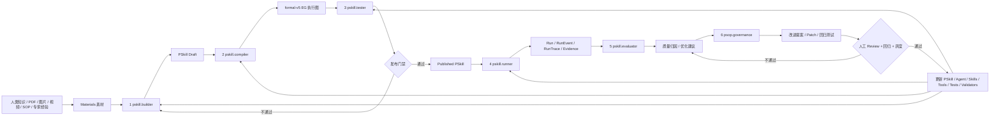

### 1.3 生产面与治理面

六个智能体不设计成自由互调网络，而拆成两个平面：

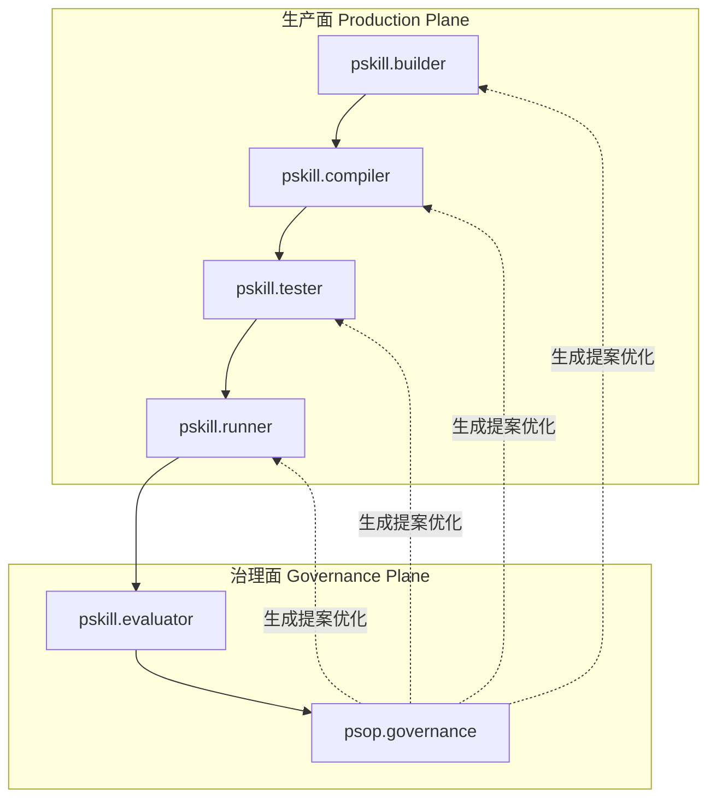

| 平面 | 智能体 | 作用 |
|---|---|---|
| 生产面 | `pskill.builder` / `pskill.compiler` / `pskill.tester` / `pskill.runner` | 负责一个 PSkill 从人类知识到真实运行的生命周期。 |
| 治理面 | `pskill.evaluator` / `psop.governance` | 负责从运行事实中做质量归因，并推动系统改进。 |

### 1.4 命名体系

| 概念 | 新命名 | 说明 |
|---|---|---|
| PSOP 业务技能 | PSkill / pskills | Physical Skills，现实物理任务契约。 |
| 技能素材 | Material / materials | 构建 PSkill 的人类知识素材。 |
| Agent 能力包 | Skill / skills | 行业通用 Skills，采用 `SKILL.md + references + scripts + assets`。 |
| 运行事件 | RunEvent / run_event | 代替旧 `terminal_event`。 |
| 运行事件附件 | RunEventPart / run_event_part | 代替旧 `terminal_event_part`。 |
| 运行追踪 | RunTrace / run_trace | 代替旧 `trace_event`。 |
| 运行评估 | RunEvaluation / run_evaluation | 代替旧 `skill_run_evaluation`。 |
| 评估问题 | RunEvaluationFinding / run_evaluation_finding | 代替旧 `skill_run_evaluation_finding`。 |

---

## 2. 目标系统架构

### 2.1 总体分层

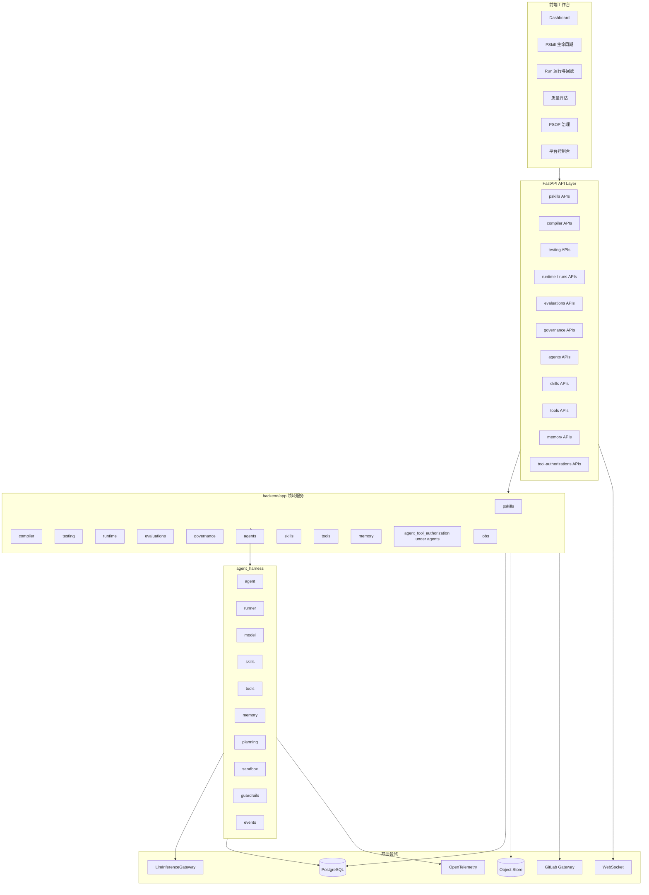

### 2.2 Runtime Kernel 状态主权

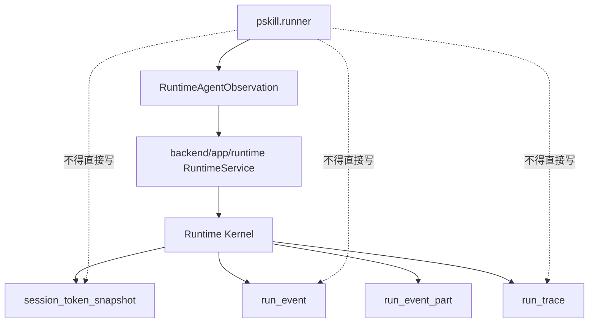

约束：

1. `pskill.runner` 只能读取当前 Run 上下文和证据，并返回结构化 `RuntimeAgentObservation`。
2. `RuntimeService` 继续负责 EG 节点选择、merge、状态更新、snapshot、run_event、run_trace。
3. Replay 只基于落库事实重建，不能依赖未持久化的 Agent 内部上下文。

---

## 3. 服务端项目结构

### 3.1 组织原则

本次重构明确移除旧目录层级：

```text
backend/app/domain/*
```

改为按领域直接组织：

```text
backend/app/pskills
backend/app/compiler
backend/app/testing
backend/app/runtime
backend/app/evaluations
backend/app/governance
backend/app/agents
backend/app/skills
backend/app/tools
backend/app/memory
backend/app/observability
backend/app/jobs
backend/app/agent_harness
```

命名约束：

| 目录 | 含义 |
|---|---|
| `backend/app/pskills` | Physical Skills 业务领域，管理 PSkill、版本、材料、source、draft patch、publish。 |
| `backend/app/skills` | Skills 包管理领域，管理 `skills/psop` 与 `skills/public` 下的 skill packages。 |
| `backend/app/agents` | Agent 定义、版本、绑定、Session、Run、Event 等业务记录。 |
| `backend/app/agent_harness` | Agent 运行基础设施，不直接承载具体业务领域状态。 |
| `backend/app/agents` | Agent 定义、版本、绑定、Session、Run、Event、ToolCall、ToolAuthorization 等业务记录。 |

### 3.2 后端目录结构

```text
backend/app/
  main.py

  core/
    config.py
    time.py
    ids.py
    errors.py
    pagination.py
    hashing.py

  api/
    router.py
    dependencies.py
    routes/
      pskills.py
      materials.py
      compiler.py
      testing.py
      runtime.py
      runs.py
      replay.py
      evaluations.py
      governance.py
      agents.py
      skills.py
      tools.py
      memory.py
      tool_authorizations.py
      observability.py

  pskills/
    models.py
    schemas.py
    repository.py
    service.py
    source_gateway.py
    material_service.py
    draft_patch.py
    publish_service.py

  compiler/
    models.py
    schemas.py
    repository.py
    service.py
    formal_v5.py
    graph_lint.py
    diagnostics.py

  testing/
    models.py
    schemas.py
    repository.py
    service.py
    simulator.py
    publish_gate.py
    fixtures.py

  runtime/
    models.py
    schemas.py
    repository.py
    service.py
    replay_service.py
    run_event_service.py
    runtime_kernel.py
    websocket.py

  evaluations/
    models.py
    schemas.py
    repository.py
    service.py
    attribution.py
    scoring.py
    finding_service.py

  governance/
    models.py
    schemas.py
    repository.py
    service.py
    proposal_engine.py
    experiment_runner.py
    canary.py
    rollback.py

  agents/
    models.py
    schemas.py
    repository.py
    service.py
    seed.py
    bindings.py
    tool_authorization_service.py

  skills/
    models.py
    schemas.py
    repository.py
    service.py
    sync.py
    validator.py
    resource_index.py

  tools/
    models.py
    schemas.py
    repository.py
    service.py
    registry_seed.py

  memory/
    models.py
    schemas.py
    repository.py
    service.py
    compaction_jobs.py

  observability/
    schemas.py
    service.py
    event_query.py
    metrics.py

  jobs/
    models.py
    repository.py
    worker.py
    scheduler.py
    handlers.py

  agent_harness/
    agent/
      agent.py
      agent_context.py
      agent_runner.py
      agent_decision.py
      agent_model.py
      agent_budget.py
      agent_error.py
      agent_schema.py

    skills/
      skill_package.py
      skill_manifest.py
      skill_loader.py
      skill_registry.py
      skill_selector.py
      skill_hydrator.py
      skill_policy.py
      skill_validator.py
      skill_context.py
      skill_resource.py

    tools/
      tool.py
      tool_registry.py
      tool_executor.py
      tool_policy.py
      tool_authorization.py
      mcp_tool_policy.py
      builtin_tools.py

    memory/
      memory_store.py
      memory_service.py
      memory_retriever.py
      memory_compactor.py
      memory_policy.py

    planning/
      planner.py
      linear_planner.py
      repair_planner.py
      test_planner.py
      governance_planner.py

    sandbox/
      sandbox.py
      sandbox_workspace.py
      restricted_workspace.py
      docker_sandbox.py

    guardrails/
      input_guardrail.py
      output_guardrail.py
      tool_guardrail.py
      skill_guardrail.py
      runtime_guardrail.py
      safety_guardrail.py
      prompt_injection_guardrail.py

    events/
      agent_event_emitter.py
      event_types.py
      event_redaction.py

    adapters/
      psop_context_adapter.py
      psop_tool_adapters.py
      psop_memory_adapter.py
      psop_observability_adapter.py

    definitions/
      builtin_agents.py
      pskill_builder.py
      pskill_compiler.py
      pskill_tester.py
      pskill_runner.py
      pskill_evaluator.py
      psop_governance.py

  infra/
    database.py
    object_store.py
    gitlab.py
    llm.py
    otel.py
```

### 3.3 领域目录说明

| 目录 | 中文说明 |
|---|---|
| `pskills` | PSkill 的创建、版本、source、materials、draft patch、发布。 |
| `compiler` | PSkill 到 formal-v5 EG 的编译、诊断、artifact 管理。 |
| `testing` | PSkill 测试套件、测试场景、模拟运行、发布门禁。 |
| `runtime` | Run、Runtime Kernel、RunEvent、RunTrace、Replay、WebSocket。 |
| `evaluations` | Run 评估、质量评分、归因 finding。 |
| `governance` | 改进提案、实验、灰度、回滚、系统演进治理。 |
| `agents` | AgentDefinition、AgentVersion、AgentBinding、AgentRun、AgentEvent、AgentToolCall、AgentToolAuthorization。 |
| `skills` | Skills 包管理，和 PSkill 无直接等价关系。 |
| `tools` | 工具定义、工具策略、工具注册数据。 |
| `memory` | Agent 记忆存储、检索、压缩、审核。 |
| `observability` | 查询 AgentEvent、RunTrace、指标和审计数据。 |
| `jobs` | 异步任务、worker、scheduler、job handler。 |
| `agent_harness` | Agent 运行底座，提供 agent、skills、tools、memory、planning、sandbox、guardrails、events。 |

---

## 4. Skills 包目录

### 4.1 包目录结构

Skills 包不再使用 `agent_skills/*` 命名，统一放在根目录 `skills/` 下：

```text
skills/
  psop/
    pskill-builder/
      SKILL.md
      references/
        pskill-contract.md
        material-analysis.md
        evidence-requirement-design.md
        safety-constraint-design.md
        source-patch-format.md
      scripts/
        validate_pskill_draft.py
      assets/
        templates/
          README.template.md
          PSKILL.template.md
          pskill.yaml.template.yml

    pskill-compiler-formal-v5/
      SKILL.md
      references/
        formal-v5-overview.md
        node-patterns.md
        guard-dsl.md
        merge-dsl.md
        runtime-contract.md
        diagnostics.md
      scripts/
        lint_eg_artifact.py

    pskill-tester/
      SKILL.md
      references/
        test-types.md
        runtime-simulation.md
        evidence-fixtures.md
        publish-gate-rules.md
        regression-testing.md
      scripts/
        generate_test_scenarios.py

    pskill-runner-field-assistant/
      SKILL.md
      references/
        terminal-guidance.md
        field-language-style.md
        wait-checkpoint-handling.md
        recovery-guidance.md
        safety-stop-rules.md

    pskill-runner-evidence-evaluator/
      SKILL.md
      references/
        image-evidence-rules.md
        audio-evidence-rules.md
        video-evidence-rules.md
        evidence-quality-rubric.md

    pskill-run-evaluator/
      SKILL.md
      references/
        attribution-taxonomy.md
        quality-scoring.md
        finding-schema.md
        evidence-linking.md

    psop-governance-manager/
      SKILL.md
      references/
        proposal-schema.md
        target-selection.md
        regression-requirements.md
        canary-policy.md
        governance-boundary.md

  public/
    ffmpeg-video-processing/
      SKILL.md
      references/
        transcoding.md
        keyframe-extraction.md
      scripts/
        extract_keyframes.py
        transcode_preview.py

    document-ocr-processing/
      SKILL.md
      references/
        pdf-ocr.md
        table-extraction.md
      scripts/
        extract_text.py
```

### 4.2 `skills/psop` 与 `skills/public` 的区别

| 目录 | 内容 | 说明 |
|---|---|---|
| `skills/psop` | PSOP 内部业务相关 Skills | 例如 PSkill 构建、编译、测试、运行、评估、治理。 |
| `skills/public` | 与 PSOP 内部业务无关的公开通用 Skills | 例如 ffmpeg 视频处理、OCR、表格解析、图像预处理。 |

### 4.3 Skills 权限原则

Skill 包中的 `allowed-tools` 只能 **收窄** Agent 权限，不能扩大权限：

```text
实际可用工具 = AgentSpec.allowed_tools ∩ SkillPackage.allowed_tools ∩ RuntimePolicy.allowed_tools
```

如果某个 `SKILL.md` 声明了危险工具，但 AgentSpec 未授权，则该工具不可用。

---

## 5. 领域建模

### 5.1 领域总图

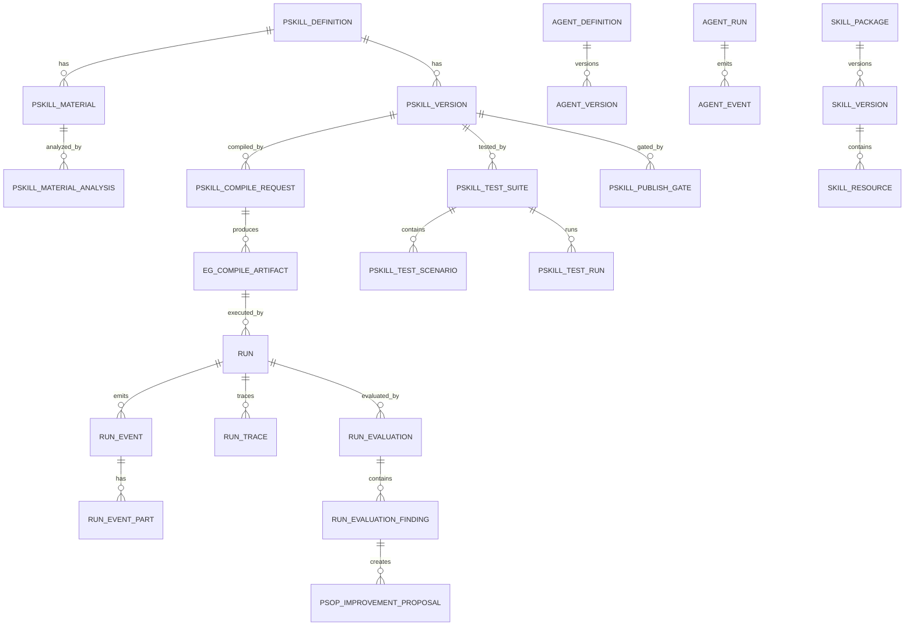

### 5.2 主要领域对象

| 领域 | 对象 | 中文说明 |
|---|---|---|
| PSkills | `PSkillDefinition` | Physical Skill 总对象。 |
| PSkills | `PSkillVersion` | PSkill 版本，包含 draft、testing、published 等状态。 |
| PSkills | `PSkillMaterial` | 构建 PSkill 的人类知识素材。 |
| PSkills | `PSkillMaterialAnalysis` | 素材分析结果，例如 OCR、ASR、关键帧、多模态摘要。 |
| Compiler | `PSkillCompileRequest` | 编译请求。 |
| Compiler | `EgCompileArtifact` | formal-v5 执行图产物。 |
| Testing | `PSkillTestSuite` | 测试套件。 |
| Testing | `PSkillTestScenario` | 测试场景。 |
| Testing | `PSkillTestRun` | 测试运行记录。 |
| Testing | `PSkillPublishGate` | 发布门禁结果。 |
| Runtime | `Run` | 一次实际运行。 |
| Runtime | `RunEvent` | 运行输入输出事件，替代 terminal_event。 |
| Runtime | `RunEventPart` | 运行事件附件，替代 terminal_event_part。 |
| Runtime | `RunTrace` | 运行追踪事件，替代 trace_event。 |
| Evaluation | `RunEvaluation` | Run 评估结果。 |
| Evaluation | `RunEvaluationFinding` | 评估问题和归因。 |
| Governance | `PsopImprovementProposal` | 系统改进提案。 |
| Governance | `PsopImprovementExperiment` | 提案回归测试和灰度实验。 |
| Agents | `AgentDefinition` | 智能体定义。 |
| Agents | `AgentVersion` | 智能体版本。 |
| Agents | `AgentRun` | 一次智能体执行。 |
| Skills | `SkillPackage` | Skill 包身份。 |
| Skills | `SkillVersion` | Skill 包版本。 |
| Tools | `ToolDefinition` | 工具定义。 |
| Memory | `AgentMemoryEntry` | Agent 记忆。 |
| Agents | `AgentToolAuthorization` | AgentRun 内高副作用工具授权记录。 |

---

## 6. 生命周期状态机

### 6.1 PSkillVersion 状态机

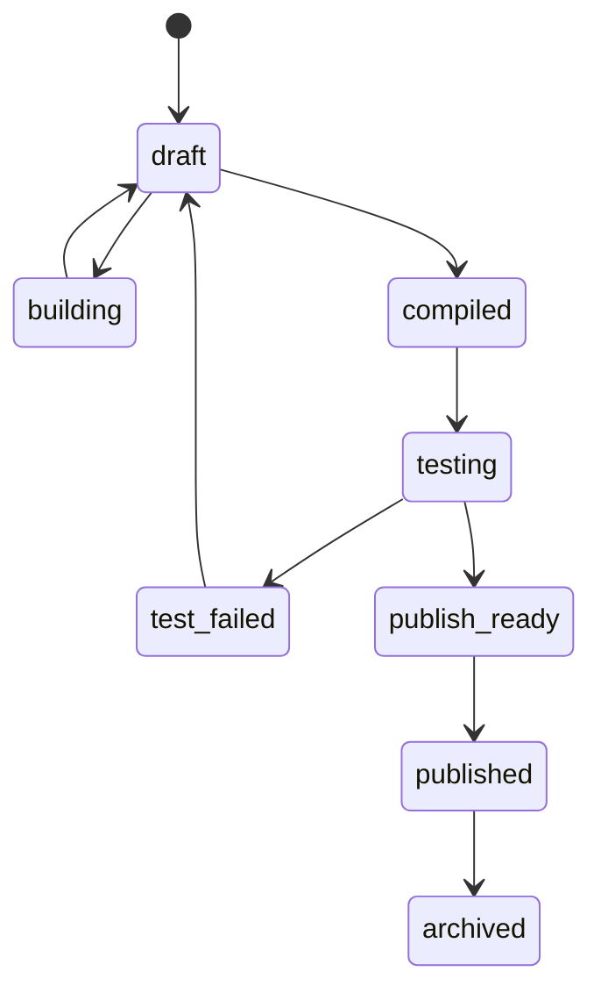

### 6.2 CompileRequest 状态机

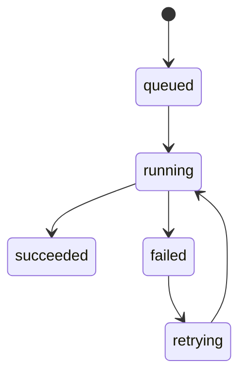

### 6.3 PSkillTestRun 状态机

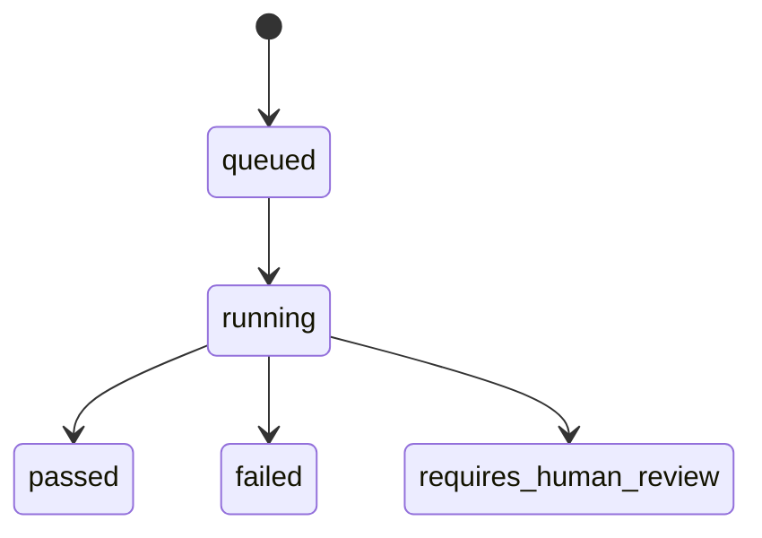

### 6.4 Run 状态机

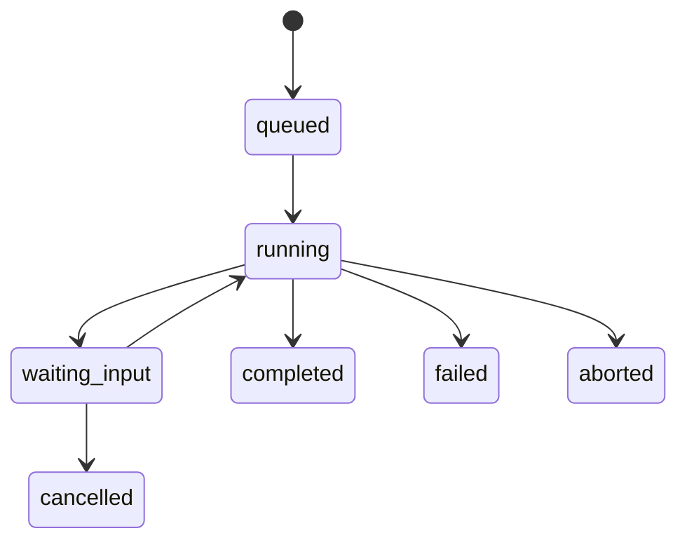

### 6.5 Governance 状态机

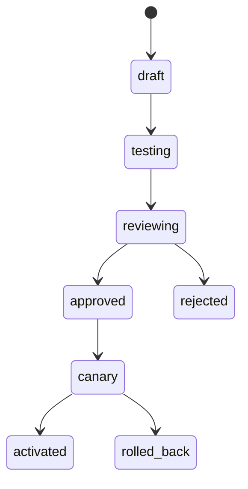

---

## 7. 数据库设计

> 说明：以下表名是目标重构后的命名。旧表迁移关系见第 17 节。

### 7.1 PSkills 领域表

#### 7.1.1 `pskill_definition`

中文说明：PSkill 总对象，表示一种现实物理任务类型。

| 字段 | 类型 | 约束 | 中文描述 |
|---|---|---|---|
| `id` | String(36) | PK | PSkill ID。 |
| `key` | String(160) | unique | PSkill 唯一键。 |
| `name` | String(255) | not null | PSkill 名称。 |
| `description` | Text | default `""` | PSkill 描述。 |
| `repository_project_id` | String(120) | nullable | GitLab 项目 ID。 |
| `repository_url` | Text | nullable | GitLab 仓库地址。 |
| `domain_pack` | String(120) | nullable | 所属领域包。 |
| `status` | String(32) | default `active` | active / archived。 |
| `created_at` | DateTime | not null | 创建时间。 |
| `updated_at` | DateTime | not null | 更新时间。 |

#### 7.1.2 `pskill_version`

中文说明：PSkill 的版本对象，包含 draft、compiled、testing、published 生命周期。

| 字段 | 类型 | 约束 | 中文描述 |
|---|---|---|---|
| `id` | String(36) | PK | PSkillVersion ID。 |
| `pskill_definition_id` | String(36) | FK | 所属 PSkill。 |
| `version_no` | Integer | not null | 版本号。 |
| `version_label` | String(80) | nullable | 版本标签。 |
| `status` | String(40) | not null | draft / compiled / testing / publish_ready / published / archived。 |
| `source_branch` | String(160) | nullable | Git source 分支。 |
| `source_commit_sha` | String(80) | nullable | 对应 commit SHA。 |
| `manifest_snapshot` | JSON | default `{}` | pskill.yaml 解析快照。 |
| `builder_agent_run_id` | String(36) | nullable | 生成该版本草稿的 AgentRun。 |
| `published_at` | DateTime | nullable | 发布时间。 |
| `created_at` | DateTime | not null | 创建时间。 |
| `updated_at` | DateTime | not null | 更新时间。 |

#### 7.1.3 `pskill_material`

中文说明：PSkill 构建所用素材，即人类知识材料。替代旧 `skill_raw_material`。

| 字段 | 类型 | 约束 | 中文描述 |
|---|---|---|---|
| `id` | String(36) | PK | Material ID。 |
| `pskill_definition_id` | String(36) | FK | 所属 PSkill。 |
| `kind` | String(40) | not null | pdf / image / video / audio / text / file。 |
| `filename` | String(255) | not null | 文件名。 |
| `media_type` | String(120) | nullable | MIME 类型。 |
| `object_key` | Text | nullable | 对象存储 key。 |
| `source_note` | Text | default `""` | 用户提供的来源说明。 |
| `status` | String(40) | default `uploaded` | uploaded / analyzing / analyzed / failed。 |
| `created_at` | DateTime | not null | 创建时间。 |

#### 7.1.4 `pskill_material_analysis`

中文说明：素材分析结果，如 OCR、ASR、关键帧、多模态摘要。替代旧 `skill_raw_material_analysis`。

| 字段 | 类型 | 约束 | 中文描述 |
|---|---|---|---|
| `id` | String(36) | PK | 分析结果 ID。 |
| `material_id` | String(36) | FK | 所属 material。 |
| `analysis_kind` | String(60) | not null | ocr / asr / keyframes / multimodal_summary / structured_extraction。 |
| `status` | String(40) | default `succeeded` | succeeded / failed。 |
| `result_json` | JSON | default `{}` | 结构化分析结果。 |
| `derived_artifact_ids` | JSON | default `[]` | 派生对象 ID，例如关键帧对象。 |
| `created_by_job_id` | String(36) | nullable | 创建该分析的 job。 |
| `created_at` | DateTime | not null | 创建时间。 |

### 7.2 Compiler 领域表

#### 7.2.1 `pskill_compile_request`

中文说明：PSkill 编译请求。

| 字段 | 类型 | 约束 | 中文描述 |
|---|---|---|---|
| `id` | String(36) | PK | 编译请求 ID。 |
| `pskill_definition_id` | String(36) | FK | 目标 PSkill。 |
| `pskill_version_id` | String(36) | FK | 目标 PSkill 版本。 |
| `source_commit_sha` | String(80) | not null | 冻结 source commit。 |
| `status` | String(40) | not null | queued / running / succeeded / failed。 |
| `agent_run_id` | String(36) | nullable | 编译智能体 AgentRun。 |
| `diagnostics_json` | JSON | default `[]` | 编译诊断。 |
| `created_at` | DateTime | not null | 创建时间。 |
| `updated_at` | DateTime | not null | 更新时间。 |

#### 7.2.2 `eg_compile_artifact`

中文说明：formal-v5 执行图产物。

| 字段 | 类型 | 约束 | 中文描述 |
|---|---|---|---|
| `id` | String(36) | PK | Artifact ID。 |
| `compile_request_id` | String(36) | FK | 所属编译请求。 |
| `pskill_version_id` | String(36) | FK | 对应 PSkill 版本。 |
| `formal_revision` | String(80) | not null | 例如 `psop-eg-formal/v5`。 |
| `artifact_json` | JSON | not null | 执行图 JSON。 |
| `artifact_hash` | String(128) | not null | Artifact hash。 |
| `status` | String(40) | not null | candidate / ready / invalid / archived。 |
| `created_at` | DateTime | not null | 创建时间。 |

### 7.3 Testing 领域表

| 表名 | 中文说明 |
|---|---|
| `pskill_test_suite` | PSkill 测试套件。 |
| `pskill_test_scenario` | 测试场景。 |
| `pskill_test_run` | 测试运行记录。 |
| `pskill_publish_gate` | 发布门禁结果。 |

#### 7.3.1 `pskill_test_suite`

| 字段 | 类型 | 中文描述 |
|---|---|---|
| `id` | String(36) | 测试套件 ID。 |
| `pskill_definition_id` | String(36) | 所属 PSkill。 |
| `pskill_version_id` | String(36) | 适用 PSkill 版本。 |
| `name` | String(255) | 测试套件名称。 |
| `suite_type` | String(60) | static / compile / runtime_simulation / safety / regression。 |
| `status` | String(40) | active / archived。 |
| `created_by_agent_run_id` | String(36) | 生成该测试套件的 AgentRun。 |
| `created_at` | DateTime | 创建时间。 |

#### 7.3.2 `pskill_test_scenario`

| 字段 | 类型 | 中文描述 |
|---|---|---|
| `id` | String(36) | 场景 ID。 |
| `suite_id` | String(36) | 所属测试套件。 |
| `name` | String(255) | 场景名称。 |
| `scenario_json` | JSON | 场景定义，包括输入、fixture、期望 decision、phase。 |
| `expected_json` | JSON | 期望输出。 |
| `status` | String(40) | active / archived。 |

#### 7.3.3 `pskill_test_run`

| 字段 | 类型 | 中文描述 |
|---|---|---|
| `id` | String(36) | 测试运行 ID。 |
| `suite_id` | String(36) | 测试套件 ID。 |
| `pskill_version_id` | String(36) | 被测 PSkill 版本。 |
| `artifact_id` | String(36) | 被测 EG artifact。 |
| `status` | String(40) | queued / running / passed / failed / requires_human_review。 |
| `score` | Integer | 测试分数 0-100。 |
| `result_json` | JSON | 测试结果。 |
| `agent_run_id` | String(36) | 测试智能体 AgentRun。 |

### 7.4 Runtime 领域表

#### 7.4.1 `run`

中文说明：一次 PSkill 实际运行。

| 字段 | 类型 | 中文描述 |
|---|---|---|
| `id` | String(36) | Run ID。 |
| `pskill_definition_id` | String(36) | 对应 PSkill。 |
| `pskill_version_id` | String(36) | 对应 PSkill 版本。 |
| `artifact_id` | String(36) | 执行的 EG artifact。 |
| `status` | String(40) | queued / running / waiting_input / completed / failed / aborted / cancelled。 |
| `runtime_phase` | String(120) | 当前 Runtime phase。 |
| `started_at` | DateTime | 开始时间。 |
| `ended_at` | DateTime | 结束时间。 |
| `created_at` | DateTime | 创建时间。 |

#### 7.4.2 `session_token_snapshot`

中文说明：正式 Runtime 状态快照。

| 字段 | 类型 | 中文描述 |
|---|---|---|
| `id` | String(36) | Snapshot ID。 |
| `run_id` | String(36) | 所属 Run。 |
| `seq_no` | Integer | 快照序号。 |
| `token_payload` | JSON | 正式 Runtime 状态。 |
| `created_at` | DateTime | 创建时间。 |

#### 7.4.3 `run_event`

中文说明：Run 的输入输出事件，替代旧 `terminal_event`。它表示用户输入、系统输出、运行智能体输出，以及必要时在 Run Live 中呈现的工具授权请求/响应；证据不足、补充证据等属于普通 Runtime flow，不属于 HITL。

| 字段 | 类型 | 中文描述 |
|---|---|---|
| `id` | String(36) | RunEvent ID。 |
| `run_id` | String(36) | 所属 Run。 |
| `seq_no` | Integer | Run 内事件序号。 |
| `event_kind` | String(60) | user_input / system_output / agent_output / tool_authorization_request / tool_authorization_response。 |
| `source` | String(60) | human / runtime / agent / tool / system。 |
| `message_text` | Text | 文本内容。 |
| `payload_json` | JSON | 结构化 payload。 |
| `agent_run_id` | String(36) | 关联 AgentRun。 |
| `created_at` | DateTime | 创建时间。 |

#### 7.4.4 `run_event_part`

中文说明：RunEvent 的多模态附件，替代旧 `terminal_event_part`。

| 字段 | 类型 | 中文描述 |
|---|---|---|
| `id` | String(36) | Part ID。 |
| `run_event_id` | String(36) | 所属 RunEvent。 |
| `part_kind` | String(40) | text / image / audio / video / file。 |
| `media_type` | String(120) | MIME 类型。 |
| `object_key` | Text | 对象存储 key。 |
| `summary_json` | JSON | OCR、ASR、多模态摘要。 |
| `created_at` | DateTime | 创建时间。 |

#### 7.4.5 `run_trace`

中文说明：Runtime、Gateway、Agent、Tool 的运行追踪事件，替代旧 `trace_event`。

| 字段 | 类型 | 中文描述 |
|---|---|---|
| `id` | String(36) | Trace ID。 |
| `run_id` | String(36) | 所属 Run。 |
| `seq_no` | Integer | Run 内 trace 序号。 |
| `trace_type` | String(120) | runtime.node.started / runtime.node.completed / agent.called / tool.called 等。 |
| `node_id` | String(160) | EG node id。 |
| `agent_run_id` | String(36) | 关联 AgentRun。 |
| `payload_json` | JSON | Trace payload。 |
| `created_at` | DateTime | 创建时间。 |

### 7.5 Evaluation 领域表

#### 7.5.1 `run_evaluation`

中文说明：一次 Run 的质量评估结果，替代旧 `skill_run_evaluation`。

| 字段 | 类型 | 中文描述 |
|---|---|---|
| `id` | String(36) | Evaluation ID。 |
| `run_id` | String(36) | 被评估 Run。 |
| `pskill_definition_id` | String(36) | 对应 PSkill。 |
| `pskill_version_id` | String(36) | 对应 PSkillVersion。 |
| `artifact_id` | String(36) | 对应 EG artifact。 |
| `agent_run_id` | String(36) | 执行评估的 AgentRun。 |
| `overall_outcome` | String(60) | success / completed_with_issues / failed / aborted。 |
| `quality_score` | Integer | 质量分 0-100。 |
| `summary` | Text | 评估摘要。 |
| `attribution_json` | JSON | 归因比例。 |
| `created_at` | DateTime | 创建时间。 |

#### 7.5.2 `run_evaluation_finding`

中文说明：Run 评估中的具体问题和归因，替代旧 `skill_run_evaluation_finding`。

| 字段 | 类型 | 中文描述 |
|---|---|---|
| `id` | String(36) | Finding ID。 |
| `evaluation_id` | String(36) | 所属 RunEvaluation。 |
| `category` | String(80) | pskill_build_issue / compile_issue / test_gap / runner_issue / human_operation_issue / evidence_quality_issue / tool_issue / environment_issue。 |
| `severity` | String(40) | low / medium / high / critical。 |
| `confidence` | Integer | 置信度 0-100。 |
| `description` | Text | 问题描述。 |
| `evidence_refs` | JSON | 证据引用。 |
| `recommended_action` | Text | 推荐动作。 |
| `status` | String(40) | open / accepted / dismissed / converted_to_proposal / resolved。 |
| `created_at` | DateTime | 创建时间。 |

### 7.6 Governance 领域表

| 表名 | 中文说明 |
|---|---|
| `psop_improvement_proposal` | PSOP 改进提案。 |
| `psop_improvement_experiment` | 提案实验、回归测试和灰度验证。 |

### 7.7 Agents 领域表

| 表名 | 中文说明 |
|---|---|
| `agent_definition` | Agent 稳定身份。 |
| `agent_version` | AgentSpec 版本。 |
| `agent_binding` | usage binding，例如 `pskill.build.default` -> 某 AgentVersion。 |
| `agent_session` | 同一业务 owner 下的 Agent 会话。 |
| `agent_run` | 一次 Agent 执行。 |
| `agent_event` | AgentRun 内部事件。 |
| `agent_model_call` | 模型调用记录。 |
| `agent_tool_call` | 工具调用记录。 |

### 7.8 Skills 包表

> 注意：这里的 `skill_*` 表表示 Skills 包，不表示 Physical Skills。Physical Skills 使用 `pskill_*`。

| 表名 | 中文说明 |
|---|---|
| `skill_package` | Skill 包身份。 |
| `skill_version` | Skill 包版本。 |
| `skill_binding` | Agent 与 Skill 包绑定。 |
| `skill_activation` | 某次 AgentRun 中实际激活的 Skill 包。 |
| `skill_resource` | Skill 包内 references、scripts、assets 等资源。 |

#### `skill_package`

| 字段 | 类型 | 中文描述 |
|---|---|---|
| `id` | String(36) | Skill package ID。 |
| `name` | String(160) | 包名，例如 `pskill-builder`、`ffmpeg-video-processing`。 |
| `scope` | String(40) | psop / public / custom。 |
| `description` | Text | 包描述。 |
| `source_uri` | Text | 文件系统路径或对象存储 URI。 |
| `status` | String(40) | active / disabled / archived。 |

#### `skill_version`

| 字段 | 类型 | 中文描述 |
|---|---|---|
| `id` | String(36) | Skill version ID。 |
| `package_id` | String(36) | 所属 Skill package。 |
| `version_label` | String(80) | 版本标签。 |
| `content_hash` | String(128) | 内容 hash。 |
| `manifest_json` | JSON | SKILL.md frontmatter。 |
| `body_object_key` | Text | SKILL.md 正文对象引用或存储位置。 |
| `resource_index` | JSON | references/scripts/assets 索引。 |
| `allowed_tools` | JSON | 声明允许工具。 |
| `validation_status` | String(40) | valid / invalid / warning。 |
| `validation_diagnostics` | JSON | 校验诊断。 |

### 7.9 Memory、Tool、工具授权表

| 表名 | 中文说明 |
|---|---|
| `agent_memory_entry` | Agent 记忆。 |
| `tool_definition` | 工具定义。 |
| `agent_tool_authorization` | AgentRun 内高副作用工具调用授权。 |

#### `agent_tool_authorization`

中文说明：保存某次 AgentRun 中，高副作用 Tool / MCP Tool / Capability 调用前的人类授权请求。它不是独立业务领域，也不表示所有人类参与动作；它只表示“AgentRun 没有该工具授权就无法继续”的运行时工具 gate。

| 字段 | 类型 | 中文描述 |
|---|---|---|
| `id` | String(36) | 工具授权 ID。 |
| `agent_run_id` | String(36) | 所属 AgentRun。 |
| `agent_tool_call_id` | String(36) | 对应的 AgentToolCall。 |
| `run_id` | String(36) | 如果发生在 Runtime run 中，则关联 Run。 |
| `run_event_id` | String(36) | 如果授权请求需要在 Run Live 中展示，则关联对应 run_event。 |
| `tool_name` | String(160) | 工具名，例如 `psop.repository.commit_patch`。 |
| `tool_provider` | String(60) | 工具来源：native / mcp / capability。 |
| `mcp_server_name` | String(160) | MCP 工具所属 server；非 MCP 工具为空。 |
| `side_effect_level` | String(60) | 副作用等级：high_write / external_action / physical_action 等。 |
| `risk_level` | String(40) | 风险等级：medium / high / critical。 |
| `authorization_reason` | Text | 为什么该工具调用需要授权。 |
| `tool_arguments_summary` | JSON | 工具参数摘要，敏感字段必须脱敏。 |
| `expected_effect_summary` | Text | 执行该工具后预计产生的效果。 |
| `reversible` | Boolean | 该动作是否可回滚。 |
| `idempotency_key` | String(255) | 工具调用幂等键。 |
| `status` | String(40) | pending / approved / rejected / expired / cancelled / executed。 |
| `request_payload` | JSON | 原始授权请求。 |
| `response_payload` | JSON | 用户批准或拒绝时提交的响应。 |
| `created_at` | DateTime | 创建时间。 |
| `responded_at` | DateTime | 用户响应时间。 |
| `executed_at` | DateTime | 批准后工具真正执行完成时间。 |

#### `agent_tool_call.status`

工具调用状态需要支持工具授权流程：

```text
planned
waiting_authorization
authorized
denied
executing
succeeded
failed
blocked
```

#### `agent_run.status`

AgentRun 增加一个专门状态：

```text
waiting_tool_authorization
```

含义：AgentRun 尚未完成，正在等待某个高副作用工具调用授权。批准后恢复 AgentRun 并执行原工具；拒绝后本次 AgentRun 以 `tool_authorization_denied` 失败。

## 8. API 接口设计

### 8.1 API 总览

```text
/api/v1/pskills
/api/v1/pskills/{pskill_id}/materials
/api/v1/compiler
/api/v1/testing
/api/v1/runtime
/api/v1/runs
/api/v1/replay
/api/v1/evaluations
/api/v1/governance
/api/v1/agents
/api/v1/skills
/api/v1/tools
/api/v1/memory
/api/v1/tool-authorizations
/api/v1/observability
```

### 8.2 PSkill API

| Method | Path | 中文说明 |
|---|---|---|
| `GET` | `/api/v1/pskills` | 查询 PSkill 列表。 |
| `POST` | `/api/v1/pskills` | 创建 PSkill。 |
| `GET` | `/api/v1/pskills/{pskill_id}` | PSkill 详情。 |
| `GET` | `/api/v1/pskills/{pskill_id}/versions` | 查询 PSkill 版本列表。 |
| `GET` | `/api/v1/pskills/{pskill_id}/source` | 读取当前 source 文件。 |
| `POST` | `/api/v1/pskills/{pskill_id}/draft/generate` | 调用 `pskill.builder` 生成 draft patch。 |
| `POST` | `/api/v1/pskills/{pskill_id}/draft/apply-patch` | 人类确认后应用 patch。 |
| `POST` | `/api/v1/pskills/{pskill_id}/publish-gate` | 创建发布门禁检查。 |
| `POST` | `/api/v1/pskills/{pskill_id}/publish` | 发布 PSkillVersion。 |

### 8.3 Materials API

| Method | Path | 中文说明 |
|---|---|---|
| `POST` | `/api/v1/pskills/{pskill_id}/materials` | 上传构建 PSkill 的素材。 |
| `GET` | `/api/v1/pskills/{pskill_id}/materials` | 查询素材列表。 |
| `GET` | `/api/v1/pskills/{pskill_id}/materials/{material_id}` | 素材详情。 |
| `POST` | `/api/v1/pskills/{pskill_id}/materials/{material_id}/analyze` | 触发素材分析。 |
| `GET` | `/api/v1/pskills/{pskill_id}/materials/{material_id}/analysis` | 查询素材分析结果。 |
| `POST` | `/api/v1/pskills/{pskill_id}/materials/batch-analyze` | 批量分析素材。 |

### 8.4 Compiler API

| Method | Path | 中文说明 |
|---|---|---|
| `POST` | `/api/v1/compiler/pskills/{pskill_id}/compile` | 创建 PSkill 编译请求。 |
| `GET` | `/api/v1/compiler/requests/{compile_request_id}` | 编译请求详情。 |
| `GET` | `/api/v1/compiler/requests/{compile_request_id}/events` | 编译 Agent 事件。 |
| `GET` | `/api/v1/compiler/artifacts/{artifact_id}` | Artifact 详情。 |
| `POST` | `/api/v1/compiler/artifacts/{artifact_id}/validate` | 重新 validator 校验。 |

### 8.5 Testing API

| Method | Path | 中文说明 |
|---|---|---|
| `GET` | `/api/v1/testing/suites` | 查询测试套件。 |
| `POST` | `/api/v1/testing/suites` | 创建测试套件。 |
| `POST` | `/api/v1/testing/suites/{suite_id}/scenarios` | 创建测试场景。 |
| `POST` | `/api/v1/testing/pskills/{pskill_id}/generate-scenarios` | 调用 `pskill.tester` 生成测试场景。 |
| `POST` | `/api/v1/testing/suites/{suite_id}/run` | 运行测试套件。 |
| `GET` | `/api/v1/testing/runs/{test_run_id}` | 测试运行详情。 |
| `GET` | `/api/v1/testing/runs/{test_run_id}/events` | 测试 Agent 事件。 |
| `POST` | `/api/v1/testing/publish-gate/run` | 运行发布门禁。 |

### 8.6 Runtime / Run API

| Method | Path | 中文说明 |
|---|---|---|
| `POST` | `/api/v1/runtime/invocations` | 创建 PSkill invocation / Run。 |
| `GET` | `/api/v1/runs/{run_id}` | Run 详情。 |
| `POST` | `/api/v1/runs/{run_id}/events` | 追加用户输入或系统事件。 |
| `GET` | `/api/v1/runs/{run_id}/events` | 查询 RunEvent 列表。 |
| `GET` | `/api/v1/runs/{run_id}/event-parts` | 查询 RunEventPart。 |
| `GET` | `/api/v1/runs/{run_id}/snapshots` | 查询 Session Token Snapshot。 |
| `GET` | `/api/v1/runs/{run_id}/traces` | 查询 RunTrace。 |
| `POST` | `/api/v1/runs/{run_id}/cancel` | 取消 Run。 |
| `GET` | `/api/v1/replay/runs/{run_id}` | Replay 数据聚合。 |

### 8.7 Evaluation API

| Method | Path | 中文说明 |
|---|---|---|
| `GET` | `/api/v1/evaluations` | 查询 Run 评估报告列表。 |
| `POST` | `/api/v1/evaluations/runs/{run_id}` | 创建 Run 评估。 |
| `GET` | `/api/v1/evaluations/{evaluation_id}` | 评估详情。 |
| `GET` | `/api/v1/evaluations/{evaluation_id}/findings` | 评估 findings。 |
| `GET` | `/api/v1/evaluations/findings` | 跨 Run finding 列表。 |
| `PATCH` | `/api/v1/evaluations/findings/{finding_id}` | 更新 finding 状态。 |
| `POST` | `/api/v1/evaluations/findings/{finding_id}/create-proposal` | 从 finding 创建治理提案。 |

### 8.8 Governance API

| Method | Path | 中文说明 |
|---|---|---|
| `GET` | `/api/v1/governance/proposals` | 改进提案列表。 |
| `POST` | `/api/v1/governance/proposals` | 创建提案。 |
| `GET` | `/api/v1/governance/proposals/{proposal_id}` | 提案详情。 |
| `POST` | `/api/v1/governance/proposals/{proposal_id}/run-tests` | 运行回归测试。 |
| `POST` | `/api/v1/governance/proposals/{proposal_id}/submit-review` | 提交提案进入人工 review 状态；这不是 AgentRun 内 HITL。 |
| `POST` | `/api/v1/governance/proposals/{proposal_id}/activate-canary` | 激活灰度。 |
| `POST` | `/api/v1/governance/proposals/{proposal_id}/rollback` | 回滚。 |
| `GET` | `/api/v1/governance/experiments/{experiment_id}` | 实验详情。 |

### 8.9 Agents / Skills / Tools / Memory / Tool Authorization API

| Method | Path | 中文说明 |
|---|---|---|
| `GET` | `/api/v1/agents` | Agent 列表。 |
| `GET` | `/api/v1/agents/{agent_key}` | Agent 详情。 |
| `GET` | `/api/v1/agents/{agent_key}/versions` | Agent 版本。 |
| `POST` | `/api/v1/agents/{agent_key}/versions` | 创建 AgentVersion draft。 |
| `POST` | `/api/v1/agents/{agent_key}/versions/{version_id}/publish` | 发布版本。 |
| `POST` | `/api/v1/agents/{agent_key}/versions/{version_id}/activate` | 激活版本。 |
| `GET` | `/api/v1/agent-runs` | AgentRun 列表。 |
| `GET` | `/api/v1/agent-runs/{agent_run_id}` | AgentRun 详情。 |
| `GET` | `/api/v1/agent-runs/{agent_run_id}/events` | AgentEvent 列表。 |
| `GET` | `/api/v1/skills` | Skills 包列表。 |
| `GET` | `/api/v1/skills/{package_name}` | Skill 包详情。 |
| `POST` | `/api/v1/skills/{package_name}/versions` | 上传或创建 Skill 包版本。 |
| `POST` | `/api/v1/skills/{package_name}/versions/{version_id}/validate` | 校验 Skill 包版本。 |
| `POST` | `/api/v1/skills/{package_name}/versions/{version_id}/activate` | 激活 Skill 包版本。 |
| `GET` | `/api/v1/tools` | 工具列表。 |
| `GET` | `/api/v1/tools/{tool_name}` | 工具详情。 |
| `GET` | `/api/v1/memory` | Memory 列表。 |
| `POST` | `/api/v1/memory/search` | Memory 检索。 |
| `PATCH` | `/api/v1/memory/{memory_id}` | 审核或编辑 Memory。 |
| `GET` | `/api/v1/tool-authorizations` | 工具授权请求列表。 |
| `GET` | `/api/v1/tool-authorizations/{authorization_id}` | 工具授权请求详情。 |
| `POST` | `/api/v1/tool-authorizations/{authorization_id}/approve` | 批准工具调用并恢复 AgentRun。 |
| `POST` | `/api/v1/tool-authorizations/{authorization_id}/reject` | 拒绝工具调用并使 AgentRun 以 `tool_authorization_denied` 失败。 |
| `GET` | `/api/v1/agent-runs/{agent_run_id}/tool-authorizations` | 查询某个 AgentRun 的工具授权请求。 |
| `GET` | `/api/v1/runs/{run_id}/tool-authorizations` | 查询某个 Run 上下文中的工具授权请求。 |

---

## 9. Agent Harness 设计

### 9.1 Agent Harness 目标与组件

Agent Harness 是六个智能体共用的运行底座。这里用更直接的组件命名，而不是把能力描述写成类名。

| 组件 | 说明 |
|---|---|
| `agent` | 描述 Agent 的目标、指令、模型策略、工具、skills、记忆策略、输出契约。 |
| `runner` | 执行 Agent loop，管理模型决策、工具调用、skills 注入、记忆、计划、退出条件。 |
| `model` | 统一封装模型调用，支持文本、多模态、结构化 JSON 输出、usage 记录。 |
| `skills` | 加载 `skills/psop` 和 `skills/public` 的 Skill 包，并按需注入上下文。 |
| `tools` | 注册和执行受控工具，管理副作用、工具授权、幂等、sandbox。 |
| `memory` | 提供短期、语义、情节、程序、素材/证据记忆。 |
| `planning` | 生成构建计划、编译修复计划、测试计划、治理提案计划。 |
| `sandbox` | 隔离脚本、文件处理、测试 fixture、公开 skills 的资源处理。 |
| `guardrails` | 输入、输出、工具、安全、prompt injection、Runtime 状态主权保护。 |
| `events` | 记录 AgentRun、AgentEvent、ModelCall、ToolCall、SkillActivation、MemoryTrace。 |

### 9.2 AgentRunner 执行循环

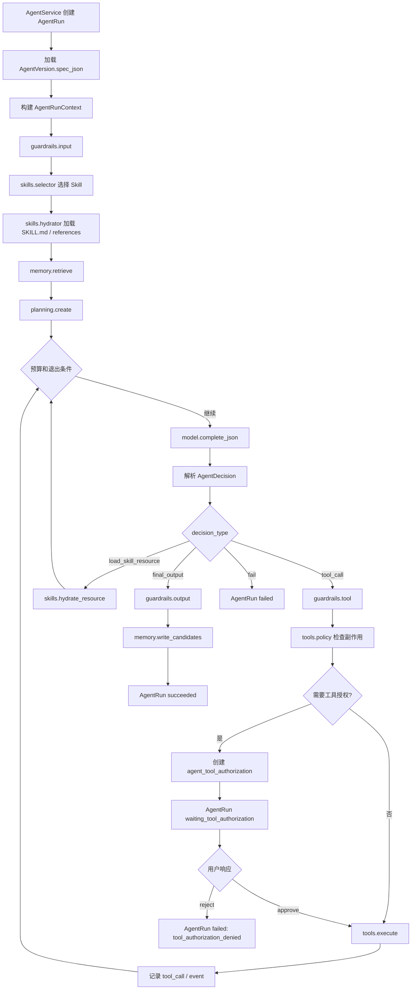

注意：`clarifying_questions`、`need_more_evidence`、`proposal_review_required` 等均应作为 Agent 最终输出或业务流程状态处理，不是 AgentRunner 内的工具授权等待。

### 9.3 AgentSpec 结构

```python
class AgentSpec(BaseModel):
    key: str
    name: str
    role: str
    goal: str
    instructions: dict[str, Any]
    model_policy: dict[str, Any]
    runtime_policy: dict[str, Any]
    allowed_tools: list[str]
    allowed_skill_names: list[str]
    memory_policy: dict[str, Any]
    planner_policy: dict[str, Any]
    sandbox_policy: dict[str, Any]
    guardrail_policy: dict[str, Any]
    output_schema: dict[str, Any]
```

默认 Agent key：

```text
pskill.builder
pskill.compiler
pskill.tester
pskill.runner
pskill.evaluator
psop.governance
```

### 9.4 Tools、MCP 与工具授权

#### 9.4.1 PSOP HITL 定义

当前阶段，PSOP 的 Human-in-the-loop 仅指 **AgentRun 内部的高副作用 Tool / MCP / Capability 调用授权机制**。

正式定义：

> 当 AgentRun 需要调用会改变业务资产、外部系统、生产配置或物理世界状态的工具时，ToolExecutor 必须暂停该 AgentRun，创建 `agent_tool_authorization`，等待用户批准。批准后恢复 AgentRun 并执行原工具调用；拒绝后该 AgentRun 以 `tool_authorization_denied` 失败。

不属于 HITL 的场景：

| 场景 | 为什么不属于 HITL |
|---|---|
| `pskill.runner` 返回 `need_more_evidence` | 本次 AgentRun 已完成；Runtime Kernel 根据 observation 进入 `waiting_input`，用户后续补证据会触发新的 run_event 和新的 AgentRun。 |
| `pskill.builder` 返回 `clarifying_questions` | 本次 AgentRun 已完成；PSkill 构建流程等待用户补充信息，补充后再启动新的 AgentRun。 |
| `pskill.tester` 返回测试失败或 `require_human_review` | 本次 AgentRun 已完成；发布门禁进入业务 review 状态。 |
| `psop.governance` 生成 proposal 等待 review | 本次 AgentRun 已完成；proposal 进入治理业务状态。 |

#### 9.4.2 工具副作用等级

| 副作用等级 | 自动执行 | 需要幂等 | 需要工具授权 | 中文说明 |
|---|---:|---:|---:|---|
| `read` | 是 | 否 | 否 | 只读查询，例如读取 PSkill、materials、run_event。 |
| `compute` | 是 | 否 | 否 | 纯计算，例如 JSON schema 校验、EG 静态检查、diff 计算。 |
| `low_write` | 是 | 视情况 | 否 | 写 AgentEvent、ToolCall、diagnostic、memory candidate 等系统内部记录。 |
| `high_write` | 否 | 是 | 是 | 提交 Git patch、激活版本、修改配置、写生产业务资产。 |
| `external_action` | 否 | 是 | 是 | 调用外部系统、创建工单、发送通知、写企业系统。 |
| `physical_action` | 否 | 是 | 是 | 未来真实设备动作或 IoT capability。 |

MCP 工具如果无法明确判断副作用，默认视为需要授权。

#### 9.4.3 工具授权执行流程

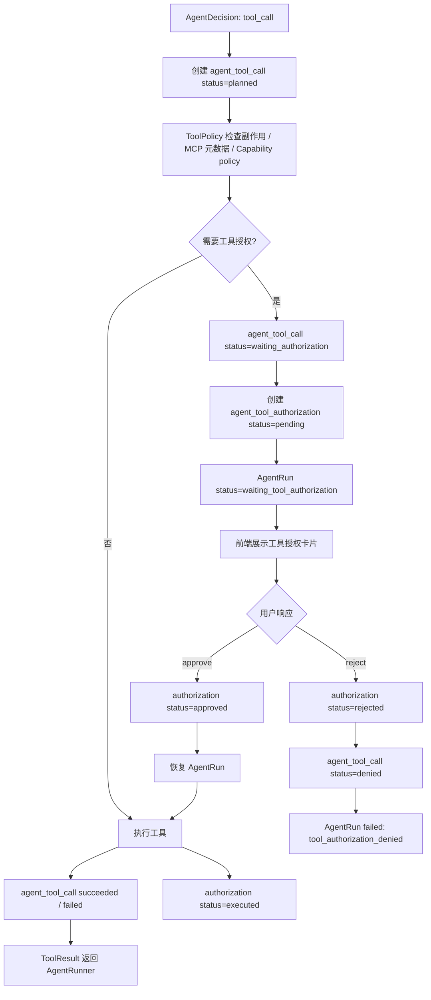

#### 9.4.4 授权不扩大权限

工具实际可用集合仍然是：

```text
AgentSpec.allowed_tools
∩ SkillPackage.allowed_tools
∩ ToolPolicy.allowed_tools
```

工具授权只是在上述集合内对高副作用调用增加运行时确认，不允许让 Agent 或 Skill 包获得原本没有的工具权限。

### 9.5 Memory 类型

| 类型 | 说明 | 使用场景 |
|---|---|---|
| `short_term` | 当前 AgentSession / Run 的短期上下文。 | 构建、编译、测试、运行单次流程。 |
| `semantic` | 领域事实、设备知识、术语。 | 构建、运行、评估。 |
| `episodic` | 历史案例和经验。 | 编译修复、运行恢复、治理归因。 |
| `procedural` | 工作规程和输出规范。 | Skill 包 references、改进后的规则。 |
| `artifact` | 素材、证据、运行片段摘要。 | materials、多模态证据、run_event_part。 |

Memory 不是事实源，不能替代 Git source、EG artifact、SessionTokenSnapshot、run_event、run_trace。

---

## 10. 六个智能体详细设计

### 10.1 Agent 总览

| Agent key | 中文名称 | binding_key | 主要输出 |
|---|---|---|---|
| `pskill.builder` | PSkill 构建智能体 | `pskill.build.default` | `PSkillBuilderResult` |
| `pskill.compiler` | PSkill 编译智能体 | `pskill.compile.formal_v5` | `PSkillCompilerResult` |
| `pskill.tester` | PSkill 测试智能体 | `pskill.test.pre_publish` | `PSkillTestResult` |
| `pskill.runner` | PSkill 运行智能体 | `pskill.run.node` | `RuntimeAgentObservation` |
| `pskill.evaluator` | PSkill 运行评估智能体 | `pskill.evaluate.run` | `RunEvaluationResult` |
| `psop.governance` | PSOP 治理智能体 | `psop.governance.proposal` | `GovernanceProposalResult` |

### 10.2 `pskill.builder`

#### 职责

将 materials 中的人类知识构建为可 review 的 PSkill draft。

#### 使用的 skills

```text
skills/psop/pskill-builder
skills/public/document-ocr-processing
skills/public/ffmpeg-video-processing
```

#### 主要工具

| 工具 | 用途 |
|---|---|
| `psop.pskills.get` | 读取 PSkill。 |
| `psop.materials.list` | 列出素材。 |
| `psop.materials.read_analysis` | 读取素材分析结果。 |
| `psop.repository.read_file` | 读取 source。 |
| `psop.repository.propose_patch` | 生成 draft patch。 |
| `psop.pskill_manifest.parse` | 解析 pskill.yaml。 |
| `psop.pskill_manifest.render` | 渲染 pskill.yaml。 |
| `psop.memory.search` | 检索领域知识和历史经验。 |
| `psop.memory.write_candidate` | 写记忆候选。 |

#### 记忆管理

| 记忆类型 | 记什么 | 如何更新 |
|---|---|---|
| `short_term` | 当前生成任务的素材摘要、抽取的步骤、风险、草稿版本、澄清问题。 | 每个构建阶段写 AgentEvent；上下文过长时 compact 为 short-term summary。 |
| `semantic` | 设备术语、操作对象、单位、证据类型、安全术语。 | 只有有 source_refs 且高置信时写 candidate；涉及安全的默认 pending_review。 |
| `episodic` | 历史 PSkill 构建成功/失败案例、人类退回原因。 | draft 被应用、退回或发布后由 compaction job 写入。 |
| `procedural` | 构建规程，例如“数值证据必须有单位、范围、拍摄要求”。 | 由 `psop.governance` 提案更新，人工确认后进入 active。 |
| `artifact` | materials 的 OCR、ASR、关键帧、PDF 页摘要、图像描述。 | material analysis 完成后写入；builder 使用时补充 source_refs。 |

#### 输出

```json
{
  "draft_summary": "string",
  "files": [],
  "manifest_patch": {},
  "evidence_requirements": [],
  "safety_constraints": [],
  "clarifying_questions": [],
  "risk_notes": [],
  "ready_for_human_review": true
}
```

### 10.3 `pskill.compiler`

#### 职责

将 frozen PSkill source 编译为 formal-v5 EG artifact，并通过 deterministic validator 和 repair loop。

#### 使用的 skills

```text
skills/psop/pskill-compiler-formal-v5
```

#### 记忆管理

| 记忆类型 | 记什么 | 如何更新 |
|---|---|---|
| `short_term` | 当前 source 摘要、contract analysis、artifact candidate、validator diagnostics、repair attempts。 | 每轮 validate / repair 后写 AgentEvent。 |
| `semantic` | 行业流程模式、常见 evidence gate、领域术语到 EG 节点的映射。 | 从成功编译案例中提取 candidate，人工或回归验证后 active。 |
| `episodic` | 某类 validator 错误的修复案例。 | validator-guided repair 成功后写入。 |
| `procedural` | formal-v5 编译规程、MVP 支持矩阵、guard/merge 写法。 | 由治理提案更新，必须测试通过后激活。 |
| `artifact` | 编译输入 source 摘要、artifact hash、graph summary。 | 编译完成后写入 compile namespace。 |

#### 输出

```json
{
  "artifact": {},
  "diagnostics": [],
  "repair_attempts": [],
  "graph_summary": {},
  "ready": true
}
```

### 10.4 `pskill.tester`

#### 职责

发布前测试 PSkill source、EG artifact、交互、安全和回归，生成发布门禁结果。

#### 使用的 skills

```text
skills/psop/pskill-tester
skills/public/ffmpeg-video-processing
```

#### 记忆管理

| 记忆类型 | 记什么 | 如何更新 |
|---|---|---|
| `short_term` | 本次测试计划、测试场景、fixture、模拟 run 结果。 | 每个 test scenario 执行后写 AgentEvent。 |
| `semantic` | 不同类型 PSkill 常见测试覆盖要求。 | 从多个通过/失败测试总结 candidate。 |
| `episodic` | 发布前未测出但运行后暴露的问题。 | RunEvaluation 指出 `test_gap` 后写入。 |
| `procedural` | 发布门禁规则、测试生成规程、安全场景模板。 | 由治理提案更新，回归通过后 active。 |
| `artifact` | 测试 fixture、模拟输入、预期输出、测试运行 trace。 | 测试套件运行后写入。 |

#### 输出

```json
{
  "decision": "pass|fail|require_human_review",
  "score": 86,
  "coverage": {},
  "blocking_findings": [],
  "warnings": [],
  "publish_gate_summary": "string"
}
```

### 10.5 `pskill.runner`

#### 职责

在 RuntimeService 调度下执行当前 EG node，协助人类完成现实任务。

#### 使用的 skills

```text
skills/psop/pskill-runner-field-assistant
skills/psop/pskill-runner-evidence-evaluator
skills/public/ffmpeg-video-processing
```

#### 状态边界

`pskill.runner` 不能直接写：

```text
run.status
session_token_snapshot
run_event
run_event_part
run_trace
```

只能返回 `RuntimeAgentObservation`，由 RuntimeService merge。

#### 记忆管理

| 记忆类型 | 记什么 | 如何更新 |
|---|---|---|
| `short_term` | 当前 node、phase、最新 snapshot 摘要、最近 run_event、当前证据判断。 | 每次 AgentRun 结束后写 summary；不作为正式 Runtime 状态。 |
| `semantic` | 设备知识、证据要求、安全规则、正常读数范围。 | 运行中只读为主；高置信新事实写 pending_review。 |
| `episodic` | 同类运行中的异常恢复案例、证据不足案例。 | Run 完成后由 evaluator 或 compaction job 写入。 |
| `procedural` | 终端表达风格、证据判断 rubric、安全停止规则。 | 通过治理提案更新。 |
| `artifact` | run_event_part 的图片、音频、视频摘要和证据质量判断。 | 多模态证据分析后写入 run namespace。 |

#### 输出

```json
{
  "decision": "proceed|retry|need_more_evidence|abort|complete",
  "reason": "string",
  "next_phase": "string",
  "terminal_message": "string",
  "facts": {},
  "evidence_refs": [],
  "safety_flags": []
}
```

### 10.6 `pskill.evaluator`

#### 职责

评估已完成 Run，做质量归因并给出优化建议。

#### 使用的 skills

```text
skills/psop/pskill-run-evaluator
```

#### 记忆管理

| 记忆类型 | 记什么 | 如何更新 |
|---|---|---|
| `short_term` | 当前 Run 的时间线摘要、关键证据、Agent 决策、异常点。 | 评估过程中按阶段写 summary。 |
| `semantic` | 质量评分标准、归因分类、领域安全知识。 | 归因规则变更时由 governance 更新。 |
| `episodic` | 运行失败案例、低质量运行案例、误判案例。 | 每次评估完成后按 finding 写 candidate。 |
| `procedural` | 评估流程、quality score 计算方法、finding schema。 | 通过治理提案和回归测试更新。 |
| `artifact` | Run replay 聚合、证据片段、run_trace 摘要。 | 评估完成后写入 evaluation namespace。 |

#### 输出

```json
{
  "overall_outcome": "completed_with_issues",
  "quality_score": 72,
  "summary": "string",
  "attribution": {},
  "findings": []
}
```

### 10.7 `psop.governance`

#### 职责

基于 `run_evaluation_finding` 生成可验证、可审批、可回滚的系统改进提案。

#### 使用的 skills

```text
skills/psop/psop-governance-manager
```

#### 绝对禁止

| 禁止动作 | 原因 |
|---|---|
| 直接激活生产 AgentVersion | 必须经过测试、人工 review 和显式激活流程；若由 AgentRun 调用激活工具，则必须经过工具授权。 |
| 直接修改 Runtime Kernel | 会影响状态主权和 Replay。 |
| 直接放宽工具权限 | 可能扩大安全风险。 |
| 直接修改已发布 PSkill | 会破坏版本可追溯。 |
| 删除或覆盖证据 | 会破坏审计。 |

#### 记忆管理

| 记忆类型 | 记什么 | 如何更新 |
|---|---|---|
| `short_term` | 当前 proposal 的来源 findings、目标对象、patch、测试计划。 | proposal 生成过程中写 AgentEvent。 |
| `semantic` | 系统结构知识、目标对象依赖关系、变更风险分类。 | 由人工维护或治理提案自举更新。 |
| `episodic` | 历史 proposal 成功/失败案例、回滚案例。 | proposal activated / rejected / rolled_back 后写入。 |
| `procedural` | 提案模板、回归要求、灰度策略、禁止动作规则。 | 必须通过治理提案、回归测试和人工 review 后更新。 |
| `artifact` | patch diff、实验结果、指标 before/after。 | experiment 完成后写入。 |

#### 输出

```json
{
  "proposal_type": "agent_skill_update|agent_spec_update|tool_policy_update|validator_update|test_suite_update|pskill_template_update",
  "target": {},
  "problem_statement": "string",
  "evidence_refs": [],
  "proposed_changes": [],
  "risk_assessment": {},
  "required_tests": [],
  "activation_plan": {}
}
```

---

## 11. 可观测与审计设计

### 11.1 事件体系

| 事件源 | 表 | 说明 |
|---|---|---|
| Runtime | `run_event` | 用户输入、系统输出、Agent 输出；若 Run Live 中出现高副作用工具授权，也记录工具授权请求/响应。 |
| Runtime | `run_trace` | Runtime 节点执行、工具、Agent 调用、异常。 |
| Agent | `agent_event` | Agent 内部事件。 |
| Agent | `agent_tool_call` | 工具调用记录。 |
| Agent | `agent_model_call` | 模型调用记录。 |
| Testing | `pskill_test_run` | 测试执行结果。 |
| Evaluation | `run_evaluation` / `run_evaluation_finding` | 质量评估与归因。 |
| Governance | `psop_improvement_proposal` | 系统改进提案。 |
| Agent | `agent_tool_authorization` | AgentRun 内高副作用工具授权记录。 |

### 11.2 Replay 聚合

Replay 页面应聚合：

```text
run
session_token_snapshot
run_event
run_event_part
run_trace
agent_run
agent_event
agent_tool_call
agent_model_call
run_evaluation
run_evaluation_finding
```

---

## 12. 前端页面设计

前端设计遵循 top-down：先呈现 PSOP 系统大闭环，再下钻到 PSkill 生命周期、Run 运行、评估、治理、平台组件。

### 12.1 主菜单结构

```text
Dashboard
PSkills
  - PSkill 列表
  - PSkill 详情
  - Materials
  - Builder Workbench
  - Compiler Workbench
  - Testing Center
  - Publish Gate
Runs
  - Run Live
  - Run Replay
  - Run Events
Evaluations
  - Run Evaluation Reports
  - Findings
Governance
  - Improvement Proposals
  - Experiments
  - Tool Authorizations
Platform
  - Agents
  - Skills
  - Tools
  - Memory
  - Observability
```

### 12.2 Dashboard

目标：展示 PSOP 六智能体闭环整体健康度。

页面内容：

| 区域 | 内容 |
|---|---|
| PSkills 概览 | draft、testing、published 数量，最近发布门禁通过率。 |
| Runtime 概览 | 最近 Run 数、成功率、aborted 数、平均完成时间。 |
| Evaluation 概览 | 平均质量分、high severity findings、未解决 findings。 |
| Governance 概览 | open proposals、testing proposals、canary、rollback。 |
| Agent 概览 | 六个智能体最近运行次数、成功率、平均耗时、工具失败率。 |

### 12.3 PSkills 菜单

#### 12.3.1 PSkill 列表页

内容：

- PSkill 名称、key、状态、当前 published version。
- 最近编译状态。
- 最近测试状态。
- 最近运行质量分。
- 未解决 findings 数。
- 入口按钮：详情、构建、编译、测试、发布门禁、Runs。

功能：

- 创建 PSkill。
- 搜索和筛选。
- 查看版本。
- 进入 Builder Workbench。

#### 12.3.2 PSkill 详情页

内容：

- PSkill 基本信息。
- 版本列表。
- Source 文件树。
- 关联 materials。
- 最新 EG artifact。
- 最新 publish gate。
- 最近 Run 和 evaluation。

功能：

- 编辑基本信息。
- 查看 source。
- 创建 draft。
- 触发编译。
- 触发测试。
- 发布。

#### 12.3.3 Materials 页面

内容：

- 素材列表：文件名、类型、状态、上传时间。
- 分析状态：OCR、ASR、关键帧、多模态摘要。
- 素材详情：原始文件预览、分析结果、派生 assets。

功能：

- 上传 materials。
- 批量分析。
- 查看分析结果。
- 将素材加入构建任务。

#### 12.3.4 Builder Workbench

内容：

- 左侧：materials 与 source refs。
- 中间：PSkill draft patch diff。
- 右侧：构建智能体输出，包括步骤、证据要求、安全约束、澄清问题、风险提示。
- 底部：AgentRun timeline、tools、memory、skills activation。

功能：

- 调用 `pskill.builder`。
- 选择 materials。
- 查看 source_ref。
- 接受/拒绝 patch。
- 对 `clarifying_questions` 进行补充；补充后触发新的构建任务 / 新的 AgentRun。
- 应用 patch 到 source。

#### 12.3.5 Compiler Workbench

内容：

- 编译请求列表。
- 编译详情：source commit、manifest snapshot、contract analysis、diagnostics、repair attempts。
- EG graph viewer。
- Artifact JSON viewer。

功能：

- 触发编译。
- 查看 formal-v5 validator 结果。
- 查看 repair attempts。
- 重新校验 artifact。

#### 12.3.6 Testing Center

内容：

- 测试套件列表。
- 测试场景编辑器。
- fixture 管理。
- 测试运行详情。
- coverage 和 publish gate 结果。

功能：

- 调用 `pskill.tester` 生成测试场景。
- 编辑场景。
- 运行测试套件。
- 查看失败 diff。
- 生成 publish gate。

#### 12.3.7 Publish Gate 页面

内容：

- Source 状态。
- 构建检查。
- 编译检查。
- 测试检查。
- 安全检查。
- 需要人工 review 的阻塞项。
- 发布结论。

功能：

- 运行门禁。
- 查看阻塞原因。
- 处理 review 结论或触发后续工具授权。
- 发布 PSkillVersion。

### 12.4 Runs 菜单

#### 12.4.1 Run Live

内容：

- 当前步骤说明。
- 证据要求。
- 输入区域：文本、图片、视频、音频、文件。
- `pskill.runner` 给现场人员的 terminal_message。
- 安全提示。
- 当前状态。

功能：

- 提交 run_event。
- 上传 run_event_part。
- 查看 AI 反馈。
- 处理高副作用工具授权；证据不足时按普通 Run flow 补充证据。
- 取消 Run。

#### 12.4.2 Run Replay

内容：

- Run timeline。
- run_event / run_event_part。
- run_trace。
- session_token_snapshot。
- AgentRun / AgentEvent。
- ToolCall / ModelCall。
- Evidence viewer。

功能：

- 按时间复盘。
- 点击 finding 跳转到证据。
- 比较不同 snapshot。
- 查看 EG node 执行路径。

#### 12.4.3 Run Events 页面

内容：

- 原始 run_event 列表。
- event_kind、source、message、parts。
- JSON payload。

功能：

- 搜索事件。
- 过滤用户输入、系统输出、Agent 输出、工具授权事件。
- 下载事件数据。

### 12.5 Evaluations 菜单

#### 12.5.1 Run Evaluation Reports

内容：

- Run 评估摘要。
- 质量分。
- 归因分布。
- findings 列表。
- evidence refs。
- 推荐动作。

功能：

- 创建 Run 评估。
- 查看关联 Replay。
- 接受/驳回 finding。
- 从 finding 创建 governance proposal。

#### 12.5.2 Findings 页面

内容：

- 跨 Run finding 聚合。
- 按 PSkill、类别、严重程度、状态筛选。
- 趋势图：数量、质量分、证据不足率。

功能：

- 批量选择 findings。
- 创建治理提案。
- 标记 resolved / dismissed。

### 12.6 Governance 菜单

Governance 菜单只呈现系统改进的业务流程，不把 proposal review 叫作 HITL。`psop.governance` 的一次 AgentRun 生成 proposal 后即完成，后续 review、测试、灰度、回滚均是治理领域状态流转。

#### 12.6.1 Improvement Proposals

内容：

- 提案列表。
- 来源 findings。
- 目标对象：AgentSpec、Skill package、ToolPolicy、Validator、TestSuite、PSkill template。
- Patch diff。
- 风险评估。
- required tests。
- activation plan。
- proposal 当前状态：draft / reviewing / testing / approved / rejected / canary / activated / rolled_back。

功能：

- 调用 `psop.governance` 生成提案。
- 编辑提案。
- 提交人工 review。
- 运行回归。
- 激活 canary。
- 回滚。
- 当某个操作需要 AgentRun 调用高副作用工具时，跳转或内嵌展示对应工具授权卡片。

#### 12.6.2 Experiments

内容：

- proposal 关联实验。
- before / after metrics。
- 回归测试结果。
- canary 范围。
- rollback 条件。

功能：

- 运行测试。
- 查看指标对比。
- 激活或回滚灰度。

### 12.7 Platform 菜单

#### 12.7.1 Agents 页面

内容：

- 六个 Agent 定义。
- AgentVersion 列表。
- AgentSpec diff。
- bindings。
- 最近 AgentRun。
- 关联工具授权请求。

功能：

- 创建 draft version。
- 发布 version。
- 激活 version。
- 回滚。
- 查看某个 AgentRun 是否处于 `waiting_tool_authorization`。

#### 12.7.2 Skills 页面

内容：

- Skill 包列表。
- `skills/psop` 与 `skills/public` 分类。
- SKILL.md frontmatter。
- references、scripts、assets。
- validation diagnostics。
- allowed-tools。

功能：

- 同步文件系统 skills。
- 上传新版本。
- 校验。
- 激活。
- 查看被哪些 Agent 使用。

#### 12.7.3 Tools 页面

内容：

- 工具列表。
- side_effect_level。
- requires_tool_authorization。
- allowed agents。
- input/output schema。
- 最近调用和失败率。

功能：

- 查看工具详情。
- 测试 read / compute 工具。
- 查看高副作用工具授权历史。
- 查看 ToolPolicy 判断为什么某个工具调用需要授权。

#### 12.7.4 Tool Authorizations 页面

该页面是 AgentRun / ToolCall 的可观测和恢复入口，不是独立业务流程页面。它也可以在 Builder Workbench、Run Live、Governance Proposal、AgentRun Detail 中以内嵌卡片形式出现。

内容：

- 所有 pending / approved / rejected / expired 工具授权请求。
- 关联 AgentRun、AgentToolCall、Run、业务对象。
- 工具名、工具来源：native / mcp / capability。
- 副作用等级：high_write / external_action / physical_action。
- 风险等级、授权原因、参数摘要、预期影响、是否可回滚。

功能：

- approve：批准工具调用，恢复 AgentRun 并执行原工具。
- reject：拒绝工具调用，使 AgentRun 以 `tool_authorization_denied` 失败。
- 查看工具参数 diff / patch diff。
- 跳转到 AgentRun timeline、ToolCall、Run Replay 或 Governance Proposal。

#### 12.7.5 Memory 页面

内容：

- memory entries。
- namespace、type、confidence、status。
- source refs。
- created_by_agent_run_id。

功能：

- 搜索。
- 审核 pending_review。
- archive。
- 查看来源。

#### 12.7.6 Observability 页面

内容：

- AgentRuns。
- AgentEvents。
- ModelCalls。
- ToolCalls。
- ToolAuthorizations。
- SkillActivations。
- RunTrace 查询。

功能：

- 排障。
- 查看耗时、usage、错误。
- 跳转关联业务对象。

## 13. 安全规则与工具授权

> 本阶段暂不设计完整权限与角色体系，默认单人开发和单人操作。但系统仍需要内置安全边界。当前阶段的 HITL 仅指 AgentRun 内高副作用工具授权，不泛化为所有人类参与。

### 13.1 高副作用工具规则

| 场景 | 规则 |
|---|---|
| 写 Git commit | `psop.repository.propose_patch` 可自动生成 patch；真正 commit 属于 `high_write`，需要 `agent_tool_authorization`。 |
| 激活 AgentVersion | 属于 `high_write`；如果由 AgentRun 触发工具执行，必须工具授权。 |
| 激活 SkillVersion | 属于 `high_write`；如果由 AgentRun 触发工具执行，必须工具授权。 |
| 放宽 ToolPolicy | 默认禁止自动执行；如果未来允许工具化，必须工具授权、回归测试和人工 review。 |
| 修改 Runtime Kernel | 治理智能体禁止直接修改；只能生成 proposal。 |
| 外部系统动作 | 属于 `external_action`，必须工具授权。 |
| 未来物理设备动作 | 属于 `physical_action`，必须工具授权；当前阶段建议默认禁用。 |

### 13.2 非 HITL 业务等待状态

以下状态需要人类参与，但不属于 AgentRun 内 HITL：

| 场景 | 正确处理方式 |
|---|---|
| 构建智能体输出 `clarifying_questions` | AgentRun succeeded；PSkill draft 状态进入 `needs_user_input`，用户补充后启动新的 `pskill.builder` AgentRun。 |
| 运行智能体输出 `need_more_evidence` | AgentRun succeeded；Runtime Kernel 写 run_event 并进入 `waiting_input`，用户上传新证据后触发新的 Runtime loop。 |
| 测试智能体输出 `require_human_review` | AgentRun succeeded；Publish Gate 进入 review 状态。 |
| 治理智能体输出 proposal | AgentRun succeeded；proposal 进入 draft / reviewing / testing 状态。 |

### 13.3 工具授权前端交互

工具授权卡片至少展示：

| 字段 | 说明 |
|---|---|
| 工具名 | 例如 `psop.repository.commit_patch`。 |
| 工具来源 | native / mcp / capability。 |
| 副作用等级 | high_write / external_action / physical_action。 |
| 影响摘要 | 将要修改或调用什么。 |
| 参数摘要 | 脱敏后的 tool arguments。 |
| 是否可回滚 | 可回滚方式或不可回滚说明。 |
| 风险说明 | 为什么需要授权。 |
| 操作 | approve / reject。 |

用户批准后，AgentRun 从 `waiting_tool_authorization` 恢复并执行原工具；原工具调用完成后，授权记录进入 `executed`，用于区分“已批准但尚未执行”和“批准后已实际执行”。用户拒绝后，本次 AgentRun 失败，错误码为 `tool_authorization_denied`。

### 13.4 可观测事件

| event_type | 中文说明 |
|---|---|
| `tool.authorization_requested` | 工具调用需要授权。 |
| `tool.authorization_approved` | 用户批准工具调用。 |
| `tool.authorization_rejected` | 用户拒绝工具调用。 |
| `tool.authorization_expired` | 授权超时。 |
| `tool.authorization_executed` | 已批准工具调用完成执行，授权记录进入 `executed`。 |
| `tool.execution_started` | 授权后开始执行工具。 |
| `tool.execution_succeeded` | 工具执行成功。 |
| `tool.execution_failed` | 工具执行失败。 |
| `agent.waiting_tool_authorization` | AgentRun 进入等待工具授权状态。 |
| `agent.resumed_after_tool_authorization` | 授权后 AgentRun 恢复。 |
| `agent.failed_tool_authorization_denied` | 用户拒绝授权导致 AgentRun 失败。 |

## 14. Job、异步编排与实时通知

### 14.1 目标 job type

| job_type | 领域 | 中文说明 |
|---|---|---|
| `material_analysis` | pskills | 分析 materials。 |
| `pskill_build` | pskills / agents | 调用 `pskill.builder`。 |
| `pskill_compile` | compiler | 调用 `pskill.compiler`。 |
| `pskill_test` | testing | 调用 `pskill.tester`。 |
| `runtime_step` | runtime | RuntimeService 推进 Run。 |
| `run_evaluation` | evaluations | 调用 `pskill.evaluator`。 |
| `governance_proposal` | governance | 调用 `psop.governance`。 |
| `memory_compaction` | memory | 压缩和沉淀记忆。 |
| `skill_sync` | skills | 同步 `skills/psop` 与 `skills/public`。 |

### 14.2 WebSocket

```text
/ws/pskills/{pskill_id}/activity
/ws/agent-runs/{agent_run_id}
/ws/runs/{run_id}
/ws/test-runs/{test_run_id}
/ws/evaluations/{evaluation_id}
/ws/governance/proposals/{proposal_id}
/ws/tool-authorizations
```

---

## 15. 实施计划

实施计划按照程序依赖和领域拆分，而不是按页面或智能体随意推进。

### 阶段 0：命名与结构重构基础

依赖：无。

领域：`core`、`api`、`jobs`、目录结构。

任务：

1. 移除 `backend/app/domain/*` 引用。
2. 建立 `backend/app/pskills`、`backend/app/runtime`、`backend/app/compiler` 等顶级领域目录。
3. 建立 `backend/app/agent_harness`。
4. 建立 `skills/psop`、`skills/public`。
5. 统一命名映射：Skill -> PSkill，raw_material -> material，terminal_event -> run_event。

验收：

- 应用可启动。
- 新目录 import 正常。
- 旧 domain 目录不再被新代码 import。

### 阶段 1：PSkills 与 Materials 领域

依赖：阶段 0。

领域：`pskills`。

任务：

1. 新建 `pskill_definition`、`pskill_version`、`pskill_material`、`pskill_material_analysis`。
2. API 改为 `/api/v1/pskills` 和 `/api/v1/pskills/{pskill_id}/materials`。
3. 迁移旧 skill / raw_material 数据。
4. 前端完成 PSkill 列表、详情、Materials 页面。

### 阶段 2：Runtime 事件命名重构

依赖：阶段 0、阶段 1。

领域：`runtime`。

任务：

1. 表重命名：`terminal_event` -> `run_event`。
2. 表重命名：`terminal_event_part` -> `run_event_part`。
3. 表重命名：`trace_event` -> `run_trace`。
4. API 改为 `/api/v1/runs/{run_id}/events`、`/traces`。
5. Replay 聚合改用新命名。

### 阶段 3：Agent Harness 基础设施

依赖：阶段 0。

领域：`agents`、`agent_harness`、`skills`、`tools`、`memory`。

任务：

1. 实现 AgentDefinition / AgentVersion / AgentRun / AgentEvent。
2. 实现 AgentRunner、model、skills、tools、memory、planning、sandbox、guardrails、events。
3. 实现 Skill package 同步：`skills/psop`、`skills/public`。
4. 实现 ToolPolicy 与 AgentRun 内工具授权。
5. 实现 Memory 基础检索和写入候选。

### 阶段 4：Compiler 领域与 `pskill.compiler`

依赖：阶段 1、阶段 3。

领域：`compiler`。

任务：

1. `pskill_compile_request`、`eg_compile_artifact`。
2. 编译 API `/api/v1/compiler/pskills/{pskill_id}/compile`。
3. 实现 `pskill.compiler` AgentSpec。
4. 接入 formal-v5 validator 和 graph lint。
5. 前端 Compiler Workbench。

### 阶段 5：Testing 领域与 `pskill.tester`

依赖：阶段 4。

领域：`testing`。

任务：

1. `pskill_test_suite`、`pskill_test_scenario`、`pskill_test_run`、`pskill_publish_gate`。
2. 实现测试模拟器。
3. 实现 `pskill.tester`。
4. 前端 Testing Center 和 Publish Gate。

### 阶段 6：Runtime 集成与 `pskill.runner`

依赖：阶段 2、阶段 3、阶段 4。

领域：`runtime`。

任务：

1. RuntimeService LLM node 改为调用 `pskill.runner`。
2. `pskill.runner` 只返回 RuntimeAgentObservation。
3. RuntimeService 继续写 snapshot、run_event、run_trace。
4. 前端 Run Live、Run Replay 增强。

### 阶段 7：Evaluation 领域与 `pskill.evaluator`

依赖：阶段 6。

领域：`evaluations`。

任务：

1. `run_evaluation`、`run_evaluation_finding`。
2. 实现 evaluation service 和 scoring / attribution。
3. 实现 `pskill.evaluator`。
4. 前端 Run Evaluation Reports、Findings。

### 阶段 8：Governance 领域与 `psop.governance`

依赖：阶段 5、阶段 7。

领域：`governance`、`agents`、`tools`。

任务：

1. `psop_improvement_proposal`、`psop_improvement_experiment`。
2. 实现 proposal engine、experiment runner、canary、rollback。
3. 实现 `psop.governance`。
4. 治理提案本身进入 review / testing / activation 状态；只有当 AgentRun 试图调用高副作用工具执行实际变更时，才创建 `agent_tool_authorization`。
5. 前端 Governance Proposals、Experiments、Platform Tool Authorizations。

### 阶段 9：平台化与可观测完善

依赖：阶段 3-8。

领域：`observability`、`memory`、`tools`、`agents`、`skills`。

任务：

1. Agent Runs 页面。
2. Skills 页面。
3. Tools 页面。
4. Memory 页面。
5. Dashboard。
6. 全局指标和 OpenTelemetry。

---

## 16. 验收标准

### 16.1 命名验收

- API 中业务技能全部使用 `/pskills`。
- 素材全部使用 `/materials`。
- Skills API 使用 `/skills`。
- 服务端不再出现新代码 `backend/app/domain/*`。
- Runtime 表使用 `run_event`、`run_event_part`、`run_trace`。
- Evaluation 表使用 `run_evaluation`、`run_evaluation_finding`。
- 六个 Agent key 为 `pskill.builder`、`pskill.compiler`、`pskill.tester`、`pskill.runner`、`pskill.evaluator`、`psop.governance`。

### 16.2 闭环验收

- Materials 能生成 PSkill draft。
- PSkill 能编译为 formal-v5 EG。
- PSkill 发布前能跑测试和发布门禁。
- Run 能由 RuntimeService 执行，`pskill.runner` 只返回 observation。
- Run 完成后能生成 run_evaluation 和 findings。
- Finding 能生成 governance proposal。
- 高副作用工具调用能创建 `agent_tool_authorization`；governance proposal review 是业务状态，不属于 AgentRun 内 HITL。

### 16.3 架构验收

- PSkill 与 Skills 概念清晰分离。
- Skill 包来自 `skills/psop` 和 `skills/public`。
- Skill 包 不能扩大工具权限。
- Memory 不作为 Runtime 事实源。
- Runtime Kernel 状态主权不变。

---

## 17. 迁移策略

### 17.1 命名迁移

| 旧名称 | 新名称 |
|---|---|
| `skills` 业务领域 | `pskills` |
| `skill_definition` | `pskill_definition` |
| `skill_version` | `pskill_version` |
| `skill_raw_material` | `pskill_material` |
| `skill_raw_material_analysis` | `pskill_material_analysis` |
| `raw-materials` API | `materials` API |
| `agent-skills` | `skills` |
| `agent_skills/public` | `skills/psop` + `skills/public` |
| `terminal_event` | `run_event` |
| `terminal_event_part` | `run_event_part` |
| `trace_event` | `run_trace` |
| `skill_run_evaluation` | `run_evaluation` |
| `skill_run_evaluation_finding` | `run_evaluation_finding` |

### 17.2 API 迁移

| 旧 API | 新 API |
|---|---|
| `/api/v1/skills` | `/api/v1/pskills` |
| `/api/v1/skills/{skill_id}/raw-materials` | `/api/v1/pskills/{pskill_id}/materials` |
| `/api/v1/agent-skills` | `/api/v1/skills` |
| `/api/v1/runs/{run_id}/terminal-events` | `/api/v1/runs/{run_id}/events` |
| `/api/v1/runs/{run_id}/trace-events` | `/api/v1/runs/{run_id}/traces` |

### 17.3 回滚策略

- 表迁移前导出旧表备份。
- API 层可短期保留 301/兼容 redirect，但新代码不再使用旧路径。
- Runtime 事件迁移必须先完成 replay 校验。
- Agent key 变更需要 seed 脚本创建新 AgentDefinition / AgentBinding。

---

## 18. 最终目标状态

重构完成后，PSOP 将形成如下闭环：

```text
Materials 人类知识
  -> pskill.builder
  -> PSkill Draft
  -> pskill.compiler
  -> formal-v5 EG
  -> pskill.tester
  -> Publish Gate
  -> pskill.runner
  -> RunEvent / RunTrace / Evidence
  -> pskill.evaluator
  -> Findings
  -> psop.governance
  -> Proposal / Experiment / Review / Tool Authorization
  -> 更新 PSkill / Agent / Skills / Tools / Tests / Runtime 规则
```

这个架构的核心价值在于：

1. 把现实世界任务表达为可版本化、可编译、可测试、可运行的 PSkill。
2. 把 Agent 能力表达为标准化、可加载、可治理的 Skills 包。
3. 把运行事实沉淀为可回放、可评估、可归因的数据。
4. 把系统进化约束在 proposal、test、review、tool authorization、canary、rollback 的治理流程中。
