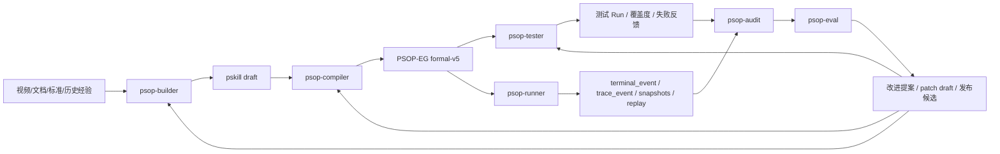

# PSOP Vision

版本：v2  
状态：Agent Harness 方向基线  
适用分支：`issue-1-psop-mvp` 后续演进

## 1. 一句话愿景

**PSOP 是面向物理世界现场作业的任务操作系统：把 SOP、专家经验、现场证据、安全约束、企业系统与 AI 智能体，编译成可执行、可验证、可回放、可审计、可持续进化的 Skill。**

PSOP 不追求把所有现场作业变成一次聊天，也不追求让自由智能体直接接管现实世界。PSOP 的核心路线是：

> 在确定性的执行骨架上，生长出柔性的智能。

这意味着：

- `PSOP Skill` 是现实任务契约，不是 prompt。
- `PSOP-EG` 是 Skill 的正式执行图，不是临时流程草稿。
- `Session Token` 是真实运行实例的一等状态对象。
- `terminal_event`、`trace_event`、`snapshot` 是可回放事实源。
- 智能体负责构建、编译、测试、执行、审计与改进，但所有动作必须落到 PSOP 的事实、产物和治理链路中。

## 2. 为什么需要 PSOP

现实现场作业的核心问题不是“缺少说明文档”，而是任务能力没有被系统化地沉淀。

传统 SOP 存在四类断裂：

1. **文档不能执行**：纸面 SOP、PDF、Wiki 和老师傅经验只能被阅读，无法直接形成运行态步骤、证据要求、异常路径和完成标准。
2. **AI 不能担责**：通用 AI 可以解释和建议，但它天然不具备状态主权、执行边界、审计链路和安全约束。
3. **知识不会复利**：每一次现场 run 产生大量高价值事实，但很少回流到 Skill、测试、编译规则和系统能力中。
4. **系统彼此割裂**：工单、资产、知识库、AR、IoT、对象存储、代码仓库、行业标准和模型工具各自孤立。

PSOP 要解决的是：让物理世界任务从“分散经验”变成“可运行资产”。

## 3. 产品定位

PSOP 是一个 Skill 平台，但更准确地说，是一个围绕现场任务的 **智能体治理与运行平台**。

它包含两类核心对象：

### 3.1 业务资产

- `PSOP Skill`：现实世界任务契约，描述目标、适用边界、步骤、证据、安全约束、异常恢复和完成标准。
- `PSOP-EG`：由 Skill 编译得到的 formal-v5 Execution Graph，是 runner 的正式输入。
- `Run Package`：一次真实运行产生的 transcript、snapshot、trace、terminal events、附件与 replay 事实。
- `Audit Report`：对真实运行或测试运行的质量归因结果。
- `Improvement Proposal`：基于质量归因生成的系统迭代提案。

### 3.2 智能体资产

- `Agent Definition`：每个 PSOP 智能体的目标、输入输出、模型、工具、MCP、skills、memory、workspace 与权限配置。
- `Agent Skill`：供智能体按需加载的领域方法、模板、规则、工具 recipe 和专业知识，不等同于 PSOP Skill。
- `Agent Run`：一次智能体运行的事实记录。
- `Agent Event`：模型调用、工具调用、文件写入、shell 执行、MCP 调用、产物生成、错误与恢复事件。
- `Agent Artifact`：智能体生成或消费的结构化产物，例如 pskill draft、EG candidate、test suite、audit report、patch proposal。

## 4. 北极星闭环

PSOP 的目标闭环是：

```text
Build -> Compile -> Test -> Run -> Audit -> Eval -> Improve
```

对应六个智能体：

```text
psop-builder
  使用视频解析结果、关键帧、文字、行业标准和历史经验构建 pskill draft。

psop-compiler
  将 pskill 编译为 formal-v5 PSOP-EG，并输出诊断与能力要求。

psop-tester
  基于世界模型生成正例、反例和边界用例，调用 psop-runner 执行测试并反馈覆盖度。

psop-runner
  运行 PSOP-EG，管理真实现场作业状态、Session Token、terminal events、trace 与 replay。

psop-audit
  基于真实 run 或测试 run 的持久化事实做执行审计与质量归因。

psop-eval
  基于测试反馈和审计归因生成系统迭代提案，受控生成 prompt、skill、测试、代码或发布改进。
```

完整闭环如下：



## 5. 核心信念

### 5.1 Skill 不是 prompt

Skill 是现实世界任务契约。它必须描述：

- 作业目标。
- 适用边界。
- 现场步骤。
- 证据要求。
- 安全约束。
- 异常恢复路径。
- 完成标准。
- 版本与发布策略。

智能体可以帮助构建 Skill，但不能把 Skill 降级为一次性提示词。

### 5.2 Execution Graph 是安全骨架

PSOP 不把现场执行交给自由 agent loop。正式运行必须基于 PSOP-EG。

PSOP-EG 是面向 Agent Harness 的控制核：

- 节点是静态候选能力。
- Guard 基于 Session Token 判定 enabledness。
- Runtime 选择节点并执行 actor。
- Merge 对 Session Token 做受控重写。
- Terminal、tool、LLM、审批、设备或外部系统都必须落入 trace 和 replay。

### 5.3 Session Token 是运行状态主权

一次真实现场 run 的正式状态不是 LangGraph thread state，也不是模型上下文，而是 PSOP 的 Session Token snapshot 链。

Agent Harness 可以拥有内部 thread state、memory 和 workspace，但这些都不能替代：

- `run.status`
- `runtime_phase`
- `session_token_snapshot`
- `terminal_event`
- `trace_event`
- `replay`

### 5.4 先闭环，再强化治理

PSOP 的第一目标不是构建最完美的权限系统，而是尽快跑通：

```text
raw materials -> pskill -> PSOP-EG -> generated tests -> runner execution -> feedback
```

因此早期采用 `dev_open` agent profile：

- 默认允许 shell。
- 默认允许文件读写。
- 默认允许已配置 MCP tools。
- 默认允许 agent workspace。
- 所有工具调用必须记录 Agent Event。
- 所有文件和执行结果必须进入 Agent Artifact 或 PSOP artifact。

后续再演进到 `prod_guarded` profile：

- MCP server trust registry。
- tool allowlist / denylist。
- secret scanner。
- human approval。
- release gate。
- sandbox hardening。

### 5.5 Skills-first，Subagents-later

PSOP 前期不应该把所有动作都拆成 subagent。

更合理的顺序是：

```text
Tools：执行具体动作。
Agent Skills：按需加载专业方法、模板、规则和领域知识。
Subagents：仅在需要上下文隔离、并行分析或独立长任务时启用。
```

因此 builder、compiler、tester 的首版应以单主智能体 + tools + skills 为主，subagents 作为后续扩展能力。

## 6. 智能体职责边界

### 6.1 psop-builder

职责：把原始材料转化为 pskill draft。

输入：

- 视频解析结果。
- 关键帧。
- ASR/OCR 文本。
- 用户补充说明。
- 行业标准或企业规范片段。
- 历史 audit/eval 经验。

输出：

- pskill draft。
- evidence map。
- missing information questions。
- safety constraints。
- applicability boundary。

原则：

- 可写 draft，不可直接发布。
- 关键步骤必须能追溯 evidence 或 standard。
- 缺证据时应提问，而不是编造。

### 6.2 psop-compiler

职责：把 pskill 编译为 PSOP-EG。

输入：

- pskill source。
- manifest snapshot。
- domain pack。
- allowed runtime capability。

输出：

- PSOP-EG formal-v5 artifact。
- compile diagnostics。
- capability summary。
- graph summary。

原则：

- formal-v5 validator 是确定性门禁。
- compiler 不能自行扩大 runner 能力边界。
- 编译失败必须产生结构化 diagnostics。

### 6.3 psop-tester

职责：生成并执行测试，反馈 Skill/EG 质量。

输入：

- pskill。
- PSOP-EG。
- world model。
- 期望与风险模型。

输出：

- positive cases。
- negative cases。
- edge cases。
- terminal timeline。
- test execution report。
- coverage feedback。

原则：

- 测试执行必须调用 psop-runner，而不是模拟结果。
- 每个测试必须标注覆盖维度。
- Judge 结论必须引用 run facts。

### 6.4 psop-runner

职责：正式执行 PSOP-EG。

输入：

- compile artifact。
- invocation envelope。
- terminal context。
- operator input。
- multimodal evidence。

输出：

- terminal output。
- Session Token snapshots。
- Trace events。
- Terminal events。
- replay detail。
- final output。

原则：

- RuntimeService 是 runner 的治理环境。
- Session Token 是唯一正式运行状态对象。
- terminal_event 是终端事实源。
- Replay 只基于持久化事实重建。

### 6.5 psop-audit

职责：审查真实执行结果并进行质量归因。

输入：

- replay facts。
- trace events。
- terminal events。
- snapshots。
- PSOP-EG。
- pskill。
- test results。

输出：

- audit report。
- deviation list。
- root cause attribution。
- evidence refs。
- confidence。

归因维度：

- skill design issue。
- compiler issue。
- runner issue。
- operator issue。
- environment issue。
- tool or integration issue。
- model behavior issue。

### 6.6 psop-eval

职责：把质量归因转化为系统迭代提案。

输入：

- audit reports。
- test reports。
- compile diagnostics。
- runtime failures。
- prompt versions。
- code/test history。

输出：

- improvement proposal。
- prompt patch draft。
- skill patch draft。
- compiler rule proposal。
- test coverage proposal。
- code patch draft。
- release checklist。

原则：

- proposal-first。
- 默认不直接发布生产版本。
- 所有代码、prompt、skill 修改必须有 diff 和测试结果。

## 7. 产品路线

### Milestone 1：Agent Harness MVP + Build/Compile/Test 闭环

目标：首个可演示闭环。

交付：

- DeepAgents-based Agent Harness Runner。
- Agent Definition YAML。
- Agent Run/Event/Artifact 基础持久化。
- Agent Skills loader。
- Workspace file tools。
- Shell tool。
- MCP tool adapter MVP。
- psop-builder MVP。
- psop-compiler MVP。
- psop-tester MVP。
- 调用现有 psop-runner 执行测试。

验收：

```text
输入视频解析摘要和行业标准片段，系统生成 pskill draft，编译出 PSOP-EG，生成正反例测试，调用 runner 执行，并输出测试反馈。
```

### Milestone 2：Audit + Eval 闭环

目标：从 run facts 到系统改进提案。

交付：

- psop-audit MVP。
- audit report schema。
- psop-eval MVP。
- improvement proposal schema。
- workspace 内 patch draft 生成。
- 可运行测试但不自动发布。

### Milestone 3：治理强化

目标：从 dev_open 到 prod_guarded。

交付：

- MCP trust registry。
- tool policy。
- human approval。
- sandbox hardening。
- long-term memory。
- release gate。
- 自动 PR / staged release。

## 8. 成功标准

短期成功标准：

- 用户可以从现场材料生成可编辑的 pskill draft。
- pskill 可以自动编译成 formal-v5 PSOP-EG。
- tester 可以生成并执行至少一组正例和反例。
- runner 执行测试后产生 replay。
- agent run、tool call、文件产物和错误都可追踪。

中期成功标准：

- audit 可以对真实 run 做质量归因。
- eval 可以生成可执行的系统改进提案。
- builder/compiler/tester 能从历史 audit/eval 中学习。
- Skill 版本质量可以通过测试覆盖度和运行质量持续提升。

长期成功标准：

- PSOP 形成自进化闭环。
- 现场经验可以沉淀为 Skill、测试、编译规则、prompt、工具和系统能力。
- 每个物理世界任务都能像软件一样被构建、编译、测试、运行、审计和迭代。

## 9. 非目标

当前阶段不追求：

- 完整租户/权限/审批流。
- 生产级 MCP 安全治理。
- 完整自动发布。
- 完整代码自修改闭环。
- 大规模多 agent 自治协作。
- 用 DeepAgents 替代 PSOP RuntimeService。

这些能力会在 Build/Compile/Test 闭环跑通后逐步补齐。