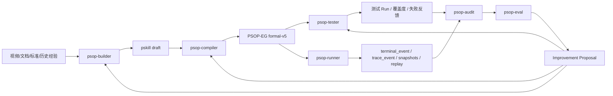

# PSOP Vision

版本：2026-06  
状态：项目核心纲领  
适用范围：PSOP 产品、架构、智能体与工程迭代

## 1. 愿景

PSOP 是面向物理世界现场作业的任务操作系统。

PSOP 将 SOP、专家经验、现场证据、安全约束、企业系统、工具能力与 AI 智能体沉淀为可执行、可验证、可回放、可审计、可持续进化的 Skill。

PSOP 的核心路线是：

> 在确定性的执行骨架上，生长出柔性的智能。

## 2. 产品定位

PSOP 不是聊天助手，也不是单次自动化脚本。

PSOP 是围绕现实现场任务构建的 Skill 平台与智能体治理平台。它负责将现实作业能力转化为可运行资产，并通过智能体闭环持续提升 Skill、执行图、测试、运行质量和系统能力。

PSOP 的正式业务资产包括：

| 资产 | 定义 |
| --- | --- |
| `PSOP Skill` | 现实任务契约，描述目标、适用边界、步骤、证据、安全约束、异常恢复和完成标准。 |
| `pskill` | Skill 的源码与结构化草稿表达，供构建、编译和版本管理使用。 |
| `PSOP-EG` | 由 pskill 编译得到的 formal-v5 Execution Graph，是 runner 的正式输入。 |
| `Run Package` | 一次运行产生的 terminal events、trace events、Session Token snapshots、附件与 replay 事实。 |
| `Audit Report` | 对真实运行或测试运行的质量归因结果。 |
| `Improvement Proposal` | 基于质量归因生成的 Skill、测试、prompt、工具、代码或发布改进提案。 |

PSOP 的正式智能体资产包括：

| 资产 | 定义 |
| --- | --- |
| `Agent Definition` | 智能体目标、输入输出、模型、tools、MCP、Agent Skills、memory、workspace 和 profile 的声明式定义。 |
| `Agent Skill` | 智能体按需加载的方法、模板、规则、脚本和领域知识；不等同于 PSOP Skill。 |
| `Agent Run` | 一次智能体运行记录。 |
| `Agent Event` | 模型调用、工具调用、文件写入、shell 执行、MCP 调用、产物生成和错误事件。 |
| `Agent Artifact` | 智能体生成或消费的结构化产物。 |

## 3. 系统公理

### 3.1 Skill 不是 prompt

Skill 是现实任务契约，不是一次性提示词。

一个合格的 PSOP Skill 必须表达：

- 作业目标。
- 适用边界。
- 现场步骤。
- 证据要求。
- 安全约束。
- 异常恢复路径。
- 完成标准。
- 版本与发布策略。

### 3.2 PSOP-EG 是执行骨架

正式运行必须基于 PSOP-EG。

PSOP-EG 负责节点、guard、enabledness、actor、merge、halt 与运行策略。自由智能体可以参与构建、编译、测试、审计和改进，但不能绕过 PSOP-EG 接管真实现场执行。

### 3.3 Session Token 是运行状态主权

一次真实 run 的正式状态是 Session Token snapshot 链，而不是模型上下文、LangGraph thread state 或 DeepAgents 内部状态。

Agent Harness 可以拥有内部 thread state、memory、workspace 和中间产物，但不能替代：

- `run.status`
- `runtime_phase`
- `session_token_snapshot`
- `terminal_event`
- `trace_event`
- `replay`

### 3.4 事实源必须 append-only

PSOP 的运行、测试、审计和演进必须基于持久化事实。

核心事实源包括：

- `terminal_event`
- `terminal_event_part`
- `trace_event`
- `session_token_snapshot`
- `artifact_object`
- `agent_event`
- `agent_artifact`

已发生事实不得就地改写，只能通过追加事件、追加诊断或生成新版本表达新的结论。

### 3.5 LLM 调用必须经过平台网关

生产链路中的模型调用必须经过 `LlmInferenceGateway` 或其受控适配器。Agent Harness 不应绕过平台模型配置、日志、usage、trace 和 redaction 机制直接调用外部模型。

## 4. 北极星闭环

PSOP 的长期闭环是：

```text
Build -> Compile -> Test -> Run -> Audit -> Eval -> Improve
```



## 5. 智能体职责

| 智能体 | 职责 | 主要产物 |
| --- | --- | --- |
| `psop-builder` | 使用视频解析结果、关键帧、文字、行业标准、企业规范和历史经验构建 pskill draft。 | pskill draft、evidence map、missing questions、safety constraints。 |
| `psop-compiler` | 将 pskill 编译为 formal-v5 PSOP-EG，并输出诊断与能力要求。 | EG artifact、compile diagnostics、graph summary、capability summary。 |
| `psop-tester` | 基于世界模型生成正例、反例和边界用例，调用 psop-runner 执行测试并输出反馈。 | test suite、scenario runs、coverage report、failure feedback。 |
| `psop-runner` | 运行 PSOP-EG，管理真实现场状态、Session Token、terminal events、trace 与 replay。 | Run Package、final output、replay facts。 |
| `psop-audit` | 基于真实 run 或测试 run 的持久化事实做执行审计与质量归因。 | audit report、deviation list、quality attribution、evidence refs。 |
| `psop-eval` | 基于测试反馈和审计归因生成系统迭代提案。 | improvement proposal、patch draft、test plan、release checklist。 |

## 6. Agent Harness 策略

PSOP 使用统一 `AgentHarnessRunner` 承载 builder、compiler、tester、audit、eval。

当前策略：

- DeepAgents-first：顶层不区分 LangGraphRunner、WorkflowRunner、DeepAgentRunner。
- LangGraph 作为 DeepAgents 或复杂 workflow 的内部能力，不作为业务层 runner 分类。
- `psop-runner` 是特殊智能体，由现有 RuntimeService 实现，不被 DeepAgents 替代。
- Skills-first：专业方法、模板、规则、脚本和领域知识优先沉淀为 Agent Skills。
- Tools 执行动作：文件、shell、MCP、PSOP API、formal-v5 validator、runtime invocation 等能力以工具形式暴露。
- Subagents-later：只有在需要上下文隔离、并行分析或独立长任务时再引入 subagents。

## 7. MVP Profile

MVP 阶段采用 `dev_open` profile，以闭环跑通为优先目标。

`dev_open` 默认能力：

- 允许 workspace 文件读写。
- 允许 workspace 内 shell。
- 允许已配置 MCP tools。
- 不启用复杂审批流。
- 所有工具调用必须记录 `agent_event`。
- 所有关键输出必须写入 `agent_artifact` 或 `artifact_object`。

生产阶段演进为 `prod_guarded` profile：

- MCP trust registry。
- tool allowlist / denylist。
- secret scanner。
- human approval。
- sandbox hardening。
- release gate。
- 自动 PR / staged release。

## 8. 产品里程碑

### Milestone 1：Agent Harness MVP + Build/Compile/Test 闭环

目标：跑通从原始材料到测试反馈的最小闭环。

范围：

- Agent Harness Runner。
- Agent Definition YAML。
- Agent Run/Event/Artifact 持久化。
- Agent Skills Loader。
- Workspace file tools。
- Shell tool。
- MCP adapter MVP。
- `psop-builder` MVP。
- `psop-compiler` MVP。
- `psop-tester` MVP。
- 调用现有 `psop-runner` 执行测试。

验收：

```text
raw material summary + standard snippets
  -> pskill draft
  -> PSOP-EG
  -> generated positive/negative tests
  -> runner execution
  -> tester feedback
```

### Milestone 2：Audit + Eval 闭环

目标：从运行事实生成质量归因与系统改进提案。

范围：

- `psop-audit` MVP。
- audit report schema。
- `psop-eval` MVP。
- improvement proposal schema。
- workspace patch draft。
- 测试运行能力。

验收：

```text
run replay/test report
  -> audit attribution
  -> eval improvement proposal
  -> prompt/skill/test/code patch draft
```

### Milestone 3：生产治理强化

目标：将 `dev_open` 演进为 `prod_guarded`。

范围：

- MCP trust registry。
- tool policy。
- human approval。
- sandbox hardening。
- long-term memory。
- release gate。
- 自动 PR / staged release。

## 9. 当前非目标

当前阶段不实现：

- 完整租户、用户、权限、审批系统。
- 生产级 MCP 安全治理。
- 自动 merge / deploy。
- 大规模 subagent 自治协作。
- 用 DeepAgents 替代 RuntimeService。
- 将 Agent Skill 与 PSOP Skill 合并为同一对象。

## 10. 文档关系

本文件是项目愿景与产品纲领。

系统工程实现以 `docs/PSOP系统架构设计.md` 为准。PSOP-EG 形式语义以 `docs/PSOP_execution_graph_formal_v5.md` 为准。